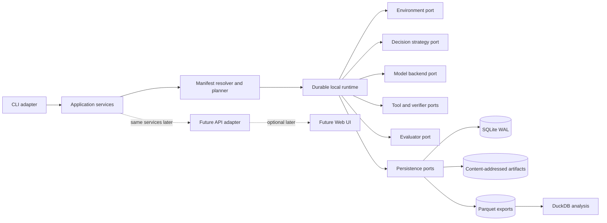

<div align="center">

# ♟ Zugzwang Research Kernel

**An attribution-first execution kernel for verifiable LLM decision experiments.**

[](#project-status)
[](docs/architecture/SYSTEM_DESIGN.md)
[](docs/architecture/MASTER_TECHNICAL_DESIGN.md)
[](docs/decisions/HUMAN_DECISION_GATES.pt-BR.md)
[](docs/architecture/REPOSITORY_LAYOUT.md)
[](docs/protocol/MANIFEST_SPEC.md)
[](docs/architecture/RUNTIME_AND_STATE_MACHINES.md)
[](docs/architecture/DATA_ARCHITECTURE.md)
[](docs/architecture/DATA_ARCHITECTURE.md)
[](docs/architecture/PROVIDER_ARCHITECTURE.md)
[](docs/research/CLAIMS_AND_EVIDENCE_POLICY.md)
[](LICENSE)

[Português](README.pt-BR.md) · [Start here](START_HERE.md) · [Documentation index](docs/INDEX.md) · [Decision console](docs/decisions/HUMAN_DECISION_GATES.pt-BR.md) · [Roadmap](docs/roadmap/ROADMAP.md)

</div>

> [!IMPORTANT]
> The experimental kernel is implemented: uv workspace, CLI, SQLite/CAS, R0-R3 strategies, provider adapters and offline tests. Independent bundle reproduction and scientific acceptance still have open work. Gates 001/002/003/004/006 are accepted; the remaining gates retain their documented conservative defaults. See the [integration queue](docs/engineering/REPOSITORY_STATUS.md) before choosing a branch.

## Quick start

```bash
uv sync --all-packages --locked   # editable workspace install
zugzwang init                     # create a local .zugzwang workspace
zugzwang doctor                   # validate workspace, DB, plugins, engine
zugzwang run experiments/fake-smoke.yaml --workspace .
zugzwang runs list --workspace .
zugzwang evaluate <run-id> --workspace .    # post-hoc, fake UCI engine
zugzwang report <run-id> --workspace .
zugzwang export <run-id> --output bundle/ --workspace .
uv run pytest -m "not e2e"       # offline suite: no network, no secrets
```

See [docs/research/V0_1_FAKE_SUITE.md](docs/research/V0_1_FAKE_SUITE.md) for the
scientific suite and what its results do — and do not — measure.

## The thesis

“An LLM playing chess” is not one capability. Observed performance is a compound of state representation, rule tracking, legal action grounding, candidate generation, search, value estimation, memory, formatting, retries, tools, and external assistance.

Zugzwang exists to make those components explicit.

The kernel answers a stricter question than “which model won?”:

> **Which component supplied which share of the observed capability, under which representation, knowledge, assistance, budget, distribution, and failure policy?**

Chess is the first domain because it supplies a deterministic state machine, formally checkable actions, long trajectories, automatic evaluation, adversarial distributions, and a mature ecosystem of engines and human data. The long-term abstraction is a research kernel for verifiable sequential decision systems, but the first implementation remains deliberately chess-first.

## What Zugzwang is

Zugzwang is a local-first, CLI-first, provider-agnostic kernel for:

- declaring experiments through strict, versioned manifests;
- resolving a source manifest into an immutable execution plan;
- running model, strategy, environment, tool, verifier, and evaluator components behind explicit contracts;
- recording every attempt, retry, tool call, artifact, transition, metric, cost, and protocol deviation;
- resuming interrupted runs without replaying committed actions;
- exporting self-contained, checksummed run bundles;
- re-evaluating bundles offline with versioned metrics;
- comparing systems without laundering harness or engine competence into the model.

## What Zugzwang is not

The initial kernel is not:

- a chess bot product;
- a Stockfish wrapper;
- a public arena or a single Elo leaderboard;
- a universal agent framework;
- a model training platform;
- a hosted multi-user service;
- a Web UI;
- a hidden retry, routing, or fallback layer.

Those may become adapters, plugins, or separate products. None may redefine the scientific semantics of the kernel.

## Scientific coordinate system

Every condition is described across independent axes.

| Axis | Question | Initial vocabulary |
|---|---|---|
| Inference regime `R` | How is the decision produced? | `R0` direct, `R1` grounded, `R2` repair, `R3` structured |
| Operational assistance `H` | What formal or strategic help was supplied live? | `H0` parser through `H7` engine-selected action |
| Knowledge assistance `K` | What external knowledge entered the prompt or policy? | `K0` none through `K7` current-position expert analysis |
| Observation profile | How was state represented? | FEN, ASCII, PGN/history, image, redundant, conflicting |
| Budget | How much compute was available? | calls, tokens, time, cost, candidates, retries |
| Distribution | Where did the state come from? | IID human, temporal, random-legal, geometric, synthetic, Chess960 later |

A run declares intended classes. The event stream records what actually happened. If a tool raises effective assistance above the declaration, the run is marked as a protocol violation rather than silently reported as stronger.

## The first scientific program

The v0.1 experiment program begins with paired local-decision studies before expensive full-game claims.

| Experiment | Core question |
|---|---|
| `REP-001` | Which state representation best separates perception, tracking, and decision quality? |
| `GROUND-001` | Does reasoning before legal-action grounding outperform legal moves shown from the start? |
| `SKILL-001` | Does a correct expert knowledge packet help beyond persona, irrelevant text, and a plausible but wrong skill? |
| `MM-001` | Does a redundant board image improve spatial reasoning when a perfect symbolic state is already present? |
| `MM-002` | Which modality does a model trust when image and symbolic state conflict? |
| `DEMO-001` | Are a few semantically matched demonstrations more useful than many random demonstrations at equal token budget? |

See [Experiment Catalog v0.1](docs/research/EXPERIMENT_CATALOG_V0_1.md).

## System architecture



The recommended implementation is a modular monolith with hexagonal boundaries:

```text
zugzwang-core
    ↑
zugzwang-runtime
    ↑             ↖
zugzwang-cli       plugins/*
    ↑             ↗
zugzwang-chess
```

The core does not import a provider SDK, SQLAlchemy, Typer, a concrete chess library, or Stockfish. Provider SDK types do not cross adapter boundaries. Plugins do not receive database sessions. The CLI never executes SQL.

## Data architecture

Three data planes solve three different problems:

| Plane | Recommended substrate | Purpose |
|---|---|---|
| Operational | SQLite in WAL mode | current state, checkpoints, budgets, projections |
| Evidence | filesystem CAS, SHA-256, Zstandard | prompts, responses, images, traces, snapshots |
| Analytical | Parquet queried by DuckDB | comparison, statistics, reports, downstream notebooks |

The scientific product is the portable run bundle, not the local database.

```text
run-bundle/
├── bundle.json
├── manifest.source.yaml
├── manifest.resolved.json
├── runtime-snapshot.json
├── plugin-snapshot.json
├── pricing-snapshot.json
├── events.jsonl.zst
├── artifacts/
├── episodes.parquet
├── attempts.parquet
├── metrics.parquet
├── games.pgn
└── checksums.sha256
```

## Provider architecture

Zugzwang owns a narrow canonical `ModelBackend` contract. A backend performs one model inference. It does not secretly implement memory, retries, tools, fallback, routing, search, or an agent loop.

Initial adapters:

- Pydantic AI Direct Model Requests, used as a transport and schema translation substrate;
- a direct OpenAI-compatible HTTP adapter for local servers and dialect testing;
- a deterministic fake backend for offline tests;
- optional bridges such as LiteLLM only as explicit plugins.

Capabilities are negotiated rather than assumed: structured output, images, tools, usage metadata, reasoning control, logprobs, seed support, prompt caching, streaming, and idempotency are recorded per backend and model snapshot.

## Multimodal and knowledge-ready, without premature RAG

The core request model uses typed content parts:

```text
TextPart
ImageArtifactPart
StructuredStatePart
ToolResultPart
```

Images are immutable CAS artifacts with content hash, MIME type, dimensions, renderer version, board orientation, theme, and source state hash. This makes visual experiments reproducible and allows cross-modal conflict to be intentional rather than accidental.

Static expert knowledge enters through versioned `KnowledgePacket` artifacts. This supports `SKILL-001` without installing a vector database or retrieval pipeline. Position-conditioned retrieval remains a later, separately classified regime.

## Project status

The runtime and lockfile exist. Experimental R5/R7, reports and viewer work remain in a stacked review queue. Implementation and passing smoke tests do not certify independent reproduction or a scientific benchmark.

Gates 001/002/003/004/006 are accepted. Gates 005 and 007-012 remain pending. Consult [DECISIONS.yaml](docs/decisions/DECISIONS.yaml) and the [repository status](docs/engineering/REPOSITORY_STATUS.md).

## Repository map

```text
.
├── AGENTS.md
├── .agents/skills/              # reusable Codex engineering workflows
├── docs/
│   ├── product/
│   ├── research/
│   ├── architecture/
│   ├── requirements/
│   ├── protocol/
│   ├── engineering/
│   ├── roadmap/
│   ├── decisions/
│   └── adr/
├── schemas/                     # draft machine-readable contracts
├── examples/
│   ├── experiments/
│   └── knowledge-packets/
├── packages/                    # package boundaries and nested AGENTS.md
├── plugins/                     # plugin boundaries and nested AGENTS.md
├── scripts/                     # documentation and contract validators
├── archive/source-material/     # supplied research and original design inputs
└── .github/                     # contribution templates and docs CI
```

## Starting new work

Read [START_HERE.md](START_HERE.md), the [integration queue](docs/engineering/REPOSITORY_STATUS.md) and the applicable work order. Create an isolated branch/worktree from the correct base and install the locked workspace. Preserve active runs and other agents' environments.

```bash
uv sync --all-packages --all-extras --locked
uv run python scripts/validate_foundation.py --strict
uv run pytest -m "not e2e"
```

The local runtime, providers, chess environment, evidence artifacts, post-hoc evaluator and model-only R6 search are implemented. Real provider data remains local and public raw-output export remains gated.
## Quality policy

A result is not publishable unless it records:

- exact model/provider identifier and date;
- complete source and resolved manifests;
- prompt and representation hashes;
- retry, fallback, routing, and selection policy;
- declared and effective `H` and `K` classes;
- raw or policy-compliant evidence artifacts;
- engine version and exact evaluation budget;
- costs, tokens, latency, failures, and timeouts;
- parsing errors separately from illegal actions;
- legal blunders separately from protocol failures;
- distribution, seeds, paired conditions, and uncertainty;
- code, plugin, schema, and metric versions.

See [Claims and Evidence Policy](docs/research/CLAIMS_AND_EVIDENCE_POLICY.md).

## Documentation

- [Documentation index](docs/INDEX.md)
- [Product requirements](docs/product/PRODUCT_REQUIREMENTS.md)
- [Scientific foundations](docs/research/SCIENTIFIC_FOUNDATIONS.md)
- [Master technical design](docs/architecture/MASTER_TECHNICAL_DESIGN.md)
- [System design](docs/architecture/SYSTEM_DESIGN.md)
- [Functional requirements](docs/requirements/FUNCTIONAL_REQUIREMENTS.md)
- [Protocol taxonomy](docs/research/PROTOCOL_TAXONOMY.md)
- [ADRs](docs/adr/README.md)
- [Roadmap](docs/roadmap/ROADMAP.md)
- [Test strategy](docs/engineering/TEST_STRATEGY.md)
- [Codex agent operating model](docs/engineering/CODEX_AGENT_OPERATING_MODEL.md)

## Contributing

The project is designed for research engineers, model authors, benchmark maintainers, chess tooling developers, and reproducibility reviewers. Read [CONTRIBUTING.md](CONTRIBUTING.md), [GOVERNANCE.md](GOVERNANCE.md), and the root [AGENTS.md](AGENTS.md) before proposing code.

## License

Mestre Mael selected GPL-3.0-or-later with python-chess on 2026-08-16. See [LICENSE](LICENSE), [ADR-004](docs/adr/ADR-004-licenca-e-biblioteca-de-regras.md) and [LICENSE-DECISION.md](LICENSE-DECISION.md). Provider-output redistribution remains a separate pending decision under GATE-005.

## Citation

A `CITATION.cff` foundation file is included. Published research should cite both the Zugzwang release and the primary papers whose datasets, protocols, or methods it uses.

---

**Chess first. Attribution always.**
