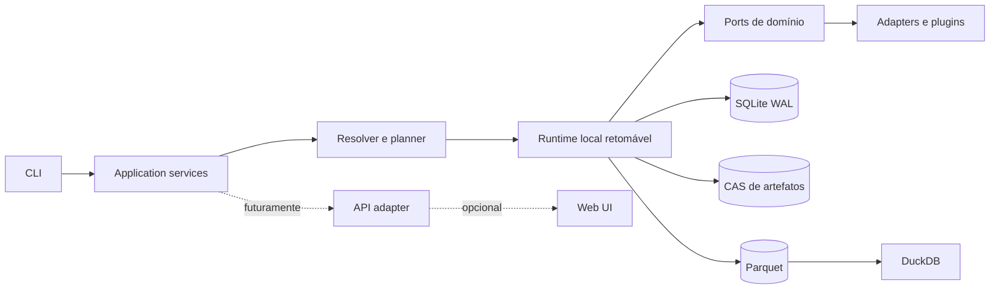

<div align="center">

# ♟ Zugzwang Research Kernel

**Kernel de execução e atribuição de competência para experimentos verificáveis com LLMs.**

[](#estado-do-projeto)
[](docs/architecture/SYSTEM_DESIGN.md)
[](docs/architecture/MASTER_TECHNICAL_DESIGN.md)
[](docs/decisions/HUMAN_DECISION_GATES.pt-BR.md)
[](docs/architecture/REPOSITORY_LAYOUT.md)
[](docs/protocol/MANIFEST_SPEC.md)
[](docs/architecture/DATA_ARCHITECTURE.md)
[](docs/architecture/PROVIDER_ARCHITECTURE.md)
[](LICENSE-DECISION.md)

[English](README.md) · [Comece aqui](START_HERE.md) · [Índice](docs/INDEX.md) · [Console do Mestre Mael](docs/decisions/HUMAN_DECISION_GATES.pt-BR.md) · [Roadmap](docs/roadmap/ROADMAP.md)

</div>

> [!IMPORTANT]
> O runtime local já está implementado. O caminho de pesquisa continua privado por padrão: provider, reasoning telemetry e outputs de Stockfish ficam em CAS/SQLite local, e export público segue bloqueado pelo GATE-005.

## A tese

“Um LLM jogando xadrez” não descreve uma capacidade unitária. O resultado observado mistura representação de estado, tracking, regras, grounding das ações, geração de candidatos, busca, função de valor, memória, formato, retries, tools e assistência externa.

O Zugzwang existe para impedir que essa mistura seja publicada como uma nota única.

A pergunta central é:

> **Qual componente forneceu qual parcela da competência observada, sob qual representação, conhecimento, assistência, orçamento, distribuição e política de falha?**

O xadrez é o primeiro domínio porque combina estado determinístico, ações formalmente verificáveis, trajetórias longas, avaliação automática e distribuições adversariais controláveis. A abstração futura pode servir a outros ambientes verificáveis, mas o primeiro kernel permanece deliberadamente chess-first.

## O que o projeto entrega

- manifestos estritos, versionados e compilados para uma forma canônica;
- execução local retomável e auditável;
- providers, strategies, tools, verifiers, evaluators e ambientes atrás de ports explícitos;
- eventos por tentativa, retry, chamada, transição e métrica;
- budgets de custo, tokens, tempo e chamadas;
- artefatos endereçados por conteúdo;
- bundles portáveis e reavaliáveis offline;
- classes de assistência operacional `H` e de conhecimento `K`;
- suporte tipado a conteúdo textual, simbólico e visual;
- experimentos pareados que distinguem perception, tracking, legalidade e decisão.
- evidência por decisão, wire request/response, telemetry do provider e EvaluationRun;
- `LegalityGateway` com feedback binário, leases de capacidade e busca R6 model-only;
- SearchWorkspace imutável com memória endógena e firewall para avaliação pós-jogo.

## Programa científico inicial

| ID | Experimento |
|---|---|
| `REP-001` | Matriz de representação: FEN, ASCII, PGN, imagem e redundância |
| `GROUND-001` | Reason-first, constrain-later |
| `SKILL-001` | Injeção causal de knowledge packets corretos, errados e placebo |
| `MM-001` | Redundância visual + simbólica |
| `MM-002` | Conflito entre modalidades e autoridade da fonte |
| `DEMO-001` | Few-shot semanticamente relevante versus many-shot aleatório |

A especificação completa está em [EXPERIMENT_CATALOG_V0_1.md](docs/research/EXPERIMENT_CATALOG_V0_1.md).

## Arquitetura



É um monólito modular hexagonal, não uma constelação prematura de serviços. O banco operacional, a evidência bruta e o plano analítico são separados. O produto científico é o bundle, não o SQLite local.

## Decisões humanas

O projeto não esconde decisões jurídicas e distributivas dentro de dependências. O scaffold só deve ultrapassar os gates essenciais após ratificação do operador humano:

1. licença e rules substrate;
2. piso Python;
3. retenção padrão de prompts e respostas;
4. nome definitivo do CLI;
5. redistribuição de outputs de providers;
6. aquisição e redistribuição do Stockfish;
7. estabilidade pública de plugins;
8. variantes do primeiro release;
9. governança do registry de custos;
10. idioma canônico da documentação;
11. matriz inaugural de modelos e orçamento pago;
12. topologia de publicação dos packages.

Abra o [Console de Decisões do Mestre Mael](docs/decisions/HUMAN_DECISION_GATES.pt-BR.md).

## Como iniciar

```bash
cat START_HERE.md
cat docs/decisions/HUMAN_DECISION_GATES.pt-BR.md
uv run python scripts/validate_foundation.py --strict
uv run pytest -m 'not e2e'
uv run zugzwang trace step STEP_ID --workspace PATH --output json
```

Os testes reais usam o proxy local configurado pelo operador. Eles exigem autorização explícita do ambiente e não fazem fallback silencioso para fake.

## Estado do projeto

O monorepo contém o runtime, os plugins, migrations, evaluator, bundles e a suite de testes. A matriz de modelo paga e a redistribuição pública continuam sujeitas aos gates humanos correspondentes.

## Licença

Nenhuma licença foi silenciosamente escolhida. Até a aceitação da [ADR-004](docs/adr/ADR-004-licenca-e-biblioteca-de-regras.md) e a inclusão de um arquivo `LICENSE`, o repositório não deve ser anunciado juridicamente como open source.

---

**Xadrez primeiro. Atribuição sempre.**
