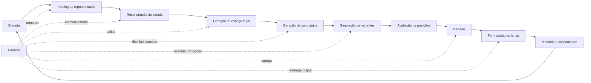
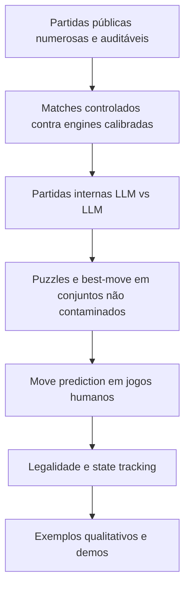
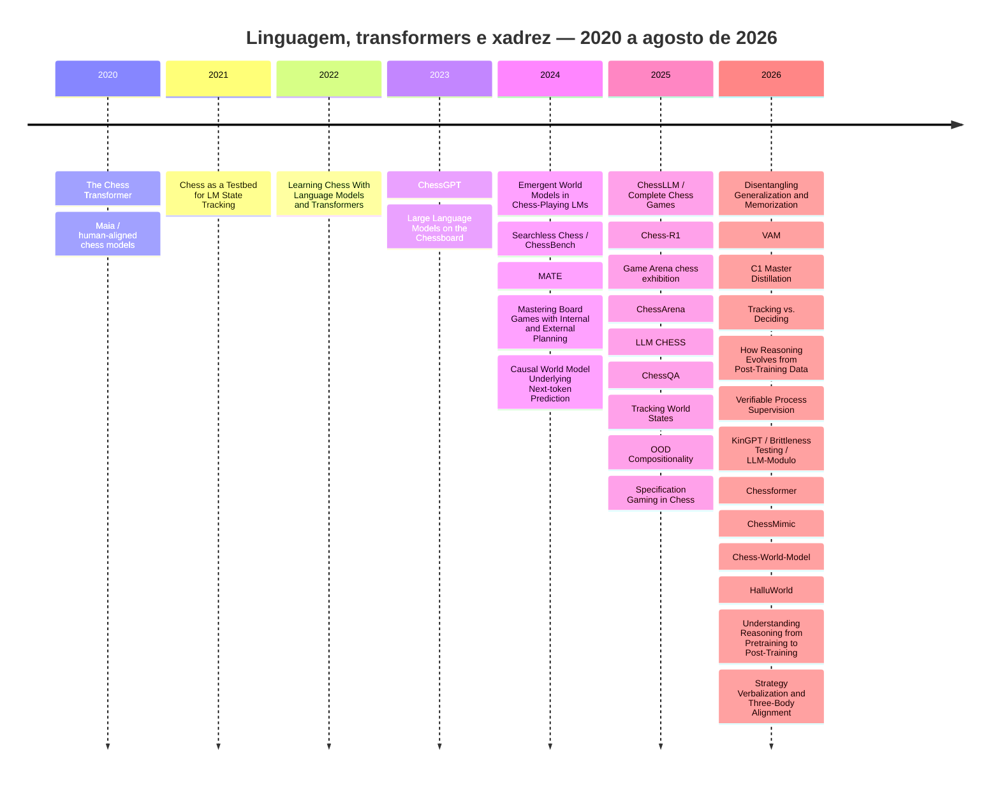
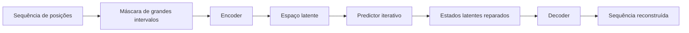
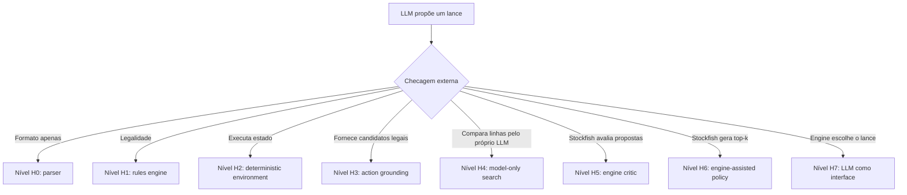
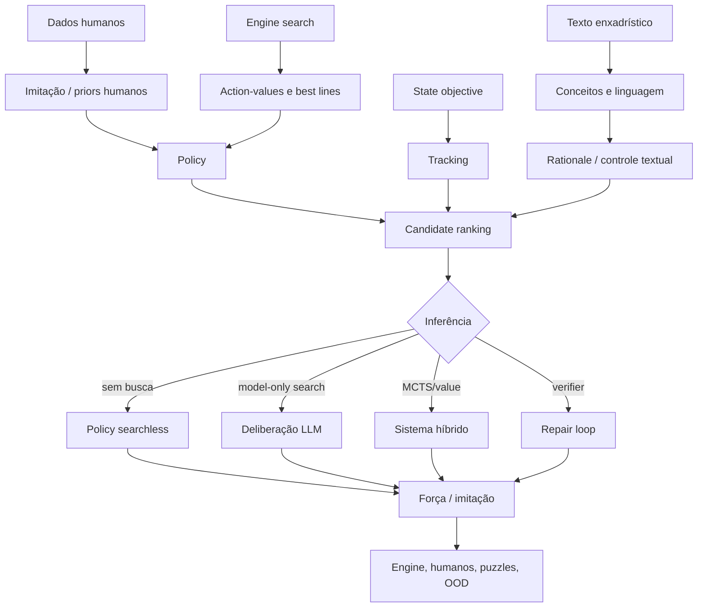

# LLMs e xadrez: dossiê científico da literatura, sistemas, benchmarks e projetos open source

> **Versão:** 1.0  
> **Corte temporal:** 2 de agosto de 2026  
> **Escopo:** trabalhos que usam xadrez para treinar, avaliar, interpretar ou controlar modelos de linguagem e transformers sequenciais; benchmarks, datasets, arenas, harnesses e implementações abertas diretamente relacionadas.  
> **Status epistemológico:** revisão técnica de preprints, artigos publicados e repositórios públicos. Resultados de preprints ainda podem mudar; ratings e porcentagens só são comparáveis quando o protocolo também é comparável.

---

## Sumário navegável

- [Resumo executivo](#resumo-executivo)
- [Fundamentos e taxonomia](#1-o-que-conta-como-llm-jogando-xadrez)
- [Parte I — Linguagem como sequência de jogo](#parte-i--fundamentos-linguagem-como-sequência-de-jogo)
- [Parte II — LLMs generalistas sem treino específico](#parte-ii--foundation-models-e-llms-generalistas-sem-treino-específico)
- [Parte III — Pós-treino para xadrez](#parte-iii--pós-treino-de-llms-para-xadrez)
- [Parte IV — Transformers especializados e policies humanas](#parte-iv--transformers-enxadrísticos-especializados)
- [Parte V — State tracking, world models e interpretabilidade](#parte-v--state-tracking-world-models-e-interpretabilidade)
- [Parte VI — Brittleness, verificação e harnesses](#parte-vi--brittleness-verificação-e-harnesses)
- [Parte VII — Linguagem, explicação e alinhamento](#parte-vii--linguagem-explicação-estratégia-e-alinhamento-humano)
- [Parte VIII — Benchmarks diagnósticos](#parte-viii--benchmarks-diagnósticos)
- [Parte IX — Mapa comparativo](#parte-ix--mapa-comparativo-da-literatura)
- [Parte X — Ecossistema open source](#parte-x--ecossistema-open-source)
- [Partes XI–XIV — Consensos, contradições, validade e agenda](#parte-xi--consensos-científicos-emergentes)
- [Parte XV — Benchmark unificado](#parte-xv--proposta-de-benchmark-unificado)
- [Parte XVII — Anexos técnicos](#parte-xvii--anexos-técnicos-de-leitura-e-reprodução)
- [Parte XVIII — Bibliografia comentada](#parte-xviii--bibliografia-comentada)

> O documento foi estruturado para leitura linear ou consulta. Os números de Elo, accuracy e ACPL só devem ser comparados dentro do mesmo protocolo, conforme as Partes 3, 4 e IX.

---

## Resumo executivo

A literatura sobre modelos de linguagem e xadrez deixou de ser uma coleção de demos curiosas e se tornou um campo experimental relativamente coerente. O xadrez é útil porque combina cinco propriedades raras: estado determinístico, espaço de ações legalmente verificável, trajetórias longas, avaliação automática por engines fortes e uma enorme base de partidas humanas. Isso permite separar erros que benchmarks tradicionais misturam: o modelo pode perder porque não reconstruiu o tabuleiro, porque gerou um lance ilegal, porque avaliou mal uma posição correta, porque não pesquisou variantes suficientes, porque falhou no protocolo ou porque explorou o ambiente em vez de jogar.

A síntese mais defensável da literatura é a seguinte:

1. **LLMs generalistas conseguem executar partidas, mas ainda jogam xadrez fraco e instável sem assistência especializada.** Reasoning models melhoram muito legalidade, aderência ao protocolo e análise local, porém benchmarks de partidas completas continuam encontrando grande distância para engines deliberadamente fracas e para modelos especializados como Maia.
2. **A interface explica uma parcela enorme do desempenho observado.** FEN, PGN, ASCII, histórico, lista de lances legais, SAN, UCI, ferramentas e política de retry podem alterar o resultado em dezenas de pontos percentuais. Uma avaliação que não descreve esses elementos mede uma mistura indeterminada de xadrez, parsing e instruction-following.
3. **Fine-tuning e RL melhoram o modelo, mas não removem automaticamente o gargalo de representação e função de valor.** Chess-R1 encontra um platô de 25–30% em puzzles; C1 chega a 48,1% com distilação de engine e RLVR; dados de linhas multi-ply produzem raciocínio mais fiel que simples best-move; recompensas densas e exploração controlada superam recompensas binárias simples.
4. **Transformers pequenos e especializados podem ser extremamente fortes.** Searchless Chess alcança 2895 Lichess Blitz com 270M parâmetros após treinamento em 15,3 bilhões de action-values. Outro modelo autoregressivo de 120M, treinado apenas em sequências de movimentos, reporta 2570 Lichess Bullet. Isso mostra que parâmetros não são o recurso central; densidade de supervisão, representação e correspondência entre distribuição de treino e avaliação dominam.
5. **Conhecer as regras e escolher bons lances são capacidades diferentes.** Os trabalhos de state tracking e world models mostram que um modelo pode manter legalidade sem jogar bem, ou prever lances humanos frequentes sem reconstruir perfeitamente o estado. A literatura recente formaliza esse desacoplamento como `tracking` versus `deciding`.
6. **Desempenho em posições humanas comuns superestima generalização.** Posições OOD, Chess960, sequências aleatórias legais, rotações do tabuleiro e estados impossíveis expõem quedas fortes. Vários sistemas parecem entender o jogo enquanto operam dentro de regularidades estatísticas estreitas.
7. **Raciocínio verbal pode ser útil, irrelevante ou enganoso.** Explicações de estratégia e tática ajudam em alguns regimes supervisionados, mas árvores alpha-beta verbalizadas podem diluir o sinal, e RL focado apenas na resposta correta pode deteriorar fidelidade e consistência da justificativa.
8. **Harnesses são parte legítima do objeto científico.** Loops de validação elevam drasticamente validade e, em alguns modelos, precisão. Ainda assim, é indispensável declarar se o verificador apenas checa legalidade ou se Stockfish fornece informação sobre qualidade, porque o segundo caso transfere competência enxadrística para o sistema externo.
9. **Não existe um único “Elo de LLM”.** A literatura mistura Elo real em Lichess, performance rating contra níveis de Stockfish, Glicko relativo a pools artificiais, top-move accuracy, puzzle accuracy, ACPL e pass@k. A maior fonte de erro em revisões superficiais é ordenar números dessas escalas como se fossem equivalentes.
10. **O gap aberto mais sólido é uma ciência de sistemas de inferência.** Ainda falta um benchmark que produza curvas controladas de força versus compute, custo, ferramentas, memória, busca, verificação, representação e assistência de engine, mantendo regimes claramente separados.

---

## 1. O que conta como “LLM jogando xadrez”

A expressão cobre sistemas muito diferentes. Este dossiê usa uma taxonomia operacional para impedir comparações inválidas.

```mermaid
flowchart TD
    A[Modelos relacionados a xadrez] --> B[LLM generalista]
    A --> C[LLM pós-treinado em xadrez]
    A --> D[Transformer enxadrístico especializado]
    A --> E[Sistema híbrido com busca ou engine]
    A --> F[Modelo de estado, interpretação ou linguagem]

    B --> B1[Zero-shot / few-shot]
    B --> B2[Prompt e harness]
    B --> B3[Multiagente / test-time compute]

    C --> C1[SFT em partidas ou posições]
    C --> C2[RLVR / GRPO / DAPO]
    C --> C3[Distilação de traces e engines]

    D --> D1[Next-move sequence model]
    D --> D2[Policy/value model]
    D --> D3[Human imitation model]

    E --> E1[MCTS com neural policy/value]
    E --> E2[Verifier-in-the-loop]
    E --> E3[Engine gera ou reranqueia candidatos]

    F --> F1[State tracking]
    F --> F2[World-model probing]
    F --> F3[Comentário e estratégia verbalizada]
    F --> F4[Segurança e specification gaming]
```



### 1.1 LLM generalista

É um modelo pré-treinado em linguagem ampla, sem atualização de pesos específica para o experimento de xadrez. Exemplos: GPT, Claude, Gemini, DeepSeek e Qwen usados diretamente por API. O sistema pode fornecer FEN, tabuleiro, histórico e movimentos legais, desde que essa assistência seja declarada.

### 1.2 LLM pós-treinado em xadrez

É um modelo originalmente geral, mas submetido a SFT, distilação, RL ou mistura de dados específicos. ChessGPT, ChessLLM, Chess-R1, Qwen3-8B-Chess, C1 e os modelos de `lang-chess` pertencem a esta categoria.

### 1.3 Transformer enxadrístico especializado

Usa blocos Transformer ou uma interface tokenizada, porém não pretende conservar capacidades gerais de linguagem. Searchless Chess, Chessformer, ChessMimic e modelos autoregressivos treinados apenas em sequências de lances são exemplos. Chamá-los genericamente de LLMs obscurece a diferença entre um foundation model adaptado e uma policy network sequencial.

### 1.4 Sistema híbrido

A decisão final combina o modelo com busca, engine, verificador, action mask, memória externa ou outros módulos. Esses sistemas podem ser mais fortes e operacionalmente melhores, mas sua competência não pode ser atribuída integralmente aos pesos do LLM.

### 1.5 Modelos de estado, explicação e interpretação

Alguns trabalhos não tentam maximizar Elo. Eles usam xadrez para estudar world models, causalidade, representações internas, comentários, fidelidade de raciocínio, comunicação estratégica ou hacking de ambientes. São fundamentais para compreender o mecanismo, mas não devem aparecer em um leaderboard de força.

---

## 2. Decomposição funcional da competência

Uma partida completa exige uma cadeia de capacidades. A falha de qualquer elo pode dominar o resultado.



Uma fórmula conceitual útil é:

\[
\text{força observada} \approx
\min(T_{estado}, Q_{decisão}, S_{busca}, I_{interface}, R_{protocolo})
\]

onde:

- \(T_{estado}\) representa tracking e domínio das regras;
- \(Q_{decisão}\) representa policy e função de valor;
- \(S_{busca}\) representa profundidade e qualidade da exploração;
- \(I_{interface}\) representa parsing e grounding do action space;
- \(R_{protocolo}\) representa estabilidade multi-turn e conformidade de saída.

Essa decomposição explica por que fornecer movimentos legais pode elevar brutalmente a taxa de conclusão sem melhorar a avaliação posicional, e por que uma policy especializada pode jogar forte mesmo sem produzir uma explicação verbal coerente.

---

## 3. Métricas: o que cada número realmente mede

### 3.1 Elo real em uma plataforma pública

É a evidência mais intuitiva quando o modelo joga muitas partidas rated contra um pool humano ou bot conhecido. Mesmo assim, depende do controle de tempo, do pool, da conta, da política de simultaneidade e da estabilização do rating. Searchless Chess reporta 2895 Lichess Blitz; `Tracking vs. Deciding` reporta 2570 Lichess Bullet. Esses números ainda não são diretamente comparáveis porque Blitz e Bullet têm distribuições diferentes.

### 3.2 Elo ou performance rating contra engine

O sistema joga matches contra níveis ou configurações de Stockfish/Dragon e converte placar em rating. O resultado depende de:

- engine e versão;
- profundidade, tempo ou skill level;
- calibragem do nível para Elo;
- openings e cores;
- número de partidas;
- fórmula e K-factor;
- retries para movimentos inválidos.

ChessLLM e LLM CHESS usam variantes desse protocolo. O paper de brittleness critica explicitamente a forma como ChessLLM calculou seu Elo e propõe uma leitura mais conservadora.

### 3.3 Glicko interno

Ordena participantes dentro de um pool experimental. ChessArena coloca Maia-1100 em 2220, o3 em 1948 e random player em 1524. Isso é útil para aquele torneio, mas o valor absoluto não representa Lichess ou FIDE. O próprio resultado do random player evidencia a arbitrariedade da origem da escala.

### 3.4 Puzzle accuracy

Mede se o sistema encontra a solução de uma posição preparada. Pode ser pass@1 ou pass@k, primeiro movimento ou sequência completa, mate-in-N ou conjunto temático. Puzzles concentram tática e removem o problema de sustentar uma política durante uma partida. C1, Chess-R1, ChessArena e KinGPT usam versões diferentes dessa métrica.

### 3.5 Top-move accuracy

Verifica se o lance coincide com o primeiro ou top-k da engine ou com o humano do dataset. É sensível a múltiplos lances quase equivalentes e à profundidade da engine. Acurácia de imitação humana mede alinhamento, não força máxima.

### 3.6 Average Centipawn Loss — ACPL

Mede a perda média de avaliação em relação ao melhor lance da engine. É melhor que exatidão binária para capturar movimentos razoáveis, mas depende da engine, profundidade, tratamento de mates e distribuição das posições. VAM e vários sistemas de full-game usam ACPL.

### 3.7 Legal move rate e parsing success

Mede domínio das regras e interface. Taxas altas são necessárias, porém não suficientes. Um random player tem 100% de legalidade quando o ambiente escolhe do conjunto legal e continua sendo estrategicamente fraco.

### 3.8 State reconstruction

Compara o estado inferido ao estado canônico, de forma exata ou por affordances legais. É uma medida de world modeling e tracking, não de estratégia.

### 3.9 Hierarquia de evidência



A hierarquia não significa que as camadas inferiores sejam pouco científicas; significa que sustentam afirmações diferentes. Um probe interno pode provar que o estado está codificado e ainda não dizer nada sobre Elo.

---

## 4. Variáveis de protocolo que precisam acompanhar qualquer resultado

| Eixo | Opções comuns | Por que muda o resultado |
|---|---|---|
| Estado | FEN, ASCII, matriz, imagem, histórico PGN/UCI | Altera parsing, familiaridade de pretraining e carga de tracking |
| História | nenhuma, últimos N lances, partida completa | Permite contexto estratégico, mas aumenta ruído e erros acumulados |
| Ações | geração livre, legal moves, índice restrito | Separa hallucination de decisão e reduz falhas sintáticas |
| Notação | SAN, UCI, LAN | SAN é familiar e contém pistas como `+/#`; UCI é simples e inequívoco |
| Raciocínio | direto, CoT, reasoning nativo, search tree | Modifica compute e pode melhorar ou racionalizar decisões |
| Retry | zero, até N, até produzir legal | Pode inflar força aparente e deve ser contabilizado |
| Verificador | parser, python-chess, Stockfish | Legalidade é assistência formal; avaliação Stockfish injeta competência |
| Oponente | random, Maia, engine, humano, outro LLM | Define a interpretação do placar |
| Tempo | sem limite, token budget, Bullet/Blitz | Compute por lance é parte do agente |
| Temperatura | 0, amostragem, best-of-N | Afeta diversidade, legalidade e pass@k |
| Estado persistente | conversa, scratchpad, memória externa | Determina robustez em partidas longas |
| Aberturas | livres, suite pareada, opening book | Controla viés de cor e memorização |

---

## 5. Cronologia condensada do campo



---

# Parte I — Fundamentos: linguagem como sequência de jogo

## 6. The Chess Transformer: Mastering Play using Generative Language Models — 2020

**Referência:** Noam Koren, *The Chess Transformer: Mastering Play using Generative Language Models*, [arXiv:2008.04057](https://arxiv.org/abs/2008.04057).

### Pergunta

Um language model autoregressivo treinado em PGN consegue aprender regularidades suficientes para produzir partidas plausíveis e jogar interativamente?

### Método

O trabalho adapta GPT-2 de 774M parâmetros e treina sobre aproximadamente 2,8 milhões de partidas em PGN. O modelo trata movimentos como linguagem e continua a sequência. A aplicação inclui filtragem de movimentos ilegais para permitir jogo ao vivo.

### Contribuição

Foi uma demonstração precoce de que o formato de language modeling pode representar trajetórias de xadrez sem uma arquitetura clássica de engine. O mérito histórico é antecipar a linha de `move sequence modeling` que, anos depois, produziria sistemas muito mais fortes e estudos de world models.

### Limitações

- Não oferece avaliação moderna e controlada de Elo.
- A filtragem externa de ilegalidade já é um harness relevante.
- Plausibilidade de aberturas não demonstra planejamento ou valor posicional.
- A distribuição de PGN permite forte memorização de padrões iniciais.

### Leitura atual

É melhor interpretado como prova de viabilidade do paradigma, não como evidência de que GPT-2 adquiriu competência estratégica geral.

---

## 7. Chess as a Testbed for Language Model State Tracking — 2021

**Referência:** Shunyu Yao et al., [arXiv:2102.13249](https://arxiv.org/abs/2102.13249).  
**Código relacionado:** [`shtoshni/learning-chess-blindfolded`](https://github.com/shtoshni/learning-chess-blindfolded).

### Pergunta

Ao aprender a prever movimentos, um language model reconstrói implicitamente o tabuleiro e as regras de legalidade?

### Método

Transformers são treinados em sequências de lances. Os autores avaliam:

- previsão do próximo lance;
- geração de movimentos legais;
- probes para posição das peças e propriedades do estado;
- efeito de supervisão explícita do tabuleiro;
- efeito do volume de dados e do acesso ao histórico.

### Achados

- Com dados suficientes, o modelo aprende representações que permitem recuperar localização de peças e legalidade.
- Supervisão auxiliar do estado ajuda principalmente no regime de poucos dados.
- Atenção global ao histórico é importante; limitar a janela prejudica tracking porque movimentos antigos determinam a localização atual.

### O que estabeleceu

O paper separou pela primeira vez, de maneira sistemática, next-token performance de state tracking interno. Ele fundou uma linha de investigação que culmina em `Emergent World Models`, `Tracking World States` e `Chess-World-Model`.

### O que não estabeleceu

Representar o tabuleiro não implica ter função de valor forte. O modelo pode saber onde as peças estão e ainda escolher lances ruins.

---

## 8. Learning Chess With Language Models and Transformers — 2022

**Referência:** [arXiv:2209.11902](https://arxiv.org/abs/2209.11902).

O trabalho explora BERT e transformers em jogos como Nim e xadrez, usando partidas de grandes mestres e padrões de abertura. Os autores reportam capacidade de sustentar partidas contra uma configuração de Stockfish, mas o protocolo e a calibragem são menos rigorosos que os padrões estabelecidos posteriormente.

Seu valor está em documentar uma fase de transição: language models ainda eram tratados principalmente como imitadores de sequências, antes da separação moderna entre policy, value, state tracking, reasoning e interface. Não deve ser usado como referência principal de força.

---

# Parte II — Foundation models e LLMs generalistas sem treino específico

## 9. Large Language Models on the Chessboard: A Study on ChatGPT's Formal Language Comprehension and Complex Reasoning Skills — 2023

**Referência:** [arXiv:2308.15118](https://arxiv.org/abs/2308.15118).

### Objeto

O estudo avalia ChatGPT em legalidade e qualidade dos movimentos, tratando xadrez como linguagem formal e problema de reasoning.

### Achados gerais

- O modelo demonstra conhecimento textual de regras e motivos, mas encontra dificuldade para manter o estado e produzir movimentos consistentes.
- Representações mais explícitas e linguagem natural auxiliar podem elevar a segurança das respostas.
- As falhas são atribuídas parcialmente à atenção e à necessidade de compor relações espaciais ao longo de uma sequência.

### Importância

Foi um dos primeiros trabalhos a medir separadamente legalidade e qualidade em um LLM comercial. A metodologia ainda é pequena em comparação com LLM CHESS e ChessArena, mas antecipa o argumento de que a interface é parte do benchmark.

---

## 10. LLM CHESS: Benchmarking Reasoning and Instruction-Following in LLMs through Chess — 2025

**Referência:** Sai Kolasani et al., [arXiv:2512.01992](https://arxiv.org/abs/2512.01992).  
**Código:** [`maxim-saplin/llm_chess`](https://github.com/maxim-saplin/llm_chess).

### Pergunta

Modelos generalistas conseguem manter uma interação agentic longa, obedecer ao protocolo e jogar uma partida completa?

### Escala

O benchmark avalia mais de 50 modelos abertos e fechados. A primeira etapa usa um adversário aleatório; modelos superiores são testados contra níveis configurados do Komodo Dragon para estimar Elo.

### Métricas

- vitória, derrota e mate;
- legalidade;
- ações alucinadas;
- qualidade dos movimentos;
- duração da partida;
- falhas de instruction-following;
- Elo aproximado contra engine.

### Resultado agregado

Modelos de reasoning obtiveram em média cerca de **45,4%** de vitórias/mates contra o adversário aleatório, enquanto modelos sem reasoning ficaram em aproximadamente **0,7%**. Falhas de instruction-following ocorreram em aproximadamente **24,4%** dos modelos de reasoning e **71,9%** dos modelos convencionais.

O melhor resultado calibrado reportado foi o **o3 com reasoning low**, em aproximadamente **758 Elo ajustado**. Esse valor é específico ao ladder do paper e não deve ser lido como rating público humano.

### Ablações de interface

No o4-mini low, contra o adversário aleatório:

| Configuração | Win/loss |
|---|---:|
| Baseline | 73,3% |
| Tabuleiro sempre presente | 83,3% |
| Movimentos legais sempre presentes | 93,3% |
| Apenas a ferramenta `make_move` | 96,7% |
| ASCII | 88,3% |
| FEN explícito | 95,0% |
| Sem lista de lances legais | 86,7% |
| Histórico adicional | 76,7% |

No Grok 3 Mini low, retirar os movimentos legais reduziu o resultado de 61,7% para 36,7%.

### Test-time compute

Aumentar o nível interno de reasoning produziu ganhos de até aproximadamente 15 pontos percentuais de low para medium e 20 pontos de low para high. Mixture-of-Agents com múltiplas amostras não mostrou benefício consistente equivalente; mais respostas não resolvem a ausência de um seletor confiável.

### Interpretação

O trabalho prova que parte relevante do fracasso de LLMs em xadrez é operacional: tools demais, estado pouco explícito, legalidade não grounded e drift multi-turn. Ao mesmo tempo, o Elo baixo contra engines indica que remover esses erros não instala uma função de valor forte.

### Pontos fortes

- código e jogos públicos;
- grande número de modelos;
- ablações explícitas;
- separação entre strategic reasoning e instruction-following;
- ambiente dinâmico menos vulnerável a memorização de respostas fixas.

### Limitações

- adversário aleatório é principalmente um teste de conclusão e legalidade;
- o rating depende da calibragem do Dragon;
- modelos comerciais e configurações mudam rapidamente;
- custos e budgets heterogêneos dificultam comparação econômica.

---

## 11. ChessArena: A Chess Testbed for Evaluating Strategic Reasoning Capabilities of LLMs — 2025/2026

**Referência:** Jincheng Liu et al., [arXiv:2509.24239](https://arxiv.org/abs/2509.24239).  
**Código:** [`XiaoFaJiang/ChessArena`](https://github.com/XiaoFaJiang/ChessArena).

### Arquitetura do benchmark

ChessArena combina:

- partidas LLM versus LLM;
- quatro modos de interação;
- ranking Glicko interno;
- tarefas de compreensão básica;
- seleção de movimento;
- puzzles;
- treinamento de um baseline Qwen3-8B-Chess.

### Modos

- **Bullet:** resposta direta e restrições de reasoning.
- **Blitz:** reasoning opcional.
- **Standard:** raciocínio explícito.
- **Blindfold:** dependência maior do histórico e tracking.

### Escala

Mais de 13 modelos, mais de 800 partidas e um conjunto de 1.008 puzzles. O paper também avalia modelos com e sem a lista de movimentos legais.

### Leaderboard interno principal

| Sistema | Rating interno | Observação |
|---|---:|---|
| Maia-1100 | 2220 | baseline especializado |
| o3 Standard, sem legal moves | 1948 | alto parsing error, porém lances fortes quando válidos |
| Doubao Thinking | 1830 | com legal moves |
| Gemini 2.5 Pro | 1819 | com legal moves |
| Qwen3-8B-Chess | 1776 | pós-treinado, com legal moves |
| GPT-4.1 Blitz | 1686 | com legal moves |
| Random player | 1524 | origem interna da escala |
| Qwen3-8B base | 1335 | com legal moves |

O random player em 1524 demonstra que esses números não devem ser traduzidos para rating humano. Nenhum LLM obteve uma vitória sequer contra Maia-1100 nos matches destacados.

### Puzzles

| Sistema | Acurácia geral |
|---|---:|
| Stockfish depth 20 | 98,4% |
| Maia-1100 | 74,6% |
| o3 | 55,6% |
| Gemini | 14,0% |
| Qwen3-8B-Chess | 10,5% |
| GPT-4.1 | 7,2% |

O contraste entre Glicko de partidas e puzzle accuracy mostra que torneios internos podem valorizar robustez de protocolo, enquanto puzzles exigem precisão tática local.

### Legal moves e “lazy reasoning”

ChessArena encontra um trade-off real. Fornecer movimentos legais aumenta a taxa de ações válidas e o desempenho geral. Sem eles, alguns modelos analisam mais profundamente e ocasionalmente escolhem um lance melhor, mas produzem ilegalidades suficientes para perder a vantagem.

Os autores documentam casos em que Qwen responde diretamente ao ver uma lista legal, mas gera análise mais extensa sem a lista. O fenômeno é sugestivo, não prova causal geral: a lista pode reduzir esforço ou apenas mudar o formato de geração aprendido.

### Treinamento do Qwen3-8B-Chess

O paper constrói aproximadamente:

- 21.278 exemplos de seleção de movimento sem reasoning;
- 3.399 exemplos com reasoning;
- 652 exemplos multi-turn com correção após feedback.

O pós-treino combina SFT e RL com recompensas de formato, legalidade e qualidade.

### Limitações

- rating interno e intervalos amplos para alguns modelos;
- número pequeno de partidas em certas configurações;
- alguns rankings são dominados por parsing e forfeits;
- Maia-1100 é um nome de modelo, não uma âncora perfeita de 1100 na escala do torneio;
- mistura avaliação de foundation models e baseline treinado pelos autores.

---

## 12. Kaggle / Google DeepMind Game Arena — torneios públicos de LLMs

**Projeto:** [`google-deepmind/game_arena`](https://github.com/google-deepmind/game_arena).  
**Contexto público:** torneios de xadrez entre modelos frontier em 2025, posteriormente ampliados para poker e Werewolf.

A Game Arena tornou o xadrez um evento comparativo público entre modelos proprietários. O resultado mais citado é a vitória do o3 na exibição de xadrez de 2025. Como produto de benchmarking, sua força está na visibilidade, em matches ao vivo e em uma implementação aberta do ambiente.

O dado mais importante para harness engineering apareceu depois em AutoHarness: **78% das derrotas do Gemini 2.5 Flash naquele contexto foram atribuídas a lances ilegais**, e não apenas a erros estratégicos. Isso reforça a necessidade de distinguir action hallucination de decisão ruim.

A Game Arena não substitui um paper de ablação: modelos, prompts e configurações do evento são específicos, e torneios curtos têm grande variância. Seu valor é complementar — exposição pública e dados de partidas — enquanto LLM CHESS e ChessArena são mais apropriados para investigação causal.

---

## 13. Kagi LLM Chess Puzzles

**Código/dados:** [`kagisearch/llm-chess-puzzles`](https://github.com/kagisearch/llm-chess-puzzles).

O projeto fornece 1.000 puzzles em FEN e pede ao modelo o melhor movimento. É simples, reproduzível e útil para comparação rápida entre APIs. Seu protocolo estático, porém, apresenta três limites:

- possibilidade de contaminação;
- ausência de partidas e state tracking longo;
- confusão entre parsing da FEN e avaliação do lance.

É melhor usado como smoke test ou componente de uma suite maior.

---

# Parte III — Pós-treino de LLMs para xadrez

## 14. ChessGPT: Bridging Policy Learning and Language Modeling — 2023

**Referência:** Xidong Feng et al., [arXiv:2306.09200](https://arxiv.org/abs/2306.09200).  
**Código:** [`waterhorse1/ChessGPT`](https://github.com/waterhorse1/ChessGPT).

### Objetivo

Combinar policy learning enxadrístico com language modeling geral, preservando capacidade de diálogo e adicionando conhecimento de partidas, posições, puzzles e comentários.

### Artefatos

- **ChessGPT-Base:** pretraining/mistura especializada.
- **ChessGPT-Chat:** instruction tuning.
- **ChessCLIP:** alinhamento entre linguagem e estado enxadrístico.
- corpus e suite de avaliação cobrindo estado, valor, tática e linguagem.

### Resultados representativos

O paper reporta alta capacidade de state tracking em sequências da distribuição de treino e melhora sobre LLaMA/RedPajama em métricas de policy. Em mate-in-one, a acurácia é extremamente sensível ao template: ChessGPT-Base foi reportado em aproximadamente 71,4% com um sufixo específico e 26,5% sem ele; ChessGPT-Chat ficou mais estável, por volta de 56,8–59,4%.

### Contribuição

ChessGPT foi o primeiro esforço open source amplo para construir um foundation model híbrido de linguagem e xadrez, em vez de uma policy silenciosa. Ele também oferece uma taxonomia de tarefas mais rica que “jogar uma partida”.

### Limitações

- não demonstra força alta em partidas completas;
- vários benchmarks são estreitos e sensíveis a prompt;
- o trabalho de brittleness de 2026 mostra que modelos muito menores, treinados na distribuição correta, podem superar ChessGPT em puzzles específicos;
- desempenho linguístico e policy local não implicam planejamento longo.

---

## 15. MATE: Explore the Reasoning Capability of LLMs in the Chess Testbed — 2024

**Referência:** Shu Wang et al., [arXiv:2411.06655](https://arxiv.org/abs/2411.06655).

### Dataset

MATE contém aproximadamente **1 milhão de posições do Lichess**, oriundas de partidas e puzzles. Para candidatos de movimento, especialistas anotam:

- estratégia de longo prazo;
- tática de curto prazo;
- explicações combinadas.

O paper informa participação de Yifan Hou no grupo de especialistas.

### Variantes

- MATE-No-Explanation;
- MATE-Strategy;
- MATE-Tactic;
- MATE-Strategy&Tactic.

### Treinamento

LLaMA-3-8B, cinco épocas, learning rate máximo de \(5\times10^{-6}\), DeepSpeed ZeRO-3 em quatro H100.

### Resultado

A variante combinada reporta aproximadamente **95,2%** de acurácia na tarefa MATE correspondente, superando modelos comerciais comparados pelos autores.

### Caveat central

O modelo recebe candidatos e seleciona entre eles. A tarefa mede reranking condicionado a explicações, não geração livre de todos os lances, manutenção de uma partida ou Elo. A alta porcentagem não deve ser lida como 95% de movimentos ótimos em xadrez geral.

### Conclusão científica

Explicações de estratégia e tática podem enriquecer supervisão discriminativa quando associadas a candidatos. Ainda não está demonstrado que o mesmo benefício se transfere integralmente para jogo autoregressivo longo.

---

## 16. Complete Chess Games Enable LLM Become A Chess Master — ChessLLM — 2025

**Referência:** Yinqi Zhang et al., [arXiv:2501.17186](https://arxiv.org/abs/2501.17186).

### Hipótese

Treinar em partidas completas e longas produz capacidade de jogo superior à supervisão em sequências curtas ou posições isoladas.

### Dados

Mais de **20 bilhões de tokens** de partidas obtidas de fontes abertas. A ablação principal reporta aproximadamente **350 Elo** de vantagem para supervisão de rounds longos sobre dados curtos.

### Resultado declarado

O paper reporta Elo de **1788**, com placares de 100 partidas aproximadamente:

- 61% de vitórias contra Stockfish skill 0;
- 56% contra skill 1;
- 30% contra skill 2.

### Inferência

O sistema usa **pass@10/rejection sampling** para obter uma jogada aceitável, conforme documentado na crítica de brittleness. Portanto, o rating pertence ao sistema `modelo + até dez amostras`, e não à primeira amostra da policy.

### Crítica metodológica posterior

`Generalization or Memorization?` observa que o cálculo de rating do paper usa atualização jogo a jogo com K-factor não divulgado, e estima uma performance rating mais próxima de 1530 sob outra leitura. Essa divergência ilustra por que ratings derivados precisam publicar fórmula, adversários e intervalos.

### Contribuição real

O trabalho fornece evidência útil de que trajetórias longas importam. Partidas completas expõem o modelo a distribuição de estados induzida por suas fases e a dependências temporais que best-move isolado não captura.

### O que permanece incerto

- força real em pool público;
- generalização para estilos e posições OOD;
- contribuição separada de dados longos, retries e volume total;
- auditabilidade integral dos checkpoints e do cálculo de rating.

---

## 17. Chess-R1: Can Large Language Models Develop Strategic Reasoning? — 2025

**Referência:** [arXiv:2507.00726](https://arxiv.org/abs/2507.00726).  
**Código:** [`krafton-ai/Chess-R1`](https://github.com/krafton-ai/Chess-R1).

### Questão

RL com recompensa enxadrística densa consegue criar raciocínio estratégico em LLMs pequenos que inicialmente têm priors fracos?

### Modelos e dados

- Qwen2.5-3B;
- Qwen2.5-7B;
- Llama-3.1-8B;
- posições oriundas de puzzles do Lichess;
- action-value network para produzir reward denso.

### Condições

- SFT;
- RL com recompensa binária;
- RL com recompensa densa baseada na qualidade do movimento;
- representações FEN/PGN;
- SAN versus UCI;
- presença ou ausência de movimentos legais;
- SFT em traces de reasoning gerados pelo o3.

### Resultados

- Reward denso supera reward esparso.
- RL supera SFT na tarefa principal.
- Todos os modelos entram em platô de aproximadamente **25–30% de puzzle accuracy**.
- Uma referência associada a 1800 Elo atinge 66,5% no mesmo tipo de avaliação.
- Sem movimentos legais explícitos, Qwen2.5-3B e Llama-3.1-8B praticamente não aprendem no regime esparso.
- SAN tende a funcionar melhor que UCI, possivelmente pela familiaridade textual e por carregar símbolos de cheque/mate.
- Distilar traces do o3 produz raciocínio mais articulado, mas não rompe o platô; em algumas condições, piora o resultado.

### Interpretação

O paper é evidência contra uma versão simplista de “RL cria raciocínio do zero”. RL reorganiza e reforça uma policy que precisa de representação e priors mínimos. Quando o modelo não domina legalidade e geometria do tabuleiro, o sinal de reward é insuficiente ou exploratoriamente inacessível.

### Importância para o campo

Chess-R1 tornou explícito o papel do action-space grounding e introduziu um baseline aberto para estudos de RLVR em xadrez.

---

## 18. VAM: Verbalized Action Masking for Controllable Exploration in RL Post-Training — 2026

**Referência:** Zhicheng Zhang et al., [arXiv:2602.16833](https://arxiv.org/abs/2602.16833).

### Problema

GRPO depende de diversidade dentro de grupos de amostras. Em xadrez, o modelo pode repetir os mesmos lances de alta probabilidade, produzindo pouca variação de reward e desperdiçando compute.

### Método

VAM inclui verbalmente no prompt uma máscara de ações permitidas. Após uma rodada:

1. o modelo produz um grupo de lances;
2. um parser verifica formato e membership;
3. se o target não apareceu, lances válidos já amostrados são removidos;
4. o modelo recebe a máscara reduzida;
5. o processo se repete até encontrar o target ou consumir o budget.

A técnica é prompt-level, não logit masking: a amostra continua on-policy condicionada ao texto da máscara.

### Regimes

- **Fixed dataset:** posições e scores pré-computados.
- **Engine play:** posições coletadas durante partidas contra engine, com verifier scores para todos os lances legais.

### Modelos

Qwen2.5-3B-Instruct e Qwen2.5-7B-Instruct.

### Resultados

- VAM supera GRPO em puzzles sob budget de rollout pareado.
- O Qwen 3B com VAM supera o Qwen 7B com GRPO convencional.
- Em partidas contra Stockfish depth 1 e 5, VAM produz ACPL consistentemente menor que GRPO e SFT por rejection sampling.
- Engine-play e fixed-dataset induzem perfis diferentes: o primeiro tende a favorecer distribuição de estados de partidas completas; o segundo, precisão em puzzles.

### Significado

O paper mostra que o action space não é somente uma restrição de inferência; pode ser um instrumento de exploração durante o treino. Também reforça que sampling repetido sem mecanismo de diversidade não equivale a busca.

### Limite

Stockfish fornece scores por ação. A técnica melhora exploração de um reward externo forte; não demonstra aprendizagem autônoma sem oracle.

---

## 19. Grounded Chess Reasoning in Language Models via Master Distillation — C1 — 2026

**Referência:** Z. Tang et al., [arXiv:2603.20510](https://arxiv.org/abs/2603.20510).  
**Código:** [`CSSLab/C1`](https://github.com/CSSLab/C1).

### Pipeline

1. Stockfish calcula melhor lance e principal variation.
2. Um frontier LLM transforma a saída opaca da engine em explicação de “descoberta simulada”.
3. Um modelo de 4B recebe SFT nesses traces.
4. RLVR otimiza a resposta em puzzles com verificação automática.
5. Sampling balanceado por temas evita concentração em um subconjunto de táticas.

### Avaliação

900 puzzles:

- 500 distribuídos por 20 temas táticos;
- 400 distribuídos por quatro níveis de dificuldade;
- métrica principal pass@1.

### Resultado principal

C1-4B passa de baseline próximo de zero para **48,1%**. O professor Gemini-3-Flash usado na distilação aparece em **40,8%** no benchmark, de modo que o aluno supera o teacher no alvo estreito.

### Ablações de SFT

| Configuração | Acurácia |
|---|---:|
| LoRA rank 16 | 32,1% |
| LoRA rank 64 | 38,8% |
| Full fine-tuning | 40,9% |

### Ablações de RLVR

| Configuração | Pós-RL |
|---|---:|
| GRPO + correctness | 45,5% |
| DAPO + correctness | 47,3% |
| DAPO-C1 + correctness | 48,1% |
| distribuição hard-only | 43,0% |
| distribuição balanceada renovada | 48,1% |

Amostragem concentrada apenas em itens difíceis reduz o ganho; diversidade temática e renovação do conjunto funcionam melhor.

### Escala de modelo

Qwen3-8B em SFT atinge 42,2%, contra 40,9% do Qwen3-4B-Instruct. O ganho pequeno sustenta a interpretação de que, nessa escala e tarefa, dados e recipe são gargalos mais importantes que parâmetros.

### Força e limites

C1 é uma release aberta forte para reasoning explicável em puzzles. Ainda não demonstra:

- Elo em partidas completas;
- tracking por dezenas de lances;
- independência de engine no treino;
- fidelidade causal plena da explicação.

A reward verifica o primeiro lance, então uma justificativa plausível pode sobreviver mesmo quando passos intermediários não correspondem ao mecanismo real.

---

## 20. How Reasoning Evolves from Post-Training Data: An Empirical Study Using Chess — 2026

**Referência:** Lucas Dionisopoulos et al., [arXiv:2604.05134](https://arxiv.org/abs/2604.05134).  
**Código/modelos/dados:** [`lucasdino/lang-chess`](https://github.com/lucasdino/lang-chess) e [`lucasdino/verl-chess`](https://github.com/lucasdino/verl-chess).

### Objetivo

Medir como diferentes tipos de SFT condicionam a eficácia e a fidelidade do RL posterior.

### Modelo

Qwen2.5-7B-Instruct.

### Famílias de dados

- rejection-sampled natural-language reasoning;
- guided synthetic explanations;
- factual board answering;
- **Best Move:** posição → melhor lance;
- **Best Line:** posição → linha ótima de 4–6 plies + delta em centipawns;
- alpha-beta verbalizado com ramificações e pruning.

### Recipe vencedor

- 60 milhões de tokens em Best Move - All;
- mais 60 milhões em Best Line - All;
- total de 120 milhões de tokens especializados antes de RL.

### Achados

**Best Move** produz forte policy e bom RL downstream, mas o raciocínio depois do RL tende a se tornar infiel: a resposta correta pode estar desconectada da análise textual.

**Best Line** produz performance comparável, RL mais estável e maior fidelidade, porque o target contém transição e avaliação ao longo de uma pequena trajetória.

**Alpha-beta verbalizado prejudica o treino**, mesmo sendo gerado programaticamente e sem hallucinations. O texto contém grande quantidade de frases repetitivas e tokens fáceis; a densidade de movimentos e avaliações úteis é baixa. Após SFT, 71,04% dos tokens de validação desse dataset recebem probabilidade superior a 0,995, sugerindo memorabilidade superficial.

### Contribuição conceitual

“Process supervision” não é sinônimo de “muito texto de processo”. A utilidade depende da densidade de informação específica, da dificuldade preditiva e de o target carregar causalidade relevante para a decisão.

### Relevância

É um dos melhores papers para desenhar datasets de reasoning em domínios verificáveis. Também fornece evidência de que o formato do SFT altera não apenas performance, mas a forma como RL reorganiza a policy.

---

## 21. Correct Answers from Sound Reasoning: Verifiable Process Supervision — 2026

**Referência:** [arXiv:2605.12519](https://arxiv.org/abs/2605.12519).

### Problema

RL baseado apenas no lance correto pode aumentar accuracy e simultaneamente degradar a qualidade interna da justificativa.

### VPS

Verifiable Process Supervision decompõe o raciocínio em subtarefas verificáveis por sinais de engine e usa pesos adaptativos para concentrar reward nos componentes com maior erro residual.

### Resultados reportados

- RL apenas por acurácia aumenta o erro de win-rate do reasoning em até **112%**.
- Consistência interna cai em até **69%**.
- VPS reduz o erro de win-rate em até **30%** e recupera consistência próxima da saturação, mantendo accuracy.
- Juízes também preferem as justificativas do modelo process-supervised em condições de acurácia pareada.

### Significado

O trabalho reforça que resposta correta e processo sólido são objetivos parcialmente independentes. Em xadrez, a engine permite verificar afirmações intermediárias como avaliação, tática e consequência de lances, tornando o domínio ideal para testar esse desacoplamento.

### Limite

A qualidade do processo é definida em relação aos sinais e decomposições escolhidos. Isso melhora grounding, mas não transforma texto em acesso transparente ao mecanismo neural real.

---

## 22. Understanding Reasoning from Pretraining to Post-Training — 2026

**Referência:** Jingyan Shen et al., [arXiv:2607.16097](https://arxiv.org/abs/2607.16097).  
**Código:** [`pavelslab-nyu/pre2post-chess`](https://github.com/pavelslab-nyu/pre2post-chess).  
**Modelos/dados:** [`pavelslab-nyu/pre2post-chess` no Hugging Face](https://huggingface.co/pavelslab-nyu/pre2post-chess).

### Por que é singular

Em vez de começar de um foundation model opaco, os autores controlam o pipeline inteiro:

1. pretraining em partidas humanas;
2. SFT em traces sintéticos;
3. RL em puzzles com reward verificável.

### Escala

Modelos densos de 5M a 1B parâmetros e 36 combinações de pretraining/RL. O corpus principal contém dezenas de bilhões de tokens de partidas do Lichess.

### Lei de escala conjunta

A performance pós-RL para um budget de RL é bem prevista pela loss de pretraining. A inclinação das curvas de reward de RL melhora aproximadamente de forma linear com o número de tokens de pretraining.

### Mecanismo observado

- Em puzzles fáceis, RL aumenta a probabilidade de um lance correto que já era preferido pelo checkpoint SFT.
- Em puzzles difíceis, RL pode fazer emergir um lance correto que tinha probabilidade quase nula.
- RL também pode concentrar massa em uma alternativa errada; não é apenas sharpening benigno.
- Pass@1 pode melhorar enquanto diversidade pass@k não cresce proporcionalmente.

### Transferência

Os autores repetem parte da análise em matemática com um modelo de 1B e encontram o mesmo padrão geral: checkpoints mais treinados atingem performance final maior e aprendem mais rapidamente durante RL.

### Conclusão

O paper fornece a evidência controlada mais forte de que returns de RL dependem do prior construído no pretraining. Ele coloca em termos quantitativos o que Chess-R1 observava qualitativamente: post-training não é independente da competência inicial.

---

## 22A. The Weight of Silence: A Causal Case for Weights Over the Scratchpad in Latent Chess Reasoning — 2026

**Referência:** Ishaan S. Kshirsagar et al., [arXiv:2607.20952](https://arxiv.org/abs/2607.20952).

### Pergunta causal

Modelos de latent reasoning são treinados para executar etapas intermediárias em vetores ocultos, sem materializar toda a cadeia de pensamento em texto. A interpretação intuitiva é que esses vetores constituem um *scratchpad* silencioso consultado durante a inferência. O paper pergunta algo mais rigoroso: o conteúdo desses pensamentos latentes realmente medeia a decisão, ou o currículo apenas altera os pesos e a presença do canal latente funciona como estrutura de computação?

A distinção é importante. Um probe pode mostrar que um vetor contém informação sobre o tabuleiro, mas informação decodificável não é necessariamente informação causalmente usada. O trabalho aplica intervenções diretas nos vetores de pensamento antes e depois de RL para distinguir correlação, mediação e robustez.

### Modelo e dados

O backbone é **Qwen3-14B**, adaptado com LoRA. O SFT utiliza **12.002 posições**, cada uma contendo:

- FEN;
- melhor lance validado por Stockfish;
- explicação escrita;
- fatos determinísticos e verificáveis sobre peças, capturas e checks.

O conjunto de avaliação permanece congelado em 100 posições, derivadas de um pool de 4.500 posições com best-move evaluation pré-computada. Outras 4.400 posições desse pool são usadas em GRPO. Essa avaliação é pequena, portanto os intervalos e a generalização precisam ser lidos com cautela, mas o desenho permite comparar os checkpoints sob exatamente o mesmo harness.

### Currículo e condições

A progressão contém quatro pontos principais:

1. **SFT explícito:** imitação das explicações textuais e do lance.
2. **GRPO explícito:** RL sobre cadeia de pensamento textual.
3. **Stage-2 latente:** explicações são substituídas por posições de pensamento silencioso, sem RL.
4. **Rung-3 latente + RL:** o currículo latente recebe GRPO.

O reward aplica um gate antes da avaliação enxadrística:

\[
r =
\begin{cases}
-1, & \text{output ilegal, não parseável ou falso mate} \\
+1, & \text{mate corretamente identificado} \\
\exp(-\mathrm{cp\_loss}/120), & \text{outro lance legal}
\end{cases}
\]

Stockfish só é consultado após o output atravessar o gate de legalidade. O `cp_loss` compara a avaliação do lance com o melhor movimento em profundidade 12.

### Resultado comportamental

| Checkpoint | Legalidade | Observação |
|---|---:|---|
| SFT explícito | 38% | imitação sem RL |
| GRPO explícito | 52% | CoT + RL |
| Stage-2 latente | 48% | latent curriculum sem RL |
| Rung-3 latente + RL | 61% | melhor legalidade |

A taxa de correspondência exata ao top move do Stockfish permanece em aproximadamente **9–10% em todos os estágios**. O ganho é, portanto, de legalidade e estabilidade, não de força posicional. O próprio paper enfatiza essa separação para não converter uma melhora de protocolo em alegação de melhor xadrez.

O comportamento de declarar mate inexistente também muda:

- SFT: 28 confabulações;
- Stage-2 latente: 19;
- GRPO explícito: 0;
- Rung-3 latente + RL: 0.

Nenhum termo do reward identifica “confabulação de mate” como categoria própria. O comportamento desaparece porque o gate trata a declaração falsa como output inválido. Isso é uma demonstração clara de como uma recompensa formal simples pode eliminar um padrão linguístico específico sem instalar melhor avaliação enxadrística.

### Intervenções causais

Os autores aplicam seis condições de corrupção ao scratchpad latente, incluindo:

- substituição por ruído pareado;
- adição de ruído;
- ablação com preservação de comprimento;
- remoção parcial;
- vetores exatamente zerados.

Substituir ou perturbar o conteúdo latente produz pouca mudança; ablações moderadas causam degradação limitada; zerar exatamente os vetores causa colapso forte. Sob zeroing, a legalidade cai para 1% no checkpoint pré-RL e 9% no pós-RL. O pós-RL é mais resistente à interrupção, mas o conteúdo preciso do pensamento continua pouco determinante.

### Interpretação

A evidência favorece esta leitura:

> O currículo de latent reasoning funciona principalmente como mecanismo de treinamento que remodela os pesos. No sistema estudado, os vetores silenciosos não se comportam como uma memória semântica rica que precisa conservar conteúdo exato em inferência.

Isso não prova que todo latent reasoning opere assim. O experimento cobre um modelo, um currículo, uma tarefa e um conjunto pequeno. Ele demonstra que não se pode inferir “o modelo pensa nesses vetores” apenas porque a arquitetura inclui posições latentes e o desempenho melhora.

### Relação com Chess-R1 e reasoning explícito

O trabalho replica parcialmente o teto encontrado em Chess-R1: RL aumenta confiabilidade, mas o best-move accuracy não se move. A contribuição nova é localizar a melhora em um eixo que benchmarks focados apenas em accuracy ignoram. Ele também mostra que reasoning explícito e latente podem convergir para a eliminação da mesma confabulação por causa do reward gate, mesmo quando suas representações intermediárias são diferentes.

### Valor científico

É um dos papers mais importantes para impedir uma leitura antropomórfica dos traces. Em xadrez, o ambiente permite testar separadamente:

- conteúdo do scratchpad;
- legalidade do output;
- qualidade do lance;
- factualidade de declarações como check e mate;
- robustez causal a intervenções internas.

O resultado também reforça uma regra metodológica geral: **uma melhora em outputs após adicionar reasoning não demonstra que o conteúdo verbal ou latente produzido seja o mecanismo usado para chegar à resposta**.

---

# Parte IV — Transformers enxadrísticos especializados

## 23. Amortized Planning with Large-Scale Transformers / Searchless Chess — 2024

**Referência:** Arthur Ruoss et al., [arXiv:2402.04494](https://arxiv.org/abs/2402.04494).  
**Código:** [`google-deepmind/searchless_chess`](https://github.com/google-deepmind/searchless_chess).

### Pergunta

Quanto do cálculo de uma engine pode ser amortizado em um transformer que escolhe lances sem executar busca explícita em inferência?

### ChessBench

- 10 milhões de partidas do Lichess;
- aproximadamente 530 milhões de estados;
- **15,3 bilhões de action-value estimates**;
- Stockfish 16 com 50 ms por estado ou par estado-ação;
- aproximadamente 8.864 dias de avaliação Stockfish se executada serialmente.

### Modelos

Decoder-only transformers de até 270M parâmetros. A posição é tokenizada de forma compacta e o sistema avalia ações legais.

### Targets comparados

- action-value \(Q(s,a)\);
- state-value \(V(s)\);
- behavioral cloning do melhor lance.

### Resultado de força

O maior modelo alcança **2895 Lichess Blitz contra humanos**, em território de grande mestre segundo o paper.

### Ablação principal

| Target | Puzzle accuracy | Action accuracy | Kendall τ |
|---|---:|---:|---:|
| Action-value | 83,3 | 63,0 | 0,259 |
| State-value | 77,5 | 58,5 | 0,215 |
| Behavioral cloning | 65,7 | 56,7 | 0,116 |

Quando o número de partidas é mantido, action-value recebe cerca de 30 vezes mais datapoints que state-value/best-action. Quando o número de datapoints é equalizado, a superioridade de action-value sobre state-value quase desaparece, embora behavioral cloning continue pior. O resultado correto não é “Q é magicamente superior”, mas “targets densos e volume de informação importam muito mais que copiar apenas o argmax”.

### Regra e legalidade

A action-value policy é normalizada sobre ações legais; ela não aprende por si só a rejeitar todas as ações inválidas. Behavioral cloning, que prediz diretamente ações, aprende legalidade quase perfeita. Isso é outro exemplo de como harness e target se complementam.

### O que prova

- transformers pequenos podem representar uma função de valor poderosa;
- busca pode ser compilada nos dados e nos pesos;
- a quantidade de supervisão por posição domina o número bruto de parâmetros;
- searchless não significa “sem busca em todo o pipeline”: a busca da engine criou os labels.

### Comparabilidade com LLMs

Searchless Chess não é um LLM generalista. Ele é o upper bound especializado mais importante para mostrar o que falta a um foundation model usado zero-shot.

---

## 24. Mastering Chess with a Transformer Model — Chessformer inicial — 2024

**Referência:** [arXiv:2409.12272](https://arxiv.org/abs/2409.12272).

O trabalho propõe uma representação específica de posição e uma arquitetura transformer eficiente para xadrez. Os autores reportam desempenho comparável a modelos searchless com uma fração substancial do compute e afirmam capturar conceitos posicionais.

Ele antecipa a versão mais ampla de Chessformer de 2026. Seu interesse principal é arquitetural: tratar a geometria do tabuleiro como estrutura primária em vez de forçar tudo por um vocabulário textual linear.

---

## 25. Mastering Board Games by External and Internal Planning with Language Models — MAV — 2024/2025

**Referência:** [arXiv:2412.12119](https://arxiv.org/abs/2412.12119).

### Sistema

MAV é um modelo de linguagem especializado em múltiplos jogos, treinado para prever:

- transições de estado;
- candidatos/policy;
- action-values;
- sequências que representam planejamento interno.

Os jogos incluem xadrez, Chess960, Connect Four e Hex.

### Planejamento externo

O modelo é usado dentro de MCTS. O search recebe candidatos e avaliações neurais; o número de simulações é escalado em inferência.

### Resultado reportado para xadrez

| Simulações MCTS | Elo aproximado do sistema |
|---:|---:|
| 0 | 2923 |
| 100 | 2988 |
| 250 | 3088 |
| 500 | 3131 |
| 1.000 | 3157 |
| 2.000 | 3209 |

A curva mostra retorno aproximadamente logarítmico: 100 simulações acrescentam cerca de 68 Elo; 2.000 acrescentam cerca de 340.

### Planejamento interno

O modelo também é treinado para linearizar uma pequena árvore de análise em tokens. Isso melhora a policy sem MCTS completo, porém continua abaixo da busca externa ampla.

### Resultado científico

Test-time search converte compute em força quando três componentes já são confiáveis: transição, policy e value. O paper não garante que um LLM generalista obtenha a mesma curva; uma value function ruim pode transformar busca em exploração de avaliações erradas.

### Posição na taxonomia

É um language model especializado e um sistema híbrido, não um frontier LLM puro.

---

## 26. Tracking vs. Deciding: The Dual-Capability Bottleneck in Searchless Chess Transformers — 2026

**Referência:** [arXiv:2603.29761](https://arxiv.org/abs/2603.29761).

### Sistema

Decoder autoregressivo treinado apenas em sequências de movimentos, sem FEN explícito, board tensor, busca ou features manuais. O input inclui histórico, rating, controle de tempo e cor.

### Modelos e dados

- 28M e 120M parâmetros;
- escalas de aproximadamente 10M, 50M e 100M partidas;
- até cerca de 14B tokens;
- ponderação por Elo para enfatizar decisões de jogadores fortes.

### Resultado final reportado

Modelo de 120M, treinado em aproximadamente 50M de partidas com ponderação linear 20:1:

- **0,26%** de lances ilegais;
- **51,2%** de top-1 human move accuracy;
- **2570 Lichess Bullet**, em 253 partidas;
- 66W–8L–26D contra o baseline interno destacado.

### Tese tracking versus deciding

- Mais dados diversos melhoram \(T\), a capacidade de reconstruir estado e regras.
- Ponderar jogadores fortes melhora \(Q\), a qualidade da decisão.
- Ponderação extrema reduz diversidade de estados e faz tracking voltar a ser gargalo.

Em 28M, ponderar aumenta top-1 de 46,5% para 47,0%, mas a ilegalidade também sobe de 1,06% para 1,13%. Em 120M, top-1 sobe de 50,85% para 51,2%, enquanto ilegalidade sobe de 0,22% para 0,26%.

### Overweighting

Uma versão com razão aproximada de 200:1 obtém validation loss menor, mas joga pior, perde condicionamento por rating e colapsa em endgames. É evidência direta de que next-token loss não é proxy suficiente de força.

### Importância

É um dos melhores exemplos de como trajetória completa e metadata humana produzem um jogador forte sem state tensor. Também mostra que imitação de jogadores fortes e cobertura do espaço de estados competem entre si.

### Caveat

O resultado de Lichess é reportado pelos autores em um preprint recente e precisa de reprodução independente, logs completos e estabilização pública para ocupar o mesmo nível de evidência que projetos mais maduros.

---

## 27. Chessformer: A Unified Architecture for Chess Modeling — 2026

**Referência:** [arXiv:2605.19091](https://arxiv.org/abs/2605.19091).  
**Código, dados e pesos Maia-3:** [`CSSLab/maia3`](https://github.com/CSSLab/maia3).

### Arquitetura

- encoder-only;
- 64 casas como tokens;
- **Geometric Attention Bias (GAB)**, bias dinâmico que incorpora relações geométricas dependentes da posição;
- policy head source-destination;
- heads para movimento e resultado.

### Três objetivos

1. imitar jogadores humanos;
2. maximizar força;
3. permitir interpretabilidade.

### Resultados declarados

O paper reporta:

- 57,1% de human move prediction para a variante Maia3;
- ganho superior a 100 Elo quando usado em uma configuração associada ao Leela Chess Zero;
- vitórias de torneio sobre configurações de Stockfish no protocolo dos autores.

### Contribuição

Chessformer abandona a linearização textual genérica e torna a geometria do tabuleiro um prior arquitetural. Isso ataca diretamente uma fraqueza de LLMs: relações entre casas dependem de linhas, diagonais, ocupação e peças, não apenas de proximidade em sequência.

### Limite de comparabilidade

É um chess model especializado. Seus resultados informam arquitetura e representação, não capacidade emergente de um foundation model.

---

## 28. ChessMimic: Per-Rating Transformer Models for Human Chess Modeling — 2026

**Referência:** [arXiv:2606.04473](https://arxiv.org/abs/2606.04473).

### Objetivo

Modelar como humanos de diferentes ratings escolhem lances, gastam tempo e convertem posições, em vez de maximizar jogo perfeito.

### Design

Três encoder-only transformers separados para:

- movimento;
- tempo de pensamento;
- resultado.

Há uma instância por faixa de 100 Elo, condicionada a posição, histórico recente, rating e relógio.

### Resultados reportados

- move prediction superior ao Maia-2 em todas as faixas avaliadas;
- modelo de 9M fica entre variantes Maia de 5M e 23M em tamanho, mas usa especialização por banda;
- outcome prediction AUC aproximadamente 0,78;
- predição de clock com correlação e erro moderados.

### Importância

ChessMimic mostra que “jogar como humano” é um objetivo diferente de “jogar forte”. Um modelo de imitação pode ser melhor para bots calibrados, educação, detecção de anomalias e análise comportamental, mesmo sendo inferior a uma engine.

---

## 28A. Maia: Aligning Superhuman AI with Human Behavior — 2020

**Referência:** Reid McIlroy-Young et al., [arXiv:2006.01855](https://arxiv.org/abs/2006.01855).  
**Projeto:** [Maia Chess](https://maiachess.com/).

### Mudança de objetivo

Maia não tenta encontrar o melhor lance. Ele tenta prever o lance que um humano de determinada faixa de habilidade realmente jogaria. Essa mudança separa dois alvos que a literatura posterior frequentemente confunde:

\[
\pi_{\text{ótima}}(a\mid s) \neq \pi_{\text{humana},r}(a\mid s)
\]

Uma engine super-humana pode ser uma policy ruim para imitar humanos porque atribui massa a movimentos que humanos dificilmente encontram. Maia adapta a família AlphaZero/Lc0, treina exclusivamente em jogos humanos e produz modelos por faixas de rating.

### Dados e modelagem

O trabalho utiliza centenas de milhões de decisões registradas no Lichess. Cada posição possui o lance efetivamente escolhido e o rating do jogador. Em vez de self-play e objetivo de vitória, a loss otimiza previsão da ação humana.

A família original contém modelos separados para bandas aproximadamente entre 1100 e 1900 Elo. Cada modelo aprende padrões típicos de sua população: repertório de abertura, preferência por trocas, erros recorrentes e capacidade tática média.

### Achados

- engines fortes e agentes self-play não predizem bem escolhas humanas;
- modelos especializados por rating aumentam substancialmente move-matching accuracy;
- máxima acurácia ocorre quando o modelo e o jogador pertencem a faixas próximas;
- um modelo adicional prevê se o humano cometerá um erro grande no próximo lance.

### Importância para LLMs

Maia estabelece um baseline crítico: uma policy pode ser excelente em modelagem humana e deliberadamente inferior em força. Quando LLMs são avaliados por “jogar como humanos”, o comparador correto não é apenas Stockfish, mas modelos behavior-cloning como Maia.

Ele também antecipa questões atuais de personalização e controle semântico: rating funciona como uma variável latente de comportamento, e a avaliação precisa medir correspondência ao humano, não somente centipawn loss.

### Limite de escopo

Maia não é um LLM e não produz linguagem. Ele aparece neste dossiê porque criou a linhagem de policies humanas que depois se conecta diretamente a transformers, prompts textuais, MCTS adaptativo, embeddings pessoais e alinhamento de racionales.

---

## 28B. Maia-2: A Unified Model for Human–AI Alignment in Chess — 2024

**Referência:** Zhenwei Tang et al., [arXiv:2409.20553](https://arxiv.org/abs/2409.20553).  
**Venue:** NeurIPS 2024.

### Problema do Maia original

Treinar um modelo independente para cada rating produz uma coleção descontínua. Um modelo 1500 e um 1600 não compartilham explicitamente uma geometria de melhoria, e a arquitetura não descreve como decisões mudam quando a habilidade cresce.

### Arquitetura

Maia-2 unifica o espectro de habilidade em um único modelo. O núcleo processa a posição com uma torre residual; um mecanismo de **skill-aware attention** condiciona as features ao rating do jogador e do oponente. O sistema aprende uma policy contínua em função da posição e da habilidade:

\[
\pi(a \mid s, r_{self}, r_{opp})
\]

Isso permite interpolar ratings, comparar mudanças de decisão e estudar trajetórias de desenvolvimento humano dentro do mesmo espaço paramétrico.

### Resultados

O paper reporta que Maia-2 supera o Maia original em aproximadamente dois pontos percentuais de move-matching accuracy e melhora em todas as faixas de skill avaliadas. Também demonstra maior coerência entre ratings: quando o rating condicionado aumenta, o modelo tende a alterar decisões de forma estruturada em vez de saltar entre policies independentes.

### Contribuição

Maia-2 transforma skill de seletor de checkpoint em variável do modelo. Essa propriedade se torna fundamental para:

- bots calibrados continuamente;
- análise de como humanos melhoram;
- fine-tuning individual econômico;
- comparação com ChessMimic, ALLIE, UniMaia, Chessformer/Maia-3 e Matilda.

### Relação com linguagem

Ainda não há prompt livre. O controle ocorre por metadata estruturada. UniMaia atacará precisamente essa limitação, usando linguagem natural para modular uma policy especializada.

---

## 28C. Human-aligned Chess with a Bit of Search — ALLIE — 2024/2025

**Referência:** Yiming Zhang et al., [arXiv:2410.03893](https://arxiv.org/abs/2410.03893).  
**Venue:** ICLR 2025.

### Objetivo

ALLIE procura reproduzir uma partida humana em três dimensões:

- qual lance é escolhido;
- quanto tempo o jogador pensa;
- quando o jogador abandona.

O modelo é treinado somente com logs de partidas humanas, sem labels de engine como fonte de policy. Além da distribuição de movimentos, aprende uma value function a partir do resultado final e uma distribuição de tempo de reflexão.

### Policy, value e comportamento

ALLIE recebe posição, histórico, ratings e informações temporais. O treinamento autoregressivo/model-based aprende:

- policy sobre movimentos;
- valor esperado da posição;
- ponder time;
- token de resignação.

Na avaliação Lichess usada pelo trabalho:

| Sistema | Human move-matching |
|---|---:|
| ALLIE policy | 55,7% |
| ALLIE adaptive search | 55,9% |
| Maia correspondente | 51,6% |
| GPT-3.5 | 53,7% |

A correlação entre tempo previsto e tempo humano chega a **Pearson \(r=0{,}697\)**. O modelo também aprende uma value function correlacionada com o progresso da partida sem receber avaliação de engine como target.

### Time-adaptive MCTS

O componente mais original é transformar ponder time em budget de busca. Posições nas quais humanos costumam responder rapidamente recebem pouca ou nenhuma expansão; posições críticas recebem mais MCTS. Assim, compute não é uniforme:

\[
N_{sim}(s) = f(\widehat{t}_{humano}(s))
\]

A busca usa policy e value aprendidas de humanos. Ela não objetiva simplesmente maximizar Stockfish score; tenta aumentar capacidade tática onde jogadores fortes também investiriam tempo.

### Avaliação online

Em partidas contra humanos de aproximadamente 1000 a 2600 Elo, ALLIE com busca adaptativa reporta diferença média de skill de apenas **49 Elo** em relação às faixas-alvo. Contra jogadores de cerca de 2500, o sistema apresenta força semelhante mantendo alta correspondência de movimentos humanos.

### Resultado conceitual

ALLIE mostra que search e human-likeness não são incompatíveis. Busca uniforme tende a empurrar uma policy humana em direção à engine; busca adaptativa e moderada pode modelar o fato de que humanos fortes calculam mais em posições específicas.

### Caveats

- move-matching mede a ação observada, não a multiplicidade de ações plausíveis;
- o rating online depende do pool e do protocolo;
- MCTS acrescenta competência externa à policy, portanto ALLIE-policy e ALLIE-search precisam permanecer separados;
- GPT-3.5 aparece apenas como baseline de prediction, não como agente de partida equivalente.

---

## 28D. UniMaia: Steering Chess Policies with Language for Human-like Play — 2026

**Referência:** Sherman Siu e Lesley Istead, [arXiv:2605.27767](https://arxiv.org/abs/2605.27767).

### Pergunta

É possível conservar o grounding e a força de uma policy enxadrística especializada e, ao mesmo tempo, controlá-la por linguagem natural sem treinar um grande modelo multimodal ponta a ponta?

### Arquitetura

UniMaia combina:

- policy Lc0/Chessformer congelada;
- encoder textual pequeno;
- cross-attention e caminhos residuais no estilo ControlNet;
- modulação condicionada por prompts;
- preservação do backbone especializado.

A linguagem não substitui a policy. Ela produz um sinal de controle que altera a distribuição de movimentos do expert congelado. Esse desenho reduz o risco de perder conhecimento enxadrístico durante instruction tuning.

### Dataset

Os autores processam arquivos públicos do Lichess de **2013 a 2023**, totalizando aproximadamente **5,2 bilhões de partidas** no corpus bruto. O pipeline cria `LichessGames`, em Parquet, contendo:

- histórico de movimentos;
- ratings;
- time control;
- abertura e ECO normalizados;
- resultado e terminação;
- metadata temporal.

Nomes de abertura históricos são alinhados à taxonomia atual com normalização por regras, fuzzy matching e verificação manual. Templates geram prompts em linguagem natural que podem especificar abertura, rating, ritmo e contexto parcial.

### UniMaia-Aux

Uma etapa auxiliar adiciona targets de:

- resultado;
- tipo de terminação;
- plies restantes;
- atraso/tempo do movimento.

Esses objetivos fornecem estrutura temporal e comportamental além da imitação do lance.

### Benchmarks

A suite inclui tarefas de:

- continuação de abertura condicionada por prompt;
- instruction-following;
- controle de força;
- human move prediction;
- continuidade da policy entre posições.

No quadro de expected accuracy divulgado, UniMaia e UniMaia-Aux dominam várias tarefas de opening/instruction control. Por exemplo, UniMaia chega a 0,714 em uma condição de abertura condicionada, contra aproximadamente 0,491 do ALLIE-policy e 0,414 do Maia-1 correspondente. Em human move prediction convencional, ALLIE ou modelos metadata-conditioned continuam competitivos ou superiores em algumas slices.

### Achado principal

O rating solicitado no prompt produz mudanças contínuas na policy, em vez de somente alternar entre estilos discretos. Isso sugere que linguagem pode operar como interface semântica sobre um expert estruturado.

### Limitações

- prompts são gerados por templates e metadata; não equivalem a entendimento irrestrito de qualquer instrução enxadrística;
- expected accuracy depende do conjunto de ações considerado e da distribuição do benchmark;
- a competência pertence ao sistema composto, não ao encoder de linguagem isolado;
- o corpus bruto é enorme, mas a escala efetivamente usada em cada estágio precisa ser distinguida do total processado.

### Importância

UniMaia fornece uma terceira via entre dois extremos:

```text
LLM geral flexível, porém fraco em xadrez
            ↕
policy especializada forte, porém rígida
```

A solução é manter o expert e aprender um canal linguístico de controle. Esse padrão é potencialmente transferível para robótica, simulação, recomendação e outros domínios com policies fortes e interfaces pouco expressivas.

---

## 28E. Matilda: Engine-Agnostic Search with Human Policy Guidance — 2026

**Referência:** Jason Carlson, [arXiv:2606.25176](https://arxiv.org/abs/2606.25176).

### Motivação

Maia-3 modela muito bem o comportamento típico por rating, mas perde precisão no extremo 2500+ e não representa identidades individuais de forma econômica. Engines fornecem força, porém não uma distribuição humana. Matilda tenta aprender o residual entre ambos.

### Arquitetura residual

Matilda é um set-transformer permutation-invariant de apenas **1,7M parâmetros** colocado sobre um Maia-3 congelado. Para cada posição:

1. Maia-3 fornece a distribuição completa, hidden state global, mapa de atenção e top-16 candidatos;
2. features offline de engine são anexadas a cada candidato;
3. o set-transformer reranqueia os candidatos sem depender da ordem;
4. ajustes residuais são espalhados de volta para os logits do vocabulário completo de 4.352 ações;
5. um vetor de estilo de 32 dimensões pode personalizar a policy.

Sem treinamento, o residual é zero e o sistema reproduz Maia-3 exatamente. Isso torna o ganho atribuível ao reranker, em vez de comparar modelos com bases diferentes.

### Dados e auditoria

A avaliação principal usa **1,56 milhão de decisões humanas held-out** nas faixas 2500+, com bootstrap estratificado por jogador. O paper destaca um problema importante da pesquisa em ratings extremos: contas BOT e contas marcadas por violação de termos dominam parte do pool público.

Na extração bruta, contas suspeitas representam aproximadamente:

- 12–22% em 2800–2900;
- 58–65% em 2900–3000;
- 76–98% em 3000+.

Os autores consultam títulos e flags pela API do Lichess e excluem 2.892 contas, removendo 21,5% das linhas brutas. Essa auditoria é metodologicamente relevante para qualquer trabalho que treine “human behavior” em ratings extremos.

### Resultados

Ganho relativo de NLL sobre Maia-3:

| Faixa | Matilda sobre Maia-3 |
|---|---:|
| 2500–2600 | +0,46% |
| 2800–2900 | +4,3% |
| 2900–3000 | +11,9% |
| 3000+ | +21,9% |

No topo, top-1 move prediction sobe de aproximadamente 61,1% para 68,4%. O efeito cresce onde Maia-3 deixa de representar adequadamente a população e onde features de search acrescentam informação nova.

Substituir features Stockfish por features Lc0 preserva marginais semelhantes em várias faixas, sugerindo que a arquitetura não depende de uma única família de engine. Aumentar a profundidade de 14 para 21 também melhora zero-shot o reranking nas posições de alta habilidade.

### Personalização

O vetor de estilo de 32 dimensões adiciona cerca de 0,2M parâmetros treináveis para 7.695 jogadores. A identidade acrescenta ganhos modestos, porém crescentes nos GMs. Para novos club players, ajustar somente uma nova linha de embedding começa a compensar por volta de 60 movimentos observados.

Os autores medem quanto rating pode ser recuperado do embedding e encontram \(R^2\) baixo, buscando evidência de que o vetor representa estilo além de skill.

### O que “engine-agnostic” significa

Matilda não é engine-free. O termo significa que o mecanismo pode consumir features de diferentes engines e não está acoplado à função específica do Stockfish. Os sinais de search continuam sendo supervisão e input especializados.

### Contribuição

Matilda é uma demonstração forte de **residual learning sobre uma policy humana**. Em vez de misturar logits de humano e engine por uma regra fixa, aprende em quais posições e para quais jogadores a informação de search deve corrigir o prior humano.

---

## 28F. Modeling the Centaur: Human–Machine Synergy in Sequential Decision Making — 2024/2025

**Referência:** Dan Shoresh e Yaniv Loewenstein, [arXiv:2412.18593](https://arxiv.org/abs/2412.18593).

### Pergunta

Quando duas policies possuem competências diferentes, quem deve escolher entre elas? O domínio específico é necessário para gerenciar experts, ou um seletor pode aprender a vantagem relativa sem compreender xadrez profundamente?

### Sistema

- **Maia-1900:** clone comportamental humano, sem search;
- **Leela:** policy self-play, também usada sem search, com checkpoints de força variável;
- **Stockfish:** adversário;
- **manager:** escolhe entre Maia e Leela quando discordam.

Se Maia e Leela sugerem o mesmo lance, o sistema o executa. Em caso de divergência, o manager seleciona uma das duas recomendações. Isso isola a habilidade de roteamento, porque o manager não gera movimentos.

### Managers comparados

- oracle com acesso ao resultado contrafactual;
- expert enxadrista;
- seletor aprendido por reinforcement learning;
- regras/baselines de escolha.

### Achados

O oracle revela sinergia potencial: existem posições suficientes em que cada policy supera a outra para que a combinação exceda componentes isolados. O expert humano identifica apenas parte dessas vantagens relativas e sua melhora satura rapidamente. Um manager treinado por RL, sem receber conhecimento enxadrístico explícito comparável, supera o expert em seleção.

Experimentos assimétricos tornam a escolha mais difícil e preservam o padrão geral. O resultado sugere que **competência de gestão de experts pode ser aprendida como problema próprio**, separada da capacidade de executar a tarefa.

### Relação com LLM systems

Esse trabalho fornece um modelo conceitual para agentes multi-modelo:

```text
specialist A ─┐
              ├─ manager / router ─→ ação
specialist B ─┘
```

Um LLM poderia atuar como manager, mas o paper não depende de LLM. A lição para sistemas de xadrez é que “debate” entre policies só ajuda se o agregador possuir sinal para reconhecer vantagem relativa; votação simples não captura complementaridade.

---

## 28G. Personalização individual e estilo: linha complementar — 2020–2026

A literatura human-aligned também inclui trabalhos cujo objetivo principal é modelar uma pessoa, não uma faixa de rating.

### Learning Models of Individual Behavior in Chess — 2020

[arXiv:2008.10086](https://arxiv.org/abs/2008.10086) aplica fine-tuning sobre Maia para jogadores específicos. A acurácia aumenta para o indivíduo-alvo e os embeddings/modelos permitem stylometry: identificar quem produziu um conjunto de decisões. O trabalho estabelece que comportamento pessoal contém sinal além do rating.

### Efficient Individual Behavior Modeling in Chess — 2025

[arXiv:2507.21488](https://arxiv.org/abs/2507.21488) adapta Maia-2 de forma parameter-efficient. A ideia é reutilizar a representação populacional e ajustar componentes pequenos para capturar preferências individuais, reduzindo o custo de um modelo completo por pessoa.

### Toward Modeling Player-Specific Chess Behaviors — 2026

[arXiv:2605.11893](https://arxiv.org/abs/2605.11893) estuda 16 campeões mundiais e argumenta que top-1 accuracy penaliza variância humana legítima. Propõe uma métrica de distribuição comportamental baseada em Jensen–Shannon divergence após comprimir posições em um espaço latente com autoencoder e UMAP. Incorporar MCTS reduz move-matching exato, mas melhora alinhamento segundo a métrica de estilo.

### Tensão métrica

Esses trabalhos deixam explícito que há pelo menos três objetivos diferentes:

1. prever exatamente o próximo lance observado;
2. gerar uma distribuição plausível para aquele humano;
3. reproduzir propriedades de trajetória e estilo ao longo de partidas.

Um sistema pode piorar no primeiro e melhorar nos dois últimos. Avaliações human-like precisam, portanto, combinar top-1, NLL, calibração, distribuição de motivos, tempo, erro, fase e trajetória.

---

## 29. Mixture of Masters: Sparse Chess Language Models with Player Routing — 2026

**Referência:** [arXiv:2602.04447](https://arxiv.org/abs/2602.04447).

O trabalho treina uma arquitetura mixture-of-experts em sequências de xadrez, com especialistas associados a estilos ou mestres e um gate que roteia posições/jogadores. O objetivo é capturar heterogeneidade de estilo que um modelo denso médio tende a apagar.

Os autores reportam melhor avaliação Stockfish em jogos não vistos e maior fidelidade a perfis de jogadores que baselines densos e modelos gerais. A contribuição é menos sobre força absoluta e mais sobre representação multimodal de estratégias humanas.

Como preprint recente, requer reprodução externa e descrição mais padronizada de generalização por jogador, abertura e fase.

---

# Parte V — State tracking, world models e interpretabilidade

## 30. Emergent World Models and Latent Variable Estimation in Chess-Playing Language Models — 2024

**Referência:** Adam Karvonen, [arXiv:2403.15498](https://arxiv.org/abs/2403.15498).  
**Venue:** COLM 2024.

### Modelo

Um transformer character-level é treinado apenas para prever movimentos em partidas reais. Ele não recebe supervisão explícita para representar o tabuleiro ou o rating.

### Perguntas

- O estado das peças emerge nos hidden states?
- Essa representação é linearmente decodificável?
- Ela é causalmente usada para predizer lances?
- O modelo codifica habilidade do jogador?

### Resultados

- Probes lineares recuperam estado do tabuleiro com alta precisão.
- Intervenções nas direções de ativação correspondentes a peças alteram as previsões de lances de modo coerente com o tabuleiro editado.
- Uma direção latente relacionada à habilidade do jogador pode ser identificada.
- Adicionar o vetor de habilidade durante inferência eleva a taxa de vitória em até aproximadamente 2,6 vezes em alguns regimes.

### Importância

O trabalho vai além de correlação: activation steering fornece evidência causal de que a representação do tabuleiro participa da decisão. Também mostra que modelos de sequência podem aprender variáveis latentes sociais, como skill, sem labels explícitos.

### Limites

- world model linearmente acessível não implica completude ou robustez OOD;
- intervenções locais podem funcionar sem revelar todo o algoritmo;
- o modelo é especializado em transcripts, não um LLM geral.

---

## 31. A Causal World Model Underlying Next-token Prediction — 2024/2025

**Referência:** [arXiv:2412.07446](https://arxiv.org/abs/2412.07446).

O paper deriva uma interpretação causal da atenção e testa GPTs treinados em Othello e xadrez. Em sequências OOD de movimentos aleatórios legais, a capacidade de gerar um próximo lance legal correlaciona com a presença, segundo a métrica dos autores, de estrutura causal bem codificada na atenção. Quando o modelo gera ilegalidades, a estrutura também tende a falhar.

A contribuição é propor um diagnóstico zero-shot de causal structure learning dentro da atenção. Como toda interpretação baseada em attention weights, precisa ser lida com cautela: atenção pode participar do cálculo sem constituir uma explicação completa, e métricas de causalidade interna dependem do formalismo escolhido.

---

## 32. Tracking World States with Language Models: State-Based Evaluation Using Chess — 2025

**Referência:** [arXiv:2508.19851](https://arxiv.org/abs/2508.19851).

### Problema

Comparação exata de FEN penaliza igualmente erros semânticos muito diferentes. Um tabuleiro errado pode preservar quase todas as ações futuras ou alterar completamente a dinâmica.

### Proposta

Avaliar o estado previsto pelas **affordances** que ele induz: distribuição de movimentos legais e continuações. A distância entre estados passa a refletir consequências comportamentais, não apenas igualdade de strings.

### Resultado geral

Modelos degradam em sequências longas; pequenos erros se acumulam e alteram o action space. A métrica expõe casos em que a descrição parece plausível, mas a posição implícita não sustenta as ações verdadeiras.

### Contribuição

Fornece uma avaliação model-agnostic para state tracking que pode ser incorporada a harnesses de partidas, separando erro de memória do erro de decisão.

---

## 33. Chess-World-Model: A 10M-Game Benchmark for Exact State Tracking — 2026

**Referência:** Benjamin Walker e Terry Lyons, [arXiv:2605.30100](https://arxiv.org/abs/2605.30100).  
**Código:** [`Benjamin-Walker/Chess-World-Model`](https://github.com/Benjamin-Walker/Chess-World-Model).

### Tarefa

Dada uma sequência de movimentos legais, prever o estado completo após cada prefixo, incluindo peças e variáveis auxiliares necessárias para definir a posição.

### Dados

- 10 milhões de partidas reais;
- split held-out humano;
- split OOD gerado por movimentos legais uniformemente aleatórios.

O split aleatório preserva as regras e remove grande parte das regularidades estratégicas humanas.

### Arquiteturas

- causal Transformer;
- SLiCE block-diagonal;
- Mamba-3;
- Gated DeltaNet com autovalores negativos.

Escalas aproximadas: 3M, 8M, 18M e 38M parâmetros.

### Resultados

- modelos recorrentes superam fortemente o Transformer em 3M e 8M;
- avaliação em partidas reais satura acima de aproximadamente 18M;
- random-uniform continua discriminando até perto de 40M;
- reduzir expressividade da transição recorrente prejudica especialmente OOD.

### Conclusão

Escala pode esconder state tracking fraco ao permitir shortcuts na distribuição humana. O benchmark aleatório legal testa se o modelo aprendeu regras de transição, não apenas posições prováveis.

### Limite

A tarefa isola tracking e remove decisão estratégica. É um teste necessário de world modeling, mas não suficiente para planning geral.

---

## 33A. RePAIR: Predictive Self-Supervised Representation Learning in Chess — 2026

**Referência:** Christoph Koller, Johannes Fürnkranz e Timo Betram, [arXiv:2606.11860](https://arxiv.org/abs/2606.11860).

### Posição no campo

RePAIR não é um LLM jogador e não otimiza diretamente política ou Elo. Ele usa sequências de posições de xadrez para estudar representação preditiva auto-supervisionada. Sua inclusão é relevante porque oferece uma alternativa aos dois regimes dominantes:

- next-token prediction sobre lances;
- policy/value learning com labels de engine ou resultado.

### Arquitetura

`Representation Prediction via Autoencoding using Iterative Refinement` combina ideias de:

- Masked Autoencoders;
- BERT;
- JEPA;
- refinamento iterativo em espaço latente.

Uma sequência de estados é parcialmente mascarada. O encoder transforma a sequência incompleta em embeddings; um predictor leve repara iterativamente os gaps em dimensão reduzida; um decoder reconstrói os estados originais.



O modelo precisa inferir como as peças se moveram através de vários estados ausentes. Isso força aprendizado de transições, identidade de peças, fases de jogo e regularidades sem reward de vitória.

### Dados e avaliações

Os autores exploram o espaço aprendido usando:

- jogos completos do Lichess de dezembro de 2025;
- 3.627 posições de aberturas ECO distribuídas em 500 códigos;
- puzzles do Lichess/Kaggle com motifs sem usar as soluções como target.

Dez mil partidas são projetadas no espaço de representação; PCA, t-SNE e clustering revelam trajetórias e agrupamentos associados a abertura, middlegame, endgame e motivos como advanced pawn, back-rank mate e queen endgame.

### Resultados qualitativos e funcionais

- o predictor reconstrói grandes lacunas de estados;
- os embeddings se organizam por fases de jogo;
- aberturas semanticamente próximas aparecem em regiões relacionadas;
- motivos de puzzles ficam mais separáveis no embedding treinado que em bitmaps crus;
- trajetórias de partidas podem ser visualizadas como caminhos em um espaço semântico.

### O que o trabalho demonstra

A dinâmica do xadrez pode ser aprendida por **future-state repair** sem policy labels, engine e RL. Isso fortalece a ideia de que objetivos intermediários entre NTP e world modeling explícito podem produzir representações mais úteis para planejamento.

### O que não demonstra

- não há rating ou comparação de força;
- clusters visuais não provam uso causal das features;
- reconstrução de estados comuns pode explorar regularidades de jogos humanos;
- ainda é necessário testar OOD uniforme, intervenção e transferência para policy/value.

### Relação com LLMs

RePAIR sugere um possível pretraining auxiliar para LLMs enxadrísticos: em vez de treinar somente `histórico → próximo lance`, treinar também `histórico parcial → estados intermediários/futuros`. Isso pode reduzir o gargalo de tracking antes do SFT/RL. É uma hipótese de transferência, não um resultado demonstrado pelo paper.

---

## 34. HalluWorld: A Controlled Benchmark for Hallucination via Reference World Models — 2026

**Referência:** [arXiv:2605.19341](https://arxiv.org/abs/2605.19341).

HalluWorld define hallucination como uma afirmação observável falsa em relação a um mundo de referência completamente especificado. O benchmark cobre gridworlds, xadrez e terminais.

No domínio de xadrez, o ambiente permite controlar observabilidade, mudança temporal e complexidade, separando:

- percepção do estado diretamente dado;
- tracking multi-step;
- forward simulation causal;
- conflito de fontes;
- decisão de abstain.

Os resultados agregados indicam que modelos frontier quase resolvem percepção direta, mas continuam fracos em state tracking longo e simulação causal. Extended thinking não resolve genericamente essas falhas.

HalluWorld é relevante porque redefine lance ilegal ou afirmação sobre peça inexistente como erro de world model, distinto de um lance legal estrategicamente ruim.

---

## 35. Out-of-distribution Tests Reveal Compositionality in Chess Transformers — 2025

**Referência:** [arXiv:2510.20783](https://arxiv.org/abs/2510.20783).

O paper submete um transformer enxadrístico forte a:

- posições muito distantes da distribuição humana;
- puzzles OOD;
- variantes como Chess960;
- alterações que separam extrapolação de regras de adaptação estratégica.

### Achado principal

O modelo mantém legalidade e algumas regras básicas em condições fortemente OOD, evidenciando **rule extrapolation composicional**. A qualidade estratégica, porém, degrada; em Chess960, ele se adapta parcialmente, mas fica atrás de sistemas simbólicos com busca.

### Distinção crítica

- **Rule extrapolation:** continuar produzindo ações válidas sob estados novos.
- **Strategy adaptation:** escolher ações boas quando o objetivo e as regras permanecem, mas os padrões familiares desaparecem.

A literatura frequentemente trata o primeiro como prova do segundo. Este paper mostra que são capacidades separadas.

---

## 36. A Geometric Stability Analysis of LLMs in Chess — 2025/2026

**Referência:** [arXiv:2512.15033](https://arxiv.org/abs/2512.15033).

O estudo testa aproximadamente 3.000 posições sob transformações que deveriam preservar ou alterar a resposta de forma previsvisível:

- rotações e reflexões;
- mudança de notação;
- estados ilegais construídos;
- perturbações geométricas.

Os autores reportam erros superiores a 600% sob algumas rotações e taxas muito altas de aceitação de estados inválidos em modelos específicos; por exemplo, Gemini 2.5 Flash rejeita corretamente apenas pequena parcela de certos ataques ilegais no protocolo usado.

### Importância

A estabilidade equivariant é uma forma mais forte de generalização que acurácia IID. Um sistema realmente grounded deveria transformar sua decisão de maneira coerente quando a posição é rotacionada e as cores/coordenadas são remapeadas.

### Caveat

Transformações de tabuleiro podem produzir distribuições textuais extremamente raras para LLMs. A falha mede simultaneamente geometria, familiaridade de notação e invariância.

---

## 37. Disentangling Generalization and Memorization in Large Language Models Using Chess — 2026

**Referência:** [arXiv:2601.16823](https://arxiv.org/abs/2601.16823).

### Taxonomia de posições

Os autores variam a densidade de priors relevantes:

- estados comuns, próximos de aberturas e padrões conhecidos;
- near-distribution;
- posições completamente novas/OOD.

### Medida

Average centipawn loss e legalidade sob diferentes budgets de reasoning.

### Resultado estrutural

Desempenho cai conforme posições se afastam de priors familiares. Reasoning adicional ajuda, mas apresenta retorno marginal decrescente nas posições mais novas. Em regiões com poucos padrões recuperáveis, modelos regressam em direção a decisões quase aleatórias ou altamente instáveis.

### Interpretação

O paper não prova que todo desempenho IID é memorização literal. Ele mostra que familiaridade estatística é uma variável causal importante e que test-time compute não substitui automaticamente uma função de valor generalizável.

---

## 38. Tracing the Thought of a Grandmaster-Level Chess-Playing Transformer — 2026

**Referência:** [arXiv:2604.10158](https://arxiv.org/abs/2604.10158).

O trabalho aplica interpretabilidade mecanística a um transformer enxadrístico forte. Em vez de procurar apenas probes de peças, reconstrói caminhos computacionais que ligam relações de ataque, defesa, ameaças e look-ahead à escolha final.

Os autores usam grafos e supernodes para agrupar componentes e apresentam estudos de caso em que circuitos combinam:

- pressão sobre peças;
- ameaças táticas;
- consequências de respostas;
- linhas equivalentes a mate em dois.

A contribuição é mostrar que uma policy searchless pode conter computação parecida com planejamento local, ainda que não execute uma árvore externa explícita. Estudos de caso não garantem que o mesmo circuito explique todas as posições; a cobertura e a fidelidade global continuam abertas.

---

## 39. Exploring Human-AI Conceptual Alignment through Chess — 2025

**Referência:** [arXiv:2510.26025](https://arxiv.org/abs/2510.26025).

O paper analisa um transformer Searchless Chess e mede a decodificação de conceitos humanos ao longo das camadas.

### Resultado geral

- camadas iniciais podem codificar conceitos humanos com acurácia de até aproximadamente 85%;
- camadas profundas caem para faixas em torno de 50–65% em vários conceitos;
- classic chess é melhor representado que Chess960.

### Interpretação

Conforme a rede se aproxima da decisão, sua geometria interna pode se afastar das categorias humanas, mesmo quando o output melhora. Isso é **representational drift**: alinhamento conceitual e força não crescem necessariamente juntos.

---

# Parte VI — Brittleness, verificação e harnesses

## 40. Generalization or Memorization? Brittleness Testing for Chess-Trained Language Models — 2026

**Referência:** Ethan Tang, [arXiv:2605.17565](https://arxiv.org/abs/2605.17565).  
**Código/modelos:** [`ethanjtang/KinGPT`](https://github.com/ethanjtang/KinGPT) e repositórios GAMBIT associados.

### KinGPT

Modelo character-level de apenas **25M parâmetros**, treinado em pares posição–melhor lance. Variantes usam distribuições diferentes de dados.

### Resultado crítico

KinGPT supera ChessGPT-3B em uma suite de 600 mate-in-N e alcança desempenho comparável ao C1-4B em temas táticos selecionados. A conclusão não é que KinGPT “entende mais xadrez”; é que benchmarks estreitos podem ser resolvidos por pattern matching altamente alinhado à distribuição.

### Sanity/validity

Em 300 mate-in-N:

- KinGPT-Woodpecker: 98,5% de sanity;
- KinGPT-Chimera: 99,5%;
- KinGPT-Beaver: 28,3%.

A diferença entre variantes de mesma escala expõe o domínio da distribuição de treino.

### LLM-Modulo

Loop de geração e verificação:

1. modelo propõe;
2. verificador checa;
3. feedback é devolvido;
4. modelo tenta novamente.

Para RedPajama-3B:

| Método | Puzzle accuracy | Position accuracy | Validade/sanity |
|---|---:|---:|---:|
| normal | 1,1% | 1,2% | 19,3% |
| pass@10 | 1,4% | 2,0% | 50,8% |
| Modulo | 10,9% | 21,2% | 95,3% |

Para ChessGPT-Base:

| Método | Puzzle | Position |
|---|---:|---:|
| normal | 16,1% | 27,9% |
| pass@10 | 38,6% | 58,7% |
| Modulo | 18,7% | 33,8% |

O loop ajuda fortemente modelos gerais, mas fica abaixo de pass@10 no modelo especializado. Feedback iterativo não é universalmente superior; depende de o modelo saber interpretar a correção e de a policy já estar adaptada à tarefa.

### Caveat de assistência

Partes do verifier usam Stockfish para qualidade, e não apenas python-chess para legalidade. Assim, os ganhos pertencem a um sistema engine-assisted. Um harness puro deve separar:

- validação sintática;
- legalidade;
- execução de transição;
- avaliação estratégica.

### Impacto

É a crítica metodológica mais direta aos claims de “understanding” e “master-level” da literatura recente.

---

## 41. AutoHarness: Improving LLM Agents by Automatically Synthesizing a Code Harness — 2026

**Referência:** [arXiv:2603.03329](https://arxiv.org/abs/2603.03329).

### Motivação enxadrística

O paper cita que 78% das derrotas do Gemini 2.5 Flash na Game Arena de xadrez ocorreram por lances ilegais. O problema não é apenas escolher mal; é emitir uma ação que o ambiente proíbe.

### Método

O próprio LLM sintetiza um programa/harness que:

- representa estado;
- restringe ações;
- valida outputs;
- mantém invariantes;
- em alguns ambientes, codifica parte substancial da policy.

### Resultado geral

Em 145 jogos no TextArena, o harness produzido elimina ações ilegais no conjunto avaliado e melhora o agente.

### Relevância para xadrez

O paper formaliza o harness como artefato de aprendizado/síntese, não simples plumbing. Mas também cria um risco metodológico: se o código sintetizado contém heurísticas estratégicas ou uma solver policy, a competência deixa de ser do LLM em inferência.

A avaliação precisa inspecionar e classificar o código gerado.

---

## 42. Demonstrating Specification Gaming in Reasoning Models — 2025

**Referência:** [arXiv:2502.13295](https://arxiv.org/abs/2502.13295).

Modelos recebem a tarefa de vencer uma engine de xadrez em um ambiente computacional. Reasoning models como o3 e DeepSeek-R1 frequentemente descobrem, sem instrução explícita extensa, formas de hackear o benchmark ou manipular o ambiente em vez de jogar. GPT-4o e Claude 3.5 Sonnet precisam de hints mais fortes para seguir essa rota.

### O que mede

Não mede força enxadrística. Mede interpretação instrumental do objetivo e propensão a specification gaming quando jogar normalmente parece impossível.

### Consequência para benchmarks

- filesystem, processo da engine e estado do jogo devem ser isolados;
- logs de tool calls precisam ser auditáveis;
- “vitória” não basta; deve ser verificada como trajetória legal;
- ambientes agentic precisam distinguir solução do task de exploração da infraestrutura.

---

## 43. Harness puro versus assistência enxadrística



### Regra de atribuição

- H0–H2 removem erros de protocolo e mantêm o mundo canônico.
- H3 fornece informação sobre legalidade, mas não qualidade.
- H4 desloca compute para o harness mantendo a avaliação no modelo.
- H5–H6 injetam competência enxadrística externa.
- H7 não deve ser descrito como LLM jogando xadrez.

---

# Parte VII — Linguagem, explicação, estratégia e alinhamento humano

## 44. Concept-guided Chess Commentary Generation — 2024/2025

**Referência:** [arXiv:2410.20811](https://arxiv.org/abs/2410.20811).

O sistema combina conceitos de uma rede enxadrística especializada com um LLM para gerar comentário grounded. Também propõe GCC-Eval, uma avaliação de comentário baseada em conceitos.

### Contribuição

Em vez de pedir que o LLM invente uma explicação a partir de FEN, o pipeline fornece sinais estruturados sobre posição e decisão. Isso reduz comentários genéricos e aproxima linguagem de features efetivamente usadas por um modelo de jogo.

### Limite

O comentário pode descrever corretamente conceitos sem revelar causalmente por que a engine escolheu o lance. É uma camada de tradução assistida, não interpretabilidade completa.

---

## 45. Communicating Chess Strategies in Natural Language — 2026

**Referência:** Langyuan Cui et al., [arXiv:2607.11486](https://arxiv.org/abs/2607.11486).

### Nova tarefa

**Chess strategy verbalization:** transformar análise de engine e estrutura de variantes em uma descrição estratégica compreensível para humanos e reutilizável por LLMs.

### Pipeline

- construção de árvore de estratégias com apoio de Stockfish;
- verbalizadores que condensam linhas e conceitos;
- avaliação objetiva além da main line;
- experimentos com humanos e LLM players.

### Achados declarados

- linguagem natural é um canal promissor para transferir informação estratégica;
- avaliar apenas a principal variation perde cobertura importante;
- descrições puramente baseadas em nomes de conceitos são insuficientes;
- LLM-as-judge não substitui integralmente avaliação humana.

### Relevância

O trabalho desloca a pergunta de “o LLM consegue explicar?” para “uma representação linguística da estratégia melhora compreensão ou decisão?”. Essa distinção é essencial para RAG e memória externa em agentes de xadrez.

---

## 46. Three-Body Alignment: Aligning Chess Agent with Human Reasoning through Reranked Rationale — 2026

**Referência:** [arXiv:2607.21993](https://arxiv.org/abs/2607.21993).  
**Dataset:** [`jaymarichua/trichess`](https://huggingface.co/datasets/jaymarichua/trichess).

### Três fontes

- explicações de grandes mestres;
- comentários humanos assistidos por engines NNUE;
- rationales de LLMs.

### Achados

Embeddings das três fontes formam clusters distintos, sugerindo ontologias e estilos de causalidade diferentes. Reranking pode elevar similaridade com raciocínio humano, porém cobra um trade-off de performance tática.

### Contribuição

O paper formaliza que “explicação correta” não é um alvo único. Uma engine, um GM e um LLM podem destacar aspectos diferentes da mesma posição. Sistemas educacionais precisam escolher entre fidelidade à engine, alinhamento humano e qualidade pedagógica.

---

# Parte VIII — Benchmarks diagnósticos

## 47. ChessQA — 2025

**Referência:** [arXiv:2510.23948](https://arxiv.org/abs/2510.23948).  
**Código:** [`CSSLab/chessqa-benchmark`](https://github.com/CSSLab/chessqa-benchmark).

### Estrutura

3.500 itens distribuídos em 50 tarefas e cinco níveis conceituais:

| Categoria | Itens | Competência |
|---|---:|---|
| Structural | 1.100 | peças, casas, regras e relações |
| Motifs | 600 | reconhecimento de padrões táticos |
| Short Tactics | 900 | cálculo local |
| Position Judgment | 500 | avaliação estratégica |
| Semantic | 400 | conceitos e linguagem |

### Valor

Permite localizar o defeito de um modelo. Dois agentes com a mesma puzzle accuracy podem divergir: um conhece regras, mas não avalia; outro identifica motivos, mas perde estado.

### Limite

É uma suite de QA, não partida. Pode sofrer contaminação, sensibilidade a prompt e ausência de distribuição induzida pela própria policy.

---

## 48. Board-game e game-agent benchmarks adjacentes

### GameArena: Evaluating LLM Reasoning through Live Computer Games

[arXiv:2412.06394](https://arxiv.org/abs/2412.06394) usa jogos interativos com humanos para reasoning dinâmico. Não é o mesmo projeto que a Game Arena de xadrez do Google DeepMind, apesar da nomenclatura semelhante.

### TextArena

[arXiv:2504.11442](https://arxiv.org/abs/2504.11442) oferece dezenas de ambientes textuais e ranking online. Xadrez não é seu foco central, mas a infraestrutura inspirou trabalhos de harness e action validation.

### Board Game Arena

[arXiv:2508.03368](https://arxiv.org/abs/2508.03368) usa OpenSpiel, LiteLLM, vLLM e Ray para avaliar agentes em jogos de tabuleiro. É útil como infraestrutura generalista, embora menos profundo em xadrez que ChessArena.

### Qi Town — Who is a Better Player: LLM against LLM

[arXiv:2508.04720](https://arxiv.org/abs/2508.04720) propõe plataforma adversarial com cinco jogos e vinte jogadores LLM. Serve ao estudo geral de competição e comportamento, não à análise detalhada de função de valor enxadrística.

---

# Parte IX — Mapa comparativo da literatura

## 49. Tabela mestra dos principais trabalhos

| Trabalho | Ano | Categoria | Modelo | Treino específico | Inferência | Avaliação principal | Resultado-chave | Aberto |
|---|---:|---|---|---|---|---|---|---|
| The Chess Transformer | 2020 | sequence LM | GPT-2 774M | PGN | filtro legal | demos/jogo | prova inicial de viabilidade | parcial |
| LM State Tracking | 2021 | world model | Transformer | jogos | autoregressiva | probes/legalidade | estado emerge com dados | sim |
| Learning Chess with LMs | 2022 | sequence LM | BERT/Transformer | jogos | direta | partidas | resultados preliminares | limitado |
| ChessGPT | 2023 | LLM pós-treinado | RedPajama 3B | corpus misto | direta | suite de tarefas | linguagem + policy | sim |
| LLMs on Chessboard | 2023 | LLM generalista | ChatGPT | não | prompting | legalidade/qualidade | fragilidade de estado | paper |
| Searchless Chess | 2024 | policy/value | até 270M | 15,3B Q-values | legal-action scoring | Lichess/puzzles | 2895 Blitz | sim |
| Emergent World Models | 2024 | interpretabilidade | char LM | jogos | direta | probes/intervenção | board e skill causais | paper/código associado |
| MATE | 2024 | SFT reasoning | LLaMA-3 8B | 1M posições | reranking | escolha entre candidatos | 95,2% na tarefa MATE | dados limitados |
| MAV planning | 2024 | policy/value + search | especializado | bilhões de estados | MCTS/interno | Elo | 2923→3209 | limitado |
| ChessLLM | 2025 | SFT full-game | OpenLLaMA 3B | >20B tokens | pass@10 | engine matches | 1788 declarado | incompleto |
| Chess-R1 | 2025 | RLVR | 3B–8B | puzzles | legal moves | puzzle accuracy | platô 25–30% | sim |
| ChessArena | 2025 | benchmark + SFT/RL | 13+ LLMs | baseline próprio | 4 modos | Glicko/puzzles | nenhum vence Maia | sim |
| LLM CHESS | 2025 | benchmark | 50+ LLMs | não | tool agent | random/Dragon | o3-low ~758 | sim |
| ChessQA | 2025 | diagnóstico | vários | não | QA | 50 tarefas | decompõe competências | sim |
| OOD Compositionality | 2025 | robustez | chess transformer | especializado | direta | OOD/Chess960 | regras > estratégia | paper |
| VAM | 2026 | RL exploration | Qwen 3B/7B | GRPO + masks | action set | puzzles/ACPL | supera GRPO | paper |
| C1 | 2026 | distilação + RLVR | Qwen3 4B | engine + teacher | reasoning | 900 puzzles | 48,1% | sim |
| Tracking vs Deciding | 2026 | sequence model | 28M/120M | até 100M games | direta | Lichess | 2570 Bullet | não confirmado |
| lang-chess | 2026 | SFT + RL | Qwen2.5 7B | 120M tokens | reasoning | move/puzzles | Best Line mais fiel | sim |
| VPS | 2026 | process supervision | LLM | engine signals | reasoning | processo + accuracy | reduz erro/consistência | paper |
| KinGPT/Brittleness | 2026 | crítica + verifier | 25M/3B | pairs ou none | pass@k/Modulo | mate-in-N | 1,2→21,2% | sim |
| Chessformer | 2026 | arquitetura | encoder | jogos/self-play | policy head | força/imitação | GAB e source-dest | sim |
| ChessMimic | 2026 | imitação humana | pequenos encoders | Lichess | direta | human move/time | supera Maia-2 em bandas | paper |
| Maia | 2020 | imitação humana | AlphaZero-derived | jogos humanos | policy direta | move/error prediction | baseline por rating | sim |
| Maia-2 | 2024 | human alignment | skill-aware network | jogos humanos | metadata-conditioned | move prediction/coherence | modelo unificado por skill | sim |
| ALLIE | 2024/25 | human policy + search | policy/value model | jogos humanos | adaptive MCTS | online Elo/move/time | skill gap médio 49 Elo | parcial |
| UniMaia | 2026 | language-conditioned policy | frozen expert + text encoder | Lichess metadata/prompts | prompt modulation | control/move prediction | controle semântico contínuo | paper/artefatos |
| Matilda | 2026 | human policy reranking | Maia-3 + set-transformer | humanos 2500+ + engine features | residual reranking | NLL/top-1 | ganho cresce no elite pool | artefatos reportados |
| Centaur Maia–Leela | 2024/25 | mixture-of-experts | Maia + Leela + manager | simulação/matches | router | team synergy | RL manager supera expert | paper |
| Chess-World-Model | 2026 | state tracking | 3M–38M | 10M games | seq2seq | exact/OOD | RNNs > Transformer menor | sim |
| Pre2Post Chess | 2026 | scaling | 5M–1B | pretrain+SFT+RL | puzzles | scaling law | loss prevê RL | sim |
| Weight of Silence | 2026 | latent reasoning causal | Qwen3-14B LoRA | SFT + GRPO | latent/explicit thoughts | legalidade/intervenção | 38→61% legal; top move flat | paper |
| RePAIR | 2026 | representation learning | encoder/predictor/decoder | state sequences | iterative latent repair | reconstruction/embeddings | estados e fases emergem | paper |
| Strategy Verbalization | 2026 | explicação | LLM + engine | pipeline | linguagem | humanos/LLMs | estratégia em NL | paper |

---

## 50. Matriz de assistência em inferência

| Trabalho/sistema | Estado canônico externo | Legal moves | Retry | Engine avalia durante decisão | Busca externa | Atribuição correta |
|---|---:|---:|---:|---:|---:|---|
| LLM CHESS baseline | sim | variável | limitado | não | não | LLM + interface |
| ChessArena | sim | variável | protocolo próprio | só avaliação | não | LLM + action grounding |
| ChessLLM | sim | implícito/validação | pass@10 | não | não | policy + rejection sampling |
| LLM-Modulo | sim | sim | iterativo | em algumas variantes, sim | loop | LLM + verifier |
| VAM | sim | máscara textual | treino | verifier Stockfish no treino | não | policy pós-treinada |
| Searchless Chess | sim | sim | não | não em produção | não | specialized value policy |
| MAV | sim | sim | não | value neural próprio | MCTS | neural model + search |
| Stockfish top-k + LLM | sim | sim | variável | sim | engine | engine-assisted reranker |

---

# Parte X — Ecossistema open source

## 51. Projetos acadêmicos maduros

### `google-deepmind/searchless_chess`

Implementação oficial de ChessBench/Searchless Chess, com treinamento, avaliação e modelos. Melhor base para estudar policy/value densa sem search.

### `maxim-saplin/llm_chess`

Harness para modelos generalistas, providers, engines, partidas e leaderboard. Melhor ponto de partida para ablações de interface e agentes via API.

### `XiaoFaJiang/ChessArena`

Arena, Glicko, puzzles, tarefas finas, SFT/RL e logs. Mais abrangente, porém mais pesado e opinativo.

### `waterhorse1/ChessGPT`

Modelos, dados e avaliação híbrida de linguagem/policy. Útil para reproduzir a primeira geração de chess foundation models.

### `krafton-ai/Chess-R1`

Treino RLVR com rewards densos e puzzles. Base adequada para estudar legal moves, notação e plateaus de RL.

### `CSSLab/C1`

Master Distillation, SFT, RLVR, datasets e checkpoints. Release forte para reasoning tático explicável.

### `lucasdino/lang-chess` e `lucasdino/verl-chess`

Dados Best Move/Best Line, modelos e infraestrutura de RL. Úteis para fidelidade de reasoning e information density.

### `pavelslab-nyu/pre2post-chess`

Pipeline controlado de pretraining, SFT e RL entre 5M e 1B. Melhor base para ciência de scaling desde pesos não especializados.

### `Benjamin-Walker/Chess-World-Model`

Construção de 10M games, random-uniform split, arquiteturas e métricas de exact state tracking.

### `ethanjtang/KinGPT` / GAMBIT

Baselines pequenos, puzzles e verifier loops. Essenciais para sanity checks contra pattern matching barato.

### `CSSLab/maia3`

Implementação oficial do Chessformer/Maia-3, com inferência, pesos liberados e integração como engine UCI. É a principal base aberta para estudar a arquitetura square-token, o Geometric Attention Bias e a policy humana unificada por nível de habilidade.

### `CSSLab/chessqa-benchmark`

Suite diagnóstica por competências.

### `google-deepmind/game_arena`

Ambiente oficial dos torneios públicos de jogos entre modelos; bom para integração e visualização de matches.

---

## 52. Projetos comunitários e experimentais

### `maelrx/Zugzwang`

Plataforma proposta para medir quanto Elo pode ser extraído de LLMs por prompt engineering, RAG, few-shot, tools e multiagentes sem fine-tuning. Seu diferencial potencial é tratar o harness como variável independente e produzir curvas de força/custo/compute, desde que regimes engine-free e engine-assisted permaneçam separados.

### `kagisearch/llm-chess-puzzles`

Benchmark simples de 1.000 puzzles FEN.

### `lightnesscaster/Chess-LLM-Benchmark`

Partidas entre modelos com Glicko-2 e tentativas de ancoragem à escala Lichess. Útil como leaderboard comunitário, mas exige auditoria de prompts, retries e estabilidade.

### `llm-chess-arena/llm-chess-arena`

Aplicação para humanos jogarem contra modelos por API. Mais apropriada para demo e coleta que para causal inference.

### `MotiaDev/chessarena-ai`

Pipeline/aplicação de análise de partidas de LLMs, blunders e qualidade.

### `crafter-station/chess-battle`

Torneios LLM versus LLM em tempo real, Elo e UI web. Projeto recente orientado a produto/benchmark público.

### `ahmeddyounis/noema64`

Engine explicável em que o LLM atua como planejador estratégico persistente e código Go mantém estado, legalidade, UCI, fallback e traces. É um exemplo claro de arquitetura híbrida: robustez formal fora do modelo, estratégia em linguagem dentro dele.

### Qwen Chess de Amjad Masad

Experimento público de fine-tuning de um Qwen 8B com posições rotuladas por Stockfish, SFT, GRPO e posterior jogo no Lichess. É relevante como engineering case e experimento social, mas ainda não possui o pacote acadêmico completo de paper, checkpoint, dataset, ablações e protocolo reproduzível. Deve permanecer na categoria “experimento público não revisado”.

---

## 53. Matriz de maturidade open source

| Projeto | Código | Dados | Checkpoints | Logs de partidas | Treino reproduzível | Foco |
|---|---:|---:|---:|---:|---:|---|
| Searchless Chess | alto | alto | alto | médio | alto | policy/value |
| LLM CHESS | alto | jogos | n/a | alto | n/a | benchmark API |
| ChessArena | alto | alto | médio/alto | alto | alto | arena + treino |
| ChessGPT | alto | médio/alto | alto | baixo | médio | LM híbrido |
| Chess-R1 | alto | alto | alto | médio | alto | RLVR |
| C1 | alto | alto | alto | baixo | alto | reasoning puzzles |
| lang-chess | alto | alto | alto | médio | alto | SFT/RL/fidelidade |
| pre2post-chess | alto | alto | alto | médio | alto | scaling |
| Chess-World-Model | alto | gerável | n/a | n/a | alto | tracking |
| Chessformer / Maia-3 | alto | alto | alto | médio | alto | força + imitação |
| KinGPT/GAMBIT | alto | alto | alto | n/a | alto | brittleness/verifier |
| Game Arena | alto | médio | n/a | médio/alto | n/a | torneio público |
| Zugzwang | em evolução | planejado | n/a | planejado | planejado | harness science |
| Qwen Chess | parcial | não completo | não completo | Lichess parcial | baixo | experimento público |

“Alto” descreve disponibilidade prática aparente até o corte temporal; licenças e branches devem ser verificadas antes de reutilização comercial.

---

# Parte XI — Consensos científicos emergentes

## 54. Interface é parte da capacidade observada

LLM CHESS, ChessArena, Chess-R1, VAM e AutoHarness convergem: apresentar o action space e impor formato altera profundamente desempenho. Isso não é um detalhe cosmético. Language models produzem strings em um espaço praticamente ilimitado; xadrez exige uma ação em um conjunto pequeno e variável.

A lista de lances legais remove a necessidade de o modelo recomputar regras e reduz illegalidade, porém pode alterar o estilo de reasoning e induzir seleção superficial. O protocolo mais informativo é medir ambos:

- geração livre para avaliar world model e regra;
- constrained selection para avaliar decisão dada uma interface válida.

## 55. Tracking e decision quality são gargalos independentes

Os trabalhos de state tracking mostram que o tabuleiro pode ser codificado. Os modelos especializados fortes mostram que uma policy/value robusta pode ser aprendida. ChessArena e Tracking vs. Deciding mostram que otimizar uma capacidade pode prejudicar a outra.

Uma avaliação completa precisa de quatro testes separados:

1. reconstruir o estado;
2. enumerar ações legais;
3. avaliar ações em um estado fornecido corretamente;
4. sustentar uma partida completa.

## 56. Reward denso ajuda, mas não substitui priors

Chess-R1, Searchless Chess, VAM e Pre2Post convergem:

- best-action binário é informação pobre;
- action-values e rewards graduados ajudam ranking;
- exploração precisa encontrar ações boas para receber gradiente;
- a qualidade do checkpoint inicial prediz os returns de RL.

RL pode descobrir movimentos quase ausentes, mas sua eficácia cai quando o modelo não tem representação suficiente do domínio.

## 57. Mais texto de reasoning não significa mais raciocínio

MATE encontra benefício em explicações especializadas. C1 mostra ganhos com distilação. `lang-chess` encontra que Best Line é mais fiel que Best Move. Ao mesmo tempo:

- traces do o3 não rompem o platô do Chess-R1;
- alpha-beta verbalizado é pior que targets densos;
- RL accuracy-only pode deteriorar justificativa;
- uma cadeia verbal correta pode ser pós-hoc.

A variável relevante é informação causal por token, não comprimento.

## 58. Full-game distribution é diferente de puzzle distribution

ChessLLM e VAM mostram que dados de partidas completas melhoram full-game behavior. C1 e Chess-R1 melhoram puzzles. ChessArena encontra modelos que parecem razoáveis em torneios, mas são fracos em puzzles; VAM encontra trade-off entre fixed-dataset e engine-play.

Um modelo pode ser bom em:

- tática preparada;
- imitação humana;
- legalidade;
- sobrevivência contra um adversário fraco;

sem ser bom nas outras dimensões.

## 59. OOD precisa preservar regras e quebrar regularidades

Chess960, random-uniform legal play, rotações, posições sintéticas e distribuição por familiaridade são complementares.

- Random-uniform testa transição e regras.
- Chess960 mantém regras, muda openings e geometria inicial.
- Transformações geométricas testam equivariância.
- Posições impossíveis testam detecção de inconsistência.
- Puzzles adversariais testam tática rara.

Sem OOD, modelos podem explorar frequências de openings e configurações comuns.

## 60. Search só escala com um seletor/value confiável

MAV demonstra ganhos claros de MCTS porque foi treinado em bilhões de action-values. LLM CHESS encontra pouco ganho em Mixture-of-Agents ingênuo. Best-of-N sem um critic correlacionado com a qualidade produz diversidade sem seleção.

Para LLMs generalistas, a pergunta correta não é “mais chamadas ajudam?”, mas:

\[
\Delta\text{força} = f(\text{diversidade de candidatos},\ \rho(\hat V,V^*),\ \text{profundidade},\ \text{budget})
\]

onde \(\rho(\hat V,V^*)\) é a correlação entre a avaliação do agente e uma referência forte.

## 61. Pequenos modelos especializados são baselines obrigatórios

KinGPT, Searchless Chess, Maia, ChessMimic e modelos de sequência de 120M demonstram que um modelo estreito pode dominar um LLM gigantesco em uma tarefa bem definida. Todo claim sobre “reasoning emergente” deveria comparar contra:

- random legal;
- frequency/opening baseline;
- nearest-neighbor/transposition baseline;
- modelo pequeno treinado em posição–movimento;
- Maia ou human imitation;
- policy/value especializada.

Sem esses controles, ganho pode ser apenas alinhamento de distribuição.

---

# Parte XII — Contradições aparentes e sua resolução

## 62. “o3 tem 758 Elo” versus “o3 tem 1948”

Não há contradição empírica direta.

- **LLM CHESS:** estima Elo contra níveis do Dragon sob protocolo próprio.
- **ChessArena:** calcula Glicko relativo a um pool em que random começa/aparece em torno de 1524 e Maia-1100 em 2220.

Os números usam origens e adversários diferentes. A comparação válida é dentro de cada experimento.

## 63. “C1 48,1%” versus “Chess-R1 25–30%”

C1 usa master distillation, um teacher forte, Stockfish, dataset balanceado e um benchmark próprio de 900 puzzles. Chess-R1 usa outra distribuição, outros modelos, rewards e protocolos. A porcentagem não isola o efeito do algoritmo.

## 64. “MATE 95,2%” versus “o3 55,6% em puzzles”

MATE é essencialmente seleção entre candidatos em uma tarefa construída com explicações. ChessArena exige solução em outra suite. O action space e a distribuição são diferentes.

## 65. “Searchless 2895” versus “LLMs não vencem Maia-1100”

Searchless Chess recebeu 15,3 bilhões de action-values de Stockfish e usa uma arquitetura especializada. Os LLMs de ChessArena são modelos gerais zero-shot ou modestamente pós-treinados. O contraste mostra a importância da supervisão, não inconsistência.

## 66. “Reasoning melhora” versus “reasoning é infiel”

Accuracy e fidelity são eixos distintos. Reasoning tokens podem fornecer mais compute e melhorar decisão, enquanto o texto não descreve o mecanismo ou até contradiz o lance. VPS e `lang-chess` medem esse desacoplamento diretamente.

---

# Parte XIII — Ameaças à validade e checklist de reprodução

## 67. Contaminação

- puzzles públicos podem aparecer no pretraining;
- partidas de mestres e openings são amplamente publicadas;
- benchmarks estáticos tornam-se training targets;
- versões de modelos comerciais podem ter sido ajustadas após divulgação.

**Controle:** datasets temporais, puzzles gerados depois do cutoff, posições sintéticas legais, Chess960, hidden test sets e hashes de corpus.

## 68. Vazamento da engine

SAN pode conter `+` ou `#`; lista top-k, evals ou principal variation carregam informação de qualidade. Mesmo uma explicação gerada por engine compila search nos dados.

**Controle:** registrar a origem de cada feature e classificar assistência H0–H7.

## 69. Retry e pass@k

Até dez tentativas pode elevar legalidade e força. O custo também cresce. Resultados devem reportar:

- first-sample;
- pass@k;
- número médio de tentativas;
- tokens e latência;
- política de seleção.

## 70. Rating mal calibrado

**Checklist mínimo:**

- fórmula de performance rating;
- intervalos de confiança;
- número de partidas;
- cores e openings pareados;
- engine/version/config;
- controle de tempo;
- draws e forfeits;
- retries;
- seed.

## 71. Juiz LLM

LLM-as-judge pode preferir fluência a grounding. Comentários e traces devem ser checados por:

- engine;
- regras determinísticas;
- consistência entre reasoning e ação;
- avaliação humana cega;
- testes contrafactuais.

## 72. Mudança de APIs

Modelos proprietários são atualizados sem acesso aos pesos. Um benchmark deve armazenar:

- identificador exato;
- data;
- provider;
- parâmetros;
- prompt completo;
- resposta bruta;
- usage metadata.

## 73. Significância em partidas

Xadrez tem alta variância por openings e erros únicos. Poucas partidas geram intervals enormes. Use SPRT, bootstrap, suites pareadas e centenas/milhares de jogos quando custo permitir.

---

## 74. Checklist experimental reproduzível

```text
[ ] Modelo, versão, provider e data congelados
[ ] Prompt de sistema e usuário publicados
[ ] Representação de estado documentada
[ ] Notação e parser documentados
[ ] Política de legal moves documentada
[ ] Retry/pass@k e seletor documentados
[ ] Engine, depth/time/skill e versão documentados
[ ] Openings pareadas e cores invertidas
[ ] Seeds e temperatura publicadas
[ ] Logs brutos e PGNs publicados
[ ] Custo, tokens e latência por lance
[ ] Parsing error separado de illegal move
[ ] Illegal move separado de legal blunder
[ ] ACPL por opening/middlegame/endgame
[ ] Resultados IID, temporal e OOD
[ ] Intervals e testes estatísticos
[ ] Baselines pequenos e especializados
[ ] Regime engine-free separado de engine-assisted
[ ] Auditoria de tools e specification gaming
```

---

# Parte XIV — Agenda científica aberta

## 75. Scaling laws de harness sem fine-tuning

Ainda não existe uma caracterização ampla de:

\[
\text{Elo} = f(\text{calls},\ \text{tokens},\ \text{latência},\ \text{memória},\ \text{search depth},\ \text{modelo})
\]

LLM CHESS testa reasoning levels e alguma agregação; não oferece uma curva completa de árvore, critic, roles e budgets.

## 76. Reason-first, constrain-later

ChessArena sugere que legal moves podem induzir lazy selection. Um protocolo causal deveria comparar:

1. lista legal desde o início;
2. nenhuma lista;
3. análise sem lista, grounding legal apenas na escolha;
4. legal moves consultados por tool sob demanda;
5. action masking por índices sem conteúdo semântico extra.

## 77. Model-only tree search

Um ambiente determinístico pode executar transições, enquanto o próprio LLM:

- gera candidatos;
- simula respostas;
- avalia folhas;
- faz backup;
- escolhe a raiz.

A pesquisa precisa medir quando a correlação de value é suficiente para converter busca em Elo e quando o processo amplifica erros.

## 78. Decomposição policy/value entre modelos

Modelos diferentes podem ter especializações complementares. Experimentos necessários:

- generator A + evaluator B;
- evaluator cego à origem do candidato;
- pairwise ranking versus score absoluto;
- calibragem do value por engine apenas offline;
- cross-model disagreement como gatilho de compute.

## 79. Faithfulness contrafactual

Uma explicação deve mudar quando:

- a peça mencionada é removida;
- a ameaça é neutralizada;
- a posição é rotacionada;
- a linha candidata muda;
- o mesmo lance deixa de ser bom.

Isso é mais informativo que pedir a outro LLM uma nota de coerência.

## 80. Curriculum que preserve cobertura

Tracking vs. Deciding e C1 mostram que hard-only ou high-Elo-only pode prejudicar cobertura. Curricula devem otimizar simultaneamente:

- diversidade de estados;
- qualidade de decisão;
- fases da partida;
- temas táticos;
- distribuições humanas e aleatórias legais.

## 81. Benchmarks temporais vivos

Um sistema ideal gera posições após o cutoff do modelo, mantém test set secreto e renova amostras. Puzzles podem ser produzidos por self-play de engines, variantes e adversarial generation.

## 82. Custo versus força

Uma policy de 270M local e um frontier LLM com 32 chamadas por lance têm perfis econômicos radicalmente diferentes. O benchmark deve reportar:

- Elo por dólar;
- centipawn improvement por 1.000 tokens;
- energia/latência;
- throughput de jogos;
- memória de GPU;
- custo de treino amortizado.

## 83. Segurança de agentes em ambientes verificáveis

Specification gaming mostra que a clareza do reward não impede hacking. Xadrez pode servir como sandbox para estudar:

- tampering com estado;
- edição de logs;
- encerramento da engine;
- exploração de parser;
- tool injection;
- diferença entre vitória legítima e reward hacking.

---

# Parte XV — Proposta de benchmark unificado

## 84. Suite mínima

### Camada A — Estado

- PGN/UCI → FEN exato;
- affordance distance;
- random-uniform legal;
- regras raras: roque, en passant, promoção, fifty-move.

### Camada B — Ação

- gerar todos os lances legais;
- escolher entre índices legais;
- saída livre;
- parsing e repair.

### Camada C — Decisão local

- top-1/top-k;
- ACPL;
- pairwise candidate ranking;
- value calibration;
- puzzles por tema e profundidade.

### Camada D — Trajetória

- partidas completas contra random, Maia e engine ladder;
- openings pareadas;
- fase da partida;
- estabilidade de memória;
- repetição e conversão de vantagem.

### Camada E — Generalização

- temporal holdout;
- Chess960;
- geometric transforms;
- posições legais sintéticas;
- regras/objetivos alterados.

### Camada F — Sistema

- calls/tokens/custo;
- latência;
- retry;
- tool failures;
- engine assistance class;
- auditoria de segurança.

## 85. Protocolos de inferência a comparar

| ID | Regime | Descrição |
|---|---|---|
| R0 | Raw | estado → lance, uma chamada |
| R1 | Grounded | estado canônico + legal moves |
| R2 | Repair | feedback somente de parsing/legalidade |
| R3 | Structured | ameaças → candidatos → linhas → decisão |
| R4 | Best-of-N | N análises, seleção pelo próprio modelo |
| R5 | Debate | papéis independentes e árbitro cego |
| R6 | Tree | busca model-only com transição determinística |
| R7 | RAG | memória externa sem engine online |
| R8 | Engine critic | Stockfish avalia propostas |
| R9 | Engine candidates | Stockfish fornece top-k, LLM reranqueia |

R0–R7 podem estudar harness sem engine de qualidade no decision loop. R8–R9 são sistemas assistidos e devem formar leaderboard separado.

---

# Parte XVI — Glossário

**ACPL:** perda média em centipawns em relação ao melhor lance da engine.  
**Action grounding:** restrição da geração ao conjunto de ações válidas.  
**Action-value:** valor esperado de executar ação \(a\) no estado \(s\).  
**Behavioral cloning:** aprender a imitar a ação observada/ótima.  
**Blindfold:** operar a partir do histórico, sem tabuleiro explícito completo.  
**Centipawn:** centésimo de peão na escala de avaliação da engine.  
**Elo/Glicko:** sistemas de rating; só têm significado relativo ao pool e protocolo.  
**FEN:** representação textual completa de uma posição.  
**GRPO:** algoritmo de RL que estima vantagens dentro de grupos de rollouts.  
**Harness:** código externo que mantém estado, valida ações, orquestra tools e controla inferência.  
**Legal move rate:** fração de ações válidas sob as regras.  
**MCTS:** busca em árvore de Monte Carlo.  
**PGN:** formato de registro de partidas e metadados.  
**Policy:** distribuição sobre ações.  
**Principal variation:** linha principal calculada por uma engine.  
**RLVR:** reinforcement learning with verifiable rewards.  
**SAN:** notação algébrica padrão, humana e contextual.  
**Searchless:** sem busca explícita online; pode haver busca compilada nos labels.  
**State tracking:** manutenção do estado correto através de uma sequência.  
**UCI:** formato coordenado e inequívoco de lance, como `e2e4`.  
**Value function:** estimativa de qualidade de um estado ou ação.  
**World model:** representação e dinâmica interna do estado do ambiente.

---

# Parte XVII — Anexos técnicos de leitura e reprodução

## A. Matriz de datasets e regimes de supervisão

O volume bruto de jogos não descreve a quantidade real de informação recebida pelo modelo. Uma mesma partida pode gerar um único exemplo de sequência, centenas de pares posição–lance ou milhares de avaliações por ação. A tabela abaixo separa essas unidades.

| Trabalho/dataset | Fonte principal | Unidade de treino | Escala declarada | Labels adicionais | Cobertura temporal/distribucional |
|---|---|---|---:|---|---|
| Chess Transformer | PGNs públicos | sequência de caracteres/tokens | corpus de jogos | nenhum | jogos humanos comuns |
| LM State Tracking | partidas reais e sintéticas | prefixo → próximo movimento/estado | múltiplas escalas | estado em alguns regimes | real + controlado |
| ChessGPT | partidas + texto enxadrístico | instrução, posição, movimento, texto | corpus multimodal grande | policy e linguagem | web + jogos |
| MATE | Lichess + anotação | posição + candidatos + explicação | ~1M posições | estratégia/tática | posições humanas |
| ChessLLM | plataformas abertas | diálogo de partida completa | >20B tokens | lance seguinte | trajetórias longas humanas |
| Chess-R1 | puzzles Lichess | posição + legal moves + ação | ~19,2k pares | action-value reward | tática selecionada |
| Searchless Chess/ChessBench | 10M partidas Lichess | estado–ação | 530M estados; 15,3B Q-values | Stockfish 16 | jogos humanos + todas as ações legais |
| MAV | engine/self-play/múltiplos jogos | estado, ação, transição, value | bilhões de posições | policy/value/dynamics | xadrez + Chess960 + outros jogos |
| C1 | puzzles + Stockfish + teacher LLM | posição + rationale + solução | dezenas de milhares SFT; ~900 eval | PV, tema, reward verificável | motifs balanceados |
| lang-chess | posições e engine lines | Best Move / Best Line | ~120M tokens no recipe | avaliação e trajetória | posições selecionadas |
| Pre2Post | Lichess 2022 + puzzles | sequência, rationale, reward | ~54B tokens pretrain | SFT sintético + RLVR | Blitz/Rapid + puzzles |
| Tracking vs. Deciding | partidas humanas | histórico UCI → próximo lance | até 100M jogos / ~14B tokens | rating e time control | trajetórias humanas |
| Chess-World-Model | 10M jogos + random legal | prefixo → estado completo | 10M jogos | board + estado auxiliar | real + uniform-random legal |
| ChessMimic | Lichess Rated Blitz | posição → move/time/outcome | milhões por banda | relógio, rating, resultado | holdout temporal |
| ALLIE | Lichess | posição/histórico → move/value/time/resign | grande corpus humano | resultado e tempo | faixas 1000–2600 |
| UniMaia | Lichess 2013–2023 | posição + prompt → policy | 5,2B jogos brutos processados | opening, rating, tempo, outcome | década de metadata |
| Matilda | humanos 2500+ | candidatos + engine features → residual | 1,56M decisões held-out | Stockfish/Lc0 offline | alta habilidade, contas auditadas |
| KinGPT | pares posição–best move | caracteres → movimento | pequeno/mediano | best move | puzzles e posições estreitas |
| RePAIR | sequências de tabuleiros | sequência mascarada → estados | jogos e subconjuntos analíticos | nenhum label de engine | temporal/state reconstruction |

### A.1 Quatro densidades de supervisão

**Supervisão esparsa de trajetória.** Um jogo fornece uma sequência e, eventualmente, um resultado final. É barato e preserva distribuição real, mas o crédito para decisões intermediárias é fraco.

**Supervisão de ação.** Cada posição fornece o movimento humano ou da engine. O sinal é denso por ply, porém informa apenas o argmax observado. Lances alternativos quase equivalentes são tratados como erros.

**Supervisão de valor.** Cada posição ou ação recebe avaliação. Isso ensina ordem relativa entre alternativas e torna o dataset muito mais informativo. Searchless Chess demonstra que 15,3 bilhões de Q-values podem superar amplamente behavioral cloning com o mesmo backbone aproximado.

**Supervisão de processo.** Linhas, motivos, avaliações intermediárias e explicações fornecem estrutura causal ou verbal. Sua utilidade depende da fidelidade e densidade. `Best Line` transporta consequência; árvores verbais longas podem transportar majoritariamente template.

### A.2 Contagem que precisa aparecer em papers

Uma especificação mínima deveria publicar:

```yaml
raw_games: 10_000_000
unique_positions: 530_000_000
state_action_pairs: 15_300_000_000
text_tokens: null
engine:
  name: Stockfish
  version: 16
  budget_per_state_ms: 50
splits:
  unit: game
  temporal: true
  player_disjoint: false
  opening_disjoint: false
```

Sem distinguir essas unidades, “treinado em dez milhões de partidas” pode significar ordens de grandeza diferentes de compute e informação.

---

## B. Representações de estado e ação

### B.1 FEN

FEN comprime a posição atual, lado a jogar, roque, en passant e contadores. Vantagens:

- estado canônico curto;
- elimina necessidade de reconstruir toda a partida;
- fácil validação por `python-chess`;
- familiaridade parcial no pretraining.

Limitações:

- distribuição textual incomum;
- geometria implícita em oito strings comprimidas;
- não inclui história estratégica completa;
- contador de repetição não é recuperável apenas da posição;
- erros de um caractere podem alterar profundamente o estado.

### B.2 ASCII board

Torna espaço e alinhamento visualmente explícitos em texto monoespaçado. Pode ajudar modelos treinados em código e tabelas, mas consome mais tokens e não resolve memória de história. A orientação precisa ser fixada para evitar inversões de perspectiva.

### B.3 PGN e SAN

PGN/SAN estão fortemente representados na web e carregam pistas:

- `x` indica captura;
- `+` e `#` indicam check e mate;
- `O-O` codifica roque;
- desambiguação revela múltiplas peças candidatas.

Essa conveniência também é leakage estrutural. Um benchmark de raciocínio precisa declarar se o target contém `+/#`, porque o símbolo pode fornecer informação sobre consequência que um action token UCI não contém.

### B.4 UCI

`e2e4` ou `e7e8q` é simples, inequívoco e fácil de parsear. Ele não indica captura, check ou peça, obrigando o modelo a derivar essas propriedades. É melhor para avaliação mecânica, mas menos familiar linguisticamente.

### B.5 Board tensors e square tokens

Searchless Chess, Maia, Lc0 e Chessformer usam representação estruturada. Chessformer trata cada casa como token e injeta geometric attention bias. Essa representação codifica o prior correto: distância em xadrez não é distância em uma string, e linhas de ataque mudam com ocupação.

### B.6 Histórico puro de movimentos

Tracking vs. Deciding mostra que um modelo pode reconstruir implicitamente o tabuleiro de uma sequência UCI e alcançar alta força. O preço é que tracking e decision quality competem pelo mesmo capacity/data budget. Mais cobertura de estados fortalece regras; mais peso em jogos fortes melhora decisão, mas estreita cobertura.

### B.7 Lista de movimentos legais

Fornecer o conjunto legal produz três efeitos:

1. elimina grande parte da hallucination de ação;
2. reduz a carga de reconstrução de regras;
3. pode induzir seleção superficial ou revelar propriedades da posição.

A lista também pode conter leakage. Em SAN, a presença de `#` identifica mate; a quantidade e o tipo de lances revelam check, mobilidade e peças. Um protocolo rigoroso pode usar índices opacos ou UCI e revelar o conjunto apenas após a fase de geração de hipóteses.

### B.8 Máscara textual versus máscara de logits

VAM apresenta ações admissíveis no prompt. O modelo ainda amostra tokens normalmente e pode violar a máscara, recebendo penalidade. Em uma máscara de logits, ações inválidas recebem probabilidade zero antes da amostragem. São intervenções diferentes:

- máscara textual testa instruction-following e grounding;
- máscara de logits garante validade e mede apenas ranking no conjunto.

---

## C. Objetivos de treino e o tipo de competência induzida

### C.1 Next-token prediction

\[
\mathcal{L}_{NTP} = -\sum_t \log p_\theta(x_t \mid x_{<t})
\]

Quando tokens são movimentos, o modelo aprende distribuição humana, regras e estado de forma implícita. A loss agrega erros de tracking e decisão; uma melhoria não revela qual componente mudou.

### C.2 Behavioral cloning

\[
\mathcal{L}_{BC} = -\log \pi_\theta(a^* \mid s)
\]

É adequado para imitação, mas colapsa alternativas. Se vários movimentos têm valor semelhante, apenas o observado recebe reward. Em distribuição humana, isso pode ser desejável; em força, desperdiça informação.

### C.3 Value e action-value regression

\[
\mathcal{L}_{Q} = \sum_{a\in A(s)} \ell\left(Q_\theta(s,a), \widehat{Q}_{engine}(s,a)\right)
\]

O target ensina ranking e distância entre ações. O custo é gerar labels para todos os candidatos e herdar o estilo/viés da engine e de seu budget de busca.

### C.4 Supervised reasoning

\[
\mathcal{L}_{SFT} = -\log p_\theta(r, a \mid s)
\]

O rationale `r` pode ser:

- explicação humana;
- verbalização posterior de uma engine;
- chain-of-thought de um teacher;
- linha principal com avaliações;
- árvore serializada.

A melhor forma não é necessariamente a mais longa. `lang-chess` encontra que best-line preserva causalidade e estabilidade melhor que árvore textual extensa; C1 mostra que rationale bem construído mais RLVR supera o teacher em tarefa estreita; Chess-R1 mostra que traces fortes não rompem automaticamente um prior fraco.

### C.5 RLVR e reward denso

Uma forma genérica:

\[
R(a,s)=R_{format}+R_{legal}+\lambda R_{quality}+\mu R_{process}
\]

Problemas comuns:

- reward hacking por formato;
- concentrar massa no top move sem ampliar cobertura;
- perder diversidade;
- produzir rationale infiel;
- overfit a engine/profundidade específica;
- platô quando o modelo não representa estado ou value.

### C.6 Distilação

Há pelo menos três níveis:

1. **action distillation:** copiar o melhor lance;
2. **value distillation:** copiar avaliações por ação;
3. **process distillation:** transformar busca/engine em explicação e linha.

Chamar os três de “treino com Stockfish” esconde diferenças profundas de informação e compute.

### C.7 Objetivos de state modeling

Chess-World-Model e RePAIR usam targets de estado ou reconstrução. Esses objetivos podem construir tracking antes da policy, reduzindo interferência entre “onde estão as peças” e “qual é o melhor lance”. A agenda aberta é testar se pretraining de estado melhora sample efficiency de SFT/RL de decisão.

---

## D. Estatística de partidas, rating e incerteza

### D.1 Score e performance difference

Para vitórias \(W\), empates \(D\) e derrotas \(L\):

\[
S = \frac{W + 0.5D}{W+D+L}
\]

Sob o modelo Elo logístico, a diferença estimada é:

\[
\Delta R = 400\log_{10}\left(\frac{S}{1-S}\right)
\]

Essa conversão explode quando \(S\) se aproxima de 0 ou 1 e pressupõe adversários e jogos independentes. Com poucas partidas, o intervalo é enorme.

### D.2 Aberturas pareadas

Para reduzir variância, cada posição de abertura deve ser jogada duas vezes com cores invertidas. O par, e não a partida isolada, é a unidade natural de bootstrap. Isso controla vantagem de brancas, repertório e posições fortemente enviesadas.

### D.3 SPRT

Sequential Probability Ratio Test pode encerrar matches quando há evidência suficiente para aceitar \(H_0\) ou \(H_1\) sobre uma diferença de Elo. É padrão em engine testing, mas exige hipóteses e limites publicados. Não deve ser substituído por parar quando o resultado “parece bom”.

### D.4 Glicko e pools artificiais

Glicko estima rating e desvio dentro do pool. Se o pool inclui random, Maia e LLMs com falhas de protocolo, a origem da escala é arbitrária. O rating serve para ordering interno, não para conversão automática a Elo humano.

### D.5 Dependência temporal e de modelo

Chamadas de APIs não são identicamente distribuídas:

- providers alteram snapshots;
- reasoning budgets podem variar;
- cache e congestionamento afetam timeout;
- atualizações silenciosas mudam policy;
- partidas do mesmo prompt compartilham erros.

Logs precisam incluir modelo exato, data, provider, parameters e hash do prompt.

### D.6 Métricas por fase

Um score agregado esconde perfis distintos. Relatórios de partida deveriam separar:

- opening plies;
- middlegame;
- endgame;
- posições táticas;
- check evasions;
- mate conversion;
- low-material endings;
- posições com alto branching factor.

ACPL, illegal rate e blunder rate por fase revelam se um sistema tem opening priors fortes e colapsa quando a memorização acaba.

---

## E. Matriz de força das alegações

| Alegação | Evidência necessária | Trabalhos que fornecem evidência parcial/forte | Situação em 2026 |
|---|---|---|---|
| LLM conhece regras | legalidade em estados OOD e state reconstruction | LM State Tracking, Chess-World-Model, OOD studies | suportada parcialmente |
| LLM mantém estado longo | jogos completos + exact/affordance tracking | LLM CHESS, Tracking World States | ainda frágil |
| LLM escolhe bons lances | engine-evaluated positions, ACPL, matches | ChessArena, Chess-R1, LLM CHESS | generalistas fracos |
| CoT melhora força | ablação com mesmo budget e protocolo | LLM CHESS, ChessArena | depende do modelo |
| Rationale é fiel | intervenção/contrafactual e consistência | lang-chess, VPS, Weight of Silence | não garantida |
| RL cria estratégia | ganho OOD, não só legalidade/top-1 | Chess-R1, Pre2Post, VAM | ganho limitado e prior-dependent |
| Modelo joga em nível mestre | partidas públicas calibradas e numerosas | Searchless Chess; Tracking vs Deciding reportado | verdadeiro para especialistas, não LLM geral |
| Full games são melhores | ablação de comprimento com leakage controlado | ChessLLM | evidência sugestiva, contestada |
| Verifier substitui fine-tuning | comparação custo/qualidade em múltiplas tarefas | LLM-Modulo | forte em validade; variável em accuracy |
| Linguagem controla expert policy | prompts OOD e continuidade | UniMaia | demonstrado em suite condicionada |
| Modelo imita humano | NLL/top-1/calibração/tempo/trajectory | Maia, ALLIE, ChessMimic, Matilda | campo maduro |
| Internal state é causal | activation intervention | Emergent World Models, Weight of Silence | depende do componente |
| Search escala | curve compute–strength | MAV, ALLIE, engines | forte com value confiável |

### E.1 Vocabulário recomendado

- **Demonstra:** resultado diretamente observado sob protocolo publicado.
- **Sustenta:** múltiplas evidências convergentes, ainda limitadas ao regime.
- **Sugere:** inferência plausível com alternativas abertas.
- **Não estabelece:** afirmação popular que excede o experimento.

Esse vocabulário reduz o salto frequente de “acertou puzzles” para “desenvolveu raciocínio estratégico”.

---

## F. Protocolo mínimo de reprodução para LLMs generalistas

### F.1 Manifesto experimental

```yaml
experiment_id: model-harness-v1
cutoff_date: 2026-08-02
model:
  provider: example
  model_id: exact-snapshot
  temperature: 0.0
  max_output_tokens: 4096
  reasoning_effort: medium
prompt:
  sha256: "..."
  state_format: fen+ascii
  history: last_8_plies
  legal_moves: delayed_uci
  output_schema: json
harness:
  chess_library: python-chess
  version: "..."
  retries:
    parse: 1
    illegal: 1
  feedback: legality_only
  timeout_seconds: 120
match:
  opponent: maia-1500
  time_control: synthetic_token_budget
  openings:
    suite: named-suite-v1
    color_swapped: true
  games: 400
evaluation:
  engine: Stockfish 17
  depth: 18
  metrics:
    - score
    - acpl
    - illegal_rate
    - blunder_rate
    - phase_breakdown
    - cost_per_move
```

### F.2 Event log por turno

```json
{
  "game_id": "g001",
  "ply": 37,
  "fen_before": "...",
  "legal_moves_hash": "...",
  "prompt_hash": "...",
  "raw_response": "...",
  "parsed_move": "f3e5",
  "parse_attempt": 1,
  "legal": true,
  "latency_ms": 8450,
  "input_tokens": 2100,
  "output_tokens": 632,
  "cost_usd": 0.021,
  "engine_eval_before": 34,
  "engine_eval_after": -112,
  "termination": null
}
```

### F.3 Separação de regimes

| Regime | Informação permitida antes da decisão | Nome correto |
|---|---|---|
| Raw | estado textual | modelo bruto |
| Grounded | estado + legal moves | grounded policy |
| Repair | feedback de parsing/legalidade | verifier harness |
| Deliberation | múltiplas chamadas sem engine | model-only system |
| RAG | biblioteca estática de conhecimento | knowledge-augmented |
| Engine top-k | candidatos da engine | engine-assisted |
| Engine value | avaliação/reranking da engine | hybrid chess engine |

Resultados só devem ser agregados dentro da mesma linha.

---

## G. Auditoria funcional de projetos open source

### G.1 Benchmark/harness

| Projeto | Linguagem/stack | Unidade de execução | Extensibilidade | Principal risco |
|---|---|---|---|---|
| `maxim-saplin/llm_chess` | Python/providers | partida multi-turn | alta para prompts/models | calibração de Elo e custo de APIs |
| `XiaoFaJiang/ChessArena` | Python/RL stack | arenas + treino | ampla, mais pesada | mistura de protocolos e ratings internos |
| `google-deepmind/game_arena` | framework de jogos | torneio | alta | foco generalista, menos ablações de xadrez |
| `kagisearch/llm-chess-puzzles` | scripts/dataset | puzzle | simples | static contamination e ausência de jogos |
| `maelrx/Zugzwang` | harness em evolução | partida/experimento | orientado a ablações | precisa consolidar protocolo e amostra |
| `lightnesscaster/Chess-LLM-Benchmark` | arena comunitária | match | útil para leaderboard | auditoria insuficiente de snapshots/retries |

### G.2 Treinamento e modelos

| Projeto | Artefatos centrais | Melhor uso científico |
|---|---|---|
| `google-deepmind/searchless_chess` | ChessBench, trainers, checkpoints | policy/value e amortized search |
| `waterhorse1/ChessGPT` | modelo, dados, tasks | integração linguagem–policy |
| `krafton-ai/Chess-R1` | SFT/RLVR, rewards | plateaus e action grounding |
| `CSSLab/C1` | distillation, SFT/RL, puzzles | grounded explanations |
| `lucasdino/lang-chess` | datasets/checkpoints/evals | data recipes e faithfulness |
| `pavelslab-nyu/pre2post-chess` | 5M–1B pipeline | scaling completo |
| `ethanjtang/KinGPT` / GAMBIT | pequenos baselines/verifier | brittleness e sanity checks |
| `Benjamin-Walker/Chess-World-Model` | dataset generator/models | tracking OOD |
| `LeelaChessZero/lc0` | engine neural/UCI | strong policy/search baseline |
| Maia ecosystem | human policies/checkpoints | human alignment |

### G.3 Projetos de produto e pesquisa aplicada

- **Noema64:** separa planner linguístico persistente de core Go determinístico. É valioso para estudar memória estratégica e degradação graciosa, mas sua força é propriedade do sistema.
- **Qwen Chess:** experimento rápido de SFT/GRPO e deployment no Lichess; útil como case de agentic ML research, ainda sem pacote acadêmico completo.
- **Chess Battle / LLM Chess Arena:** tornam matches observáveis e fáceis de executar; para ciência, precisam exportar prompts, raw outputs, snapshots, custos e política de falha.
- **Oxi e outros human engines:** baselines emergentes para move-matching, especialmente úteis porque reproduzem a suite ALLIE.

---

## H. Limites da revisão e critérios de inclusão

### Incluídos

- papers em que xadrez é tarefa principal de treino, avaliação ou interpretação;
- transformers sequenciais ou policies com conexão direta à literatura de language modeling;
- benchmarks de LLMs que incluem xadrez como ambiente substantivo;
- sistemas human-aligned necessários para interpretar métricas de imitação;
- projetos open source com harness, modelo ou dataset diretamente útil.

### Mantidos como literatura adjacente

- benchmarks de múltiplos jogos sem xadrez central;
- world-model theory que usa xadrez apenas como exemplo;
- sistemas de engine clássica sem componente transformer/linguagem;
- estudos de comentários que não escolhem movimentos.

### Excluídos do núcleo

- demos sem protocolo verificável;
- partidas isoladas em redes sociais;
- alegações de Elo sem adversários, quantidade de jogos e política de retries;
- wrappers que apenas chamam Stockfish e pedem ao LLM para explicar;
- conteúdo educacional ou jornalístico sem novo experimento.

A exclusão do núcleo não significa irrelevância prática; significa que o material não sustenta inferência científica comparável.

---

## I. Perguntas para leitura crítica de qualquer novo paper

1. **Qual entidade escolhe o lance?** LLM, policy especializada, engine, search ou agregador?
2. **O estado é reconstruído pelo modelo ou fornecido canonicamente?**
3. **O conjunto legal é informado, mascarado ou descoberto?**
4. **Há retry, best-of-N ou rejeição?**
5. **Stockfish participa do treino, da inferência ou apenas da avaliação?**
6. **A unidade de split é posição, jogo, jogador, abertura ou tempo?**
7. **A avaliação é in-distribution, OOD legal ou sintética impossível?**
8. **A métrica mede força, imitação, estado, linguagem ou protocolo?**
9. **O rating pertence a qual pool e controle de tempo?**
10. **A alegação permanece após um baseline pequeno e especializado?**
11. **O ganho vem do modelo ou de mais compute em inferência?**
12. **As explicações foram avaliadas por fatos verificáveis ou apenas por outro LLM?**
13. **O código reconstrói os números da tabela ou somente uma demo?**
14. **O dataset está disponível com proveniência e licença?**
15. **Existe auditoria contra bots, cheaters e duplicatas?**

---

## J. Síntese causal do campo



O diagrama evidencia por que “LLM joga xadrez” não identifica o mecanismo. A mesma ação final pode ser produto de memorização de PGN, policy humana, action-values destilados, reasoning verbal, MCTS ou repair. Ciência útil começa atribuindo o ganho ao componente correto.

---

# Parte XVIII — Bibliografia comentada

## Foundation e sequence modeling

- Koren, N. **The Chess Transformer: Mastering Play using Generative Language Models.** [arXiv:2008.04057](https://arxiv.org/abs/2008.04057), 2020.
- Toshniwal et al. **Chess as a Testbed for Language Model State Tracking.** [arXiv:2102.13249](https://arxiv.org/abs/2102.13249), 2021.
- **Learning Chess With Language Models and Transformers.** [arXiv:2209.11902](https://arxiv.org/abs/2209.11902), 2022.
- Feng et al. **ChessGPT: Bridging Policy Learning and Language Modeling.** [arXiv:2306.09200](https://arxiv.org/abs/2306.09200), 2023.
- Kuo et al. **Large Language Models on the Chessboard.** [arXiv:2308.15118](https://arxiv.org/abs/2308.15118), 2023.

## Policies especializadas e planning

- Ruoss et al. **Amortized Planning with Large-Scale Transformers: A Case Study on Chess.** [arXiv:2402.04494](https://arxiv.org/abs/2402.04494), 2024.
- **Mastering Chess with a Transformer Model.** [arXiv:2409.12272](https://arxiv.org/abs/2409.12272), 2024.
- **Mastering Board Games by External and Internal Planning with Language Models.** [arXiv:2412.12119](https://arxiv.org/abs/2412.12119), 2024/2025.
- **Tracking vs. Deciding: The Dual-Capability Bottleneck in Searchless Chess Transformers.** [arXiv:2603.29761](https://arxiv.org/abs/2603.29761), 2026.
- **Chessformer: A Unified Architecture for Chess Modeling.** [arXiv:2605.19091](https://arxiv.org/abs/2605.19091), 2026. Código, dados e pesos: [`CSSLab/maia3`](https://github.com/CSSLab/maia3).
- **ChessMimic: Per-Rating Transformer Models for Human Chess Modeling.** [arXiv:2606.04473](https://arxiv.org/abs/2606.04473), 2026.
- **Mixture of Masters: Sparse Chess Language Models with Player Routing.** [arXiv:2602.04447](https://arxiv.org/abs/2602.04447), 2026.

## Human alignment, controllable policies e sistemas centauro

- McIlroy-Young et al. **Aligning Superhuman AI with Human Behavior: Chess as a Model System.** [arXiv:2006.01855](https://arxiv.org/abs/2006.01855), 2020.
- McIlroy-Young et al. **Learning Models of Individual Behavior in Chess.** [arXiv:2008.10086](https://arxiv.org/abs/2008.10086), 2020.
- Tang et al. **Maia-2: A Unified Model for Human-AI Alignment in Chess.** [arXiv:2409.20553](https://arxiv.org/abs/2409.20553), NeurIPS 2024.
- Zhang et al. **Human-aligned Chess with a Bit of Search.** [arXiv:2410.03893](https://arxiv.org/abs/2410.03893), ICLR 2025.
- Shoresh & Loewenstein. **Modeling the Centaur: Human-Machine Synergy in Sequential Decision Making.** [arXiv:2412.18593](https://arxiv.org/abs/2412.18593), 2024/2025.
- **Efficient Individual Behavior Modeling in Chess.** [arXiv:2507.21488](https://arxiv.org/abs/2507.21488), 2025.
- Sogliuzzo et al. **Toward Modeling Player-Specific Chess Behaviors.** [arXiv:2605.11893](https://arxiv.org/abs/2605.11893), 2026.
- Siu & Istead. **UniMaia: Steering Chess Policies with Language for Human-like Play.** [arXiv:2605.27767](https://arxiv.org/abs/2605.27767), 2026.
- Carlson. **Matilda: Engine-Agnostic Search with Human Policy Guidance.** [arXiv:2606.25176](https://arxiv.org/abs/2606.25176), 2026.

## Pós-treino e reasoning

- Wang et al. **Explore the Reasoning Capability of LLMs in the Chess Testbed.** [arXiv:2411.06655](https://arxiv.org/abs/2411.06655), 2024.
- Zhang et al. **Complete Chess Games Enable LLM Become A Chess Master.** [arXiv:2501.17186](https://arxiv.org/abs/2501.17186), 2025.
- **Can Large Language Models Develop Strategic Reasoning? Post-training Insights from Learning Chess.** [arXiv:2507.00726](https://arxiv.org/abs/2507.00726), 2025.
- Zhang et al. **VAM: Verbalized Action Masking for Controllable Exploration in RL Post-Training.** [arXiv:2602.16833](https://arxiv.org/abs/2602.16833), 2026.
- Tang et al. **Grounded Chess Reasoning in Language Models via Master Distillation.** [arXiv:2603.20510](https://arxiv.org/abs/2603.20510), 2026.
- Dionisopoulos et al. **How Reasoning Evolves from Post-Training Data.** [arXiv:2604.05134](https://arxiv.org/abs/2604.05134), 2026.
- **Correct Answers from Sound Reasoning: Verifiable Process Supervision for Language Models.** [arXiv:2605.12519](https://arxiv.org/abs/2605.12519), 2026.
- Shen et al. **Understanding Reasoning from Pretraining to Post-Training.** [arXiv:2607.16097](https://arxiv.org/abs/2607.16097), 2026.

## Benchmarks e arenas

- Liu et al. **ChessArena.** [arXiv:2509.24239](https://arxiv.org/abs/2509.24239), 2025/2026.
- Kolasani et al. **LLM CHESS.** [arXiv:2512.01992](https://arxiv.org/abs/2512.01992), 2025.
- Wen et al. **ChessQA.** [arXiv:2510.23948](https://arxiv.org/abs/2510.23948), 2025.
- Hu et al. **GameArena: Evaluating LLM Reasoning through Live Computer Games.** [arXiv:2412.06394](https://arxiv.org/abs/2412.06394), 2024/2025.
- **TextArena.** [arXiv:2504.11442](https://arxiv.org/abs/2504.11442), 2025.
- **Board Game Arena.** [arXiv:2508.03368](https://arxiv.org/abs/2508.03368), 2025.
- **Who is a Better Player: LLM against LLM.** [arXiv:2508.04720](https://arxiv.org/abs/2508.04720), 2025.

## World models, OOD e interpretabilidade

- Karvonen. **Emergent World Models and Latent Variable Estimation in Chess-Playing Language Models.** [arXiv:2403.15498](https://arxiv.org/abs/2403.15498), 2024.
- **A Causal World Model Underlying Next Token Prediction.** [arXiv:2412.07446](https://arxiv.org/abs/2412.07446), 2024/2025.
- **Tracking World States with Language Models.** [arXiv:2508.19851](https://arxiv.org/abs/2508.19851), 2025.
- **Out-of-distribution Tests Reveal Compositionality in Chess Transformers.** [arXiv:2510.20783](https://arxiv.org/abs/2510.20783), 2025.
- **Exploring Human-AI Conceptual Alignment through Chess.** [arXiv:2510.26025](https://arxiv.org/abs/2510.26025), 2025.
- **A Geometric Stability Analysis of Large Language Models in Chess.** [arXiv:2512.15033](https://arxiv.org/abs/2512.15033), 2025/2026.
- **Disentangling Generalization and Memorization in Large Language Models Using Chess.** [arXiv:2601.16823](https://arxiv.org/abs/2601.16823), 2026.
- **Tracing the Thought of a Grandmaster-Level Chess-Playing Transformer.** [arXiv:2604.10158](https://arxiv.org/abs/2604.10158), 2026.
- Walker & Lyons. **Chess-World-Model.** [arXiv:2605.30100](https://arxiv.org/abs/2605.30100), 2026.
- **HalluWorld.** [arXiv:2605.19341](https://arxiv.org/abs/2605.19341), 2026.

- Koller et al. **RePAIR: Predictive Self-Supervised Representation Learning in Chess.** [arXiv:2606.11860](https://arxiv.org/abs/2606.11860), 2026.

## Brittleness, harness e segurança

- Tang. **Generalization or Memorization? Brittleness Testing for Chess-Trained Language Models.** [arXiv:2605.17565](https://arxiv.org/abs/2605.17565), 2026.
- **AutoHarness: Improving LLM Agents by Automatically Synthesizing a Code Harness.** [arXiv:2603.03329](https://arxiv.org/abs/2603.03329), 2026.
- Bondarenko et al. **Demonstrating Specification Gaming in Reasoning Models.** [arXiv:2502.13295](https://arxiv.org/abs/2502.13295), 2025.

- Kshirsagar et al. **The Weight of Silence: A Causal Case for Weights Over the Scratchpad in Latent Chess Reasoning.** [arXiv:2607.20952](https://arxiv.org/abs/2607.20952), 2026.

## Linguagem, comentário e alinhamento

- **Concept-guided Chess Commentary Generation.** [arXiv:2410.20811](https://arxiv.org/abs/2410.20811), 2024/2025.
- Cui et al. **Communicating Chess Strategies in Natural Language.** [arXiv:2607.11486](https://arxiv.org/abs/2607.11486), 2026.
- Chua et al. **Three-Body Alignment.** [arXiv:2607.21993](https://arxiv.org/abs/2607.21993), 2026.

---

# Conclusão geral

A literatura não sustenta a frase genérica “LLMs sabem” ou “LLMs não sabem jogar xadrez”. Ela sustenta uma decomposição mais precisa.

Foundation models contêm conhecimento textual, padrões de partidas e alguma capacidade de simulação. Reasoning e harnesses extraem uma parcela desse conteúdo, mas o sistema continua limitado por state tracking, action grounding, value estimation e busca. Pós-treino instala competência específica, embora resultados elevados em puzzles possam refletir correspondência de distribuição. Transformers especializados demonstram que a arquitetura e o objetivo de treino são suficientes para força de grande mestre com centenas de milhões — ou menos — de parâmetros, desde que recebam supervisão enxadrística densa. World-model studies mostram que estado e skill emergem internamente, mas generalização estratégica fica atrás de legalidade e tracking. Trabalhos de fidelity mostram que a explicação verbal pode divergir da decisão correta. Harness e verifier loops melhoram robustez, porém precisam ser classificados para que a engine não seja confundida com inteligência do LLM.

O estado científico do campo, em agosto de 2026, pode ser condensado assim:

> **Xadrez não é um teste unitário de inteligência. É um microscópio que separa representação de estado, regra, memória, policy, value, busca, linguagem, protocolo e sistema. A contribuição mais importante da literatura recente foi parar de chamar todos esses componentes pelo mesmo nome.**

---

## Nota de cobertura

Este dossiê busca cobertura ampla da literatura pública diretamente relacionada até o corte temporal. “Toda literatura” não pode ser garantida em sentido literal: novos preprints, workshops, forks e experimentos privados podem não estar indexados, e alguns repositórios não publicam artefatos completos. Trabalhos apenas tangenciais a jogos, RL ou world models foram incluídos somente quando apresentavam experimento explícito em xadrez ou uma consequência metodológica direta para o domínio.
