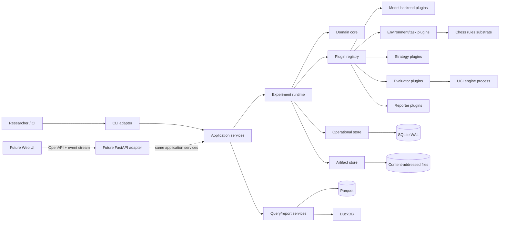
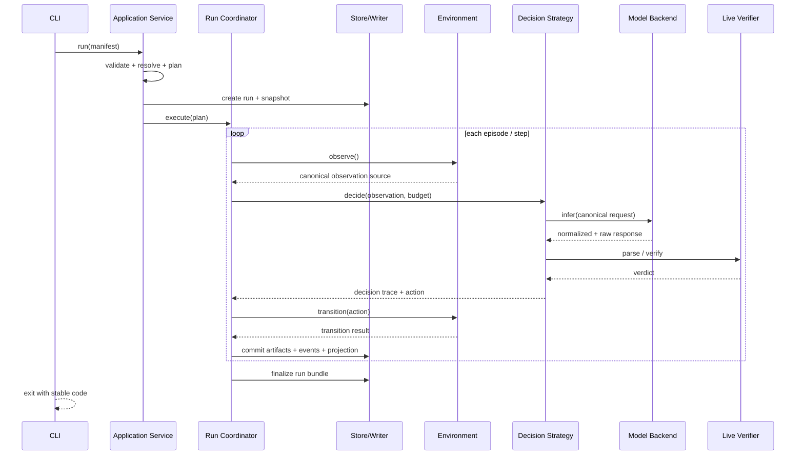
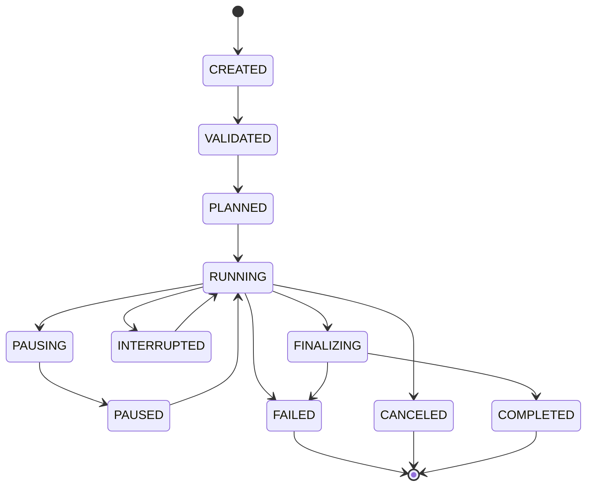

# Zugzwang Research Kernel

## Greenfield Technical Design, System Architecture and ADR Catalogue

**Status:** proposta arquitetural para debate e implementação  
**Versão do documento:** 0.1  
**Data:** 11 de agosto de 2026  
**Escopo de entrega:** kernel local-first, CLI-first, provider-agnostic, modular e reproduzível  
**Fora do corte inicial:** Web UI, serviço multiusuário, treinamento de modelos e execução distribuída

---

## 0. Decisão executiva

O Zugzwang deve nascer como um **kernel aberto de execução experimental e atribuição de competência para sistemas de decisão baseados em modelos**, usando xadrez como primeiro domínio verificável.

Ele não será, no núcleo inicial:

- um bot de xadrez;
- um wrapper de Stockfish;
- uma arena pública;
- um leaderboard que reduz tudo a Elo;
- um framework universal de agentes;
- uma plataforma de RL;
- uma aplicação Web.

A unidade central do produto é um **experimento reproduzível**, composto por protocolo, ambiente, policy, estratégia de inferência, orçamento, assistência, tentativas, artefatos, avaliações e proveniência. O kernel deve conseguir responder não apenas “qual sistema venceu?”, mas:

> Qual componente forneceu qual parcela da competência observada, sob qual interface, assistência, orçamento, distribuição e política de falha?

A arquitetura recomendada é:

- **monólito modular com arquitetura hexagonal**, não microserviços;
- **monorepo em workspace `uv`**, sem fragmentação gratuita em dezenas de distribuições;
- **Python 3.13 como piso inicial**, com uma pequena ilha Rust apenas se a decisão de licença do core enxadrístico exigir;
- **CLI fina em Typer**, chamando os mesmos application services que uma API futura chamará;
- **runner assíncrono, explícito e retomável**, construído no projeto, sem LangGraph, Temporal, Celery ou Ray no v0.1;
- **SQLite em WAL como banco operacional local**, com um único writer coordenado;
- **artefatos endereçados por conteúdo em filesystem**, sem despejar prompts e respostas gigantes no banco;
- **Parquet + DuckDB para análise**, separados do banco transacional;
- **contrato próprio de provider**, com Pydantic AI Direct Model Requests como adapter inicial e um adapter OpenAI-compatible direto;
- **estratégias agentic explícitas**, sem entregar a semântica científica a um loop de agente de terceiros;
- **event log append-only como trilha científica**, mas sem adotar event sourcing integral para todo o domínio;
- **plugins via Python entry points**, inicialmente first-party e executados no processo;
- **Stockfish sempre atrás de uma fronteira UCI explícita**, preferencialmente pós-hoc; uso live eleva a classe de assistência;
- **separação rígida entre verificação formal e assistência estratégica**;
- **Apache-2.0 como licença recomendada para o kernel**, condicionada à escolha consciente de uma biblioteca enxadrística permissiva.

A decisão de maior impacto e maior custo de reversão é a biblioteca de regras do xadrez. `python-chess` entrega maturidade excepcional, porém é GPL-3.0+. Usá-la como dependência distribuída empurra o projeto para uma estratégia copyleft. Para um kernel que pretende ser embutido em ferramentas acadêmicas, comerciais e comunitárias, a recomendação arquitetural é manter o kernel Apache-2.0 e usar uma implementação permissiva de regras, mesmo aceitando um pouco mais de engenharia inicial.

---

## 1. Fundamentação científica que determina a arquitetura

O projeto parte de uma constatação metodológica: “LLM jogando xadrez” descreve sistemas materialmente diferentes. O resultado observado pode conter, em proporções distintas:

- parsing da representação;
- reconstrução de estado;
- domínio das regras;
- geração de candidatos;
- simulação de variantes;
- função de valor;
- busca;
- escolha final;
- formatação;
- memória multi-turn;
- retries;
- action grounding;
- engines e verificadores externos.

A literatura revisada no dossiê-base mostra que interface, histórico, legal moves, notação, ferramentas, retry, reasoning budget e assistência externa podem alterar substancialmente os resultados. Ela também mostra que tracking, legalidade, decisão, busca e fidelidade da explicação são capacidades diferentes. Portanto, a arquitetura não pode modelar tudo como um objeto genérico chamado `Agent` e depois publicar apenas uma taxa de vitória.

As consequências arquiteturais são obrigatórias:

1. **O protocolo faz parte do dado experimental.** Prompt, representação, legal moves, retries, ferramentas e orçamento não são detalhes de implementação.
2. **O harness é uma variável independente.** Alterar o harness cria outra condição experimental.
3. **Verificar legalidade não equivale a avaliar qualidade.** O primeiro preserva o mundo formal; o segundo injeta competência enxadrística.
4. **O estado canônico pertence ao ambiente.** O modelo pode ser testado por reconstruí-lo, mas não pode ser a autoridade silenciosa do jogo.
5. **Resultados precisam carregar proveniência.** Uma métrica sem evaluator, versão, configuração e regime é um número órfão.
6. **Não existe um único Elo universal de LLM.** O sistema deve favorecer vetores de capacidade e relatórios condicionados ao protocolo.
7. **OOD é parte do design, não um apêndice.** O kernel precisa permitir posições temporais, random-legal, Chess960 e transformações, mesmo que nem todas entrem no v0.1.
8. **Reprodutibilidade tem níveis.** APIs proprietárias mutáveis não permitem prometer repetição bit a bit; permitem auditoria, replay e rerun condicionado à disponibilidade do snapshot.

### 1.1 Taxonomia de assistência incorporada ao kernel

O manifesto e os eventos devem carregar uma classe de assistência declarada e uma classe efetivamente observada:

| Classe | Assistência | Atribuição correta |
|---|---|---|
| H0 | parsing/formato | modelo + parser |
| H1 | checagem de regras | modelo + rules verifier |
| H2 | ambiente executa estado e transição | policy sobre ambiente canônico |
| H3 | conjunto de ações legais é fornecido | grounded policy |
| H4 | busca apenas com modelos | model-only inference system |
| H5 | engine avalia candidatos | engine-critic system |
| H6 | engine gera candidatos | engine-assisted policy |
| H7 | engine escolhe a ação | LLM como interface/explicador |

**Regra arquitetural:** qualquer ferramenta ou evaluator live possui um `assistance_impact`. A classe efetiva do run é calculada a partir do que realmente ocorreu. Se o experimento declarar H2 e uma tool H5 for usada, o run é marcado como **protocol violation**, não silenciosamente promovido a um resultado “melhor”.

### 1.2 Regimes de inferência como estratégias versionadas

O sistema deve reconhecer regimes comparáveis, sem confundir estratégia com provider:

| ID | Regime | Situação no roadmap |
|---|---|---|
| R0 | chamada direta, estado → ação | v0.1 |
| R1 | estado grounded + ações legais | v0.1 |
| R2 | repair apenas de parsing/legalidade | v0.1 |
| R3 | análise estruturada → candidatos → decisão | v0.1 |
| R4 | Best-of-N com seleção model-only | depois do núcleo |
| R5 | debate e árbitro cego | adiado |
| R6 | tree search model-only | adiado |
| R7 | memória/RAG sem engine online | adiado |
| R8 | engine critic live | plugin posterior, leaderboard separado |
| R9 | engine fornece top-k | plugin posterior, leaderboard separado |

O kernel não precisa codificar esses IDs como uma enumeração eternamente fechada. Ele deve registrar `strategy_id`, `strategy_version`, `declared_regime` e o grafo de eventos produzido. Os IDs funcionam como taxonomia científica, não como limite de extensão.

---

## 2. Identidade do produto

### 2.1 Definição

**Zugzwang Research Kernel** é uma infraestrutura local-first para descrever, executar, retomar, auditar, avaliar e comparar experimentos agentic em ambientes verificáveis, começando por xadrez.

### 2.2 Usuários primários

1. **Pesquisador de LLMs:** compara modelos, prompts, ferramentas e test-time compute.
2. **Engenheiro de agentes:** testa providers, estratégias, retries, custo e robustez.
3. **Autor de benchmark:** publica suites e protocolos reproduzíveis.
4. **Autor de modelo especializado:** adiciona uma policy local como baseline.
5. **Mantenedor de plugin:** integra provider, environment, evaluator ou reporter.
6. **CI de pesquisa:** reproduz smoke suites sem intervenção humana.

### 2.3 Proposta de valor

O valor não está em tornar fácil chamar um modelo. Isso já é commodity. O valor está em tornar difícil publicar um resultado metodologicamente ambíguo.

O Zugzwang deve oferecer:

- manifesto rigoroso;
- capacidade negotiation;
- execução retomável;
- budget accounting;
- artefatos auditáveis;
- classes de assistência;
- eventos por tentativa;
- separação live/post-hoc;
- imports e exports estáveis;
- avaliação com proveniência;
- comparação honesta entre sistemas diferentes.

### 2.4 Princípios

1. **Attribution-first:** toda competência externa deve ficar visível.
2. **Artifact-first:** resultados são bundles portáveis, não apenas linhas numa base local.
3. **Local-first:** um pesquisador executa tudo sem servidor permanente.
4. **Explicit over magical:** nenhum retry, fallback, tool ou coercion escondido.
5. **Protocol as data:** o experimento resolvido é imutável e hashável.
6. **Core small, edges extensible:** o kernel contém contratos; integrações vivem nas bordas.
7. **Replay before rerun:** primeiro ser capaz de reanalisar chamadas existentes, depois repetir custosamente APIs.
8. **Fail closed:** ausência de capability ou inconsistência metodológica interrompe por padrão.
9. **Scientific events are not logs:** a trilha experimental não depende de uma plataforma de observabilidade.
10. **Chess-first, not chess-trapped:** generalizar apenas contratos que já possuem um segundo uso plausível.

---

## 3. Objetivos, não objetivos e critérios de fronteira

### 3.1 Objetivos do v0.1

- executar experimentos de move selection, state reconstruction e partidas completas;
- suportar ao menos dois caminhos de provider: adapter multi-provider e OpenAI-compatible direto;
- oferecer R0–R3;
- suportar random legal, outra policy e engine UCI como oponentes;
- validar parsing, legalidade e transição determinística;
- avaliar partidas pós-hoc com engine UCI;
- persistir, retomar e exportar runs;
- medir chamadas, tokens, latência, retries e custo;
- produzir JSON/JSONL/Parquet/PGN e relatório Markdown/terminal;
- funcionar integralmente por CLI;
- permitir plugins first-party sem modificar o core;
- deixar uma API futura como adapter, não como reescrita.

### 3.2 Não objetivos do v0.1

- Web UI;
- daemon obrigatório;
- REST API pública;
- autenticação e multi-tenancy;
- scheduler distribuído;
- execução em cluster;
- treinamento, SFT, RLVR ou fine-tuning;
- vector database e RAG;
- arbitrary shell/code tools;
- multiagent debate;
- MCTS/model-only tree search;
- public leaderboard;
- marketplace de plugins;
- suporte amplo a variantes;
- ingestão completa de PGN com árvores, comentários e NAGs;
- garantia de reprodução bit a bit de APIs proprietárias;
- abstração universal para todos os jogos e ambientes RL.

### 3.3 Regra para evitar genericidade prematura

Uma abstração entra no `zugzwang-core` somente quando:

1. não contém termos específicos de xadrez;
2. possui pelo menos dois consumidores concretos, ou é fundamental para o protocolo;
3. reduz acoplamento real, não apenas embeleza UML;
4. pode ser testada sem provider, banco ou engine;
5. não esconde informação necessária à atribuição científica.

Caso contrário, permanece em `zugzwang-chess` ou no plugin que a necessita.

---

## 4. Requisitos funcionais

### 4.1 Workspace, configuração e descoberta

| ID | Requisito | Aceitação resumida |
|---|---|---|
| FR-001 | Inicializar workspace local | `zgw init` cria layout e config sem servidor |
| FR-002 | Validar manifesto | erro aponta caminho, valor, schema e sugestão |
| FR-003 | Exportar JSON Schema | schema versionado para tooling externo |
| FR-004 | Resolver manifesto | defaults, plugins, capabilities e preços ficam congelados |
| FR-005 | Planejar sem executar | mostra episódios, chamadas previstas, budget e incompatibilidades |
| FR-006 | Expandir matrizes | `product` e `zip` determinísticos, com IDs estáveis por condição |
| FR-007 | Descobrir plugins | entry points locais, sem consulta de rede |
| FR-008 | Inspecionar capabilities | provider/model/tool/evaluator exibem suporte declarado |

### 4.2 Execução

| ID | Requisito | Aceitação resumida |
|---|---|---|
| FR-009 | Criar run imutável | `ResolvedManifest` não muda após início |
| FR-010 | Executar episódios concorrentes | limites por provider e budget são respeitados |
| FR-011 | Executar R0–R3 | cada estratégia produz trace explícito |
| FR-012 | Chamar modelos por contrato comum | request/response normalizados e raw preservado quando disponível |
| FR-013 | Executar tools tipadas | input validado, output versionado, side effect declarado |
| FR-014 | Aplicar ação somente pelo environment | model/tool não muta estado canônico diretamente |
| FR-015 | Validar parsing e legalidade | parse error e illegal action são categorias distintas |
| FR-016 | Registrar toda tentativa | transporte, throttling, parse e retry sem sobrescrita |
| FR-017 | Impor budgets | calls, tokens, USD, wall time e retries possuem limites |
| FR-018 | Impor rate limits | semáforos/token buckets por backend/modelo |
| FR-019 | Cancelar/interromper | `Ctrl-C` gera checkpoint consistente |
| FR-020 | Retomar | steps já commitados não são repetidos |
| FR-021 | Finalizar idempotentemente | repetir finalização não duplica métricas ou artefatos |

### 4.3 Xadrez

| ID | Requisito | Aceitação resumida |
|---|---|---|
| FR-022 | Manter estado integral | posição, lado, roque, en passant, contadores e repetição |
| FR-023 | Codificar observações | FEN, ASCII, histórico e combinações configuráveis |
| FR-024 | Codificar ações | UCI canônico; SAN apenas como codec de interface |
| FR-025 | Enumerar ações legais | conjunto e hash reproduzíveis |
| FR-026 | Suportar ações opacas | índices sem leakage semântico opcional |
| FR-027 | Partidas completas | termination e resultado formalmente verificados |
| FR-028 | Move selection | posição fixa com candidatos livres ou grounded |
| FR-029 | State reconstruction | comparar estado previsto ao canônico |
| FR-030 | Aberturas pareadas | mesma abertura com cores invertidas |
| FR-031 | Oponentes plugáveis | random legal, policy, script/replay e UCI engine |
| FR-032 | Exportar PGN estrito | partida principal reproduzível, sem exigir parser rico |

### 4.4 Persistência, artefatos e replay

| ID | Requisito | Aceitação resumida |
|---|---|---|
| FR-033 | Persistir estado operacional | SQLite local com migrations |
| FR-034 | Registrar eventos append-only | envelope versionado e sequência monotônica por agregado |
| FR-035 | Armazenar blobs por conteúdo | SHA-256, escrita atômica e deduplicação |
| FR-036 | Produzir run bundle | manifesto, eventos, objetos, métricas e checksums |
| FR-037 | Importar bundle | valida schema e checksums antes de registrar |
| FR-038 | Replay offline | parsing, transição e avaliação podem ser refeitos sem provider |
| FR-039 | Garbage collection segura | remove apenas objetos não referenciados após grace period |
| FR-040 | Doctor | detecta dangling refs, órfãos, migrations e engines inválidos |

### 4.5 Avaliação e relatórios

| ID | Requisito | Aceitação resumida |
|---|---|---|
| FR-041 | Avaliação pós-hoc | engine não entra no decision loop por acidente |
| FR-042 | Métrica com proveniência | definição, versão, source, config e scope |
| FR-043 | Métricas operacionais | latency, calls, tokens, retries, failures, custo |
| FR-044 | Métricas enxadrísticas | outcome, legal rate, CPL/ACPL, blunders e fase |
| FR-045 | Estatística pareada | bootstrap por pares/openings quando aplicável |
| FR-046 | Consultar via DuckDB | Parquet sem depender do SQLite operacional |
| FR-047 | Saída humana e machine-readable | terminal/Markdown e JSON/JSONL/Parquet |
| FR-048 | Separar classes de sistema | model-only, grounded e engine-assisted nunca agregados juntos |

### 4.6 Segurança e governança

| ID | Requisito | Aceitação resumida |
|---|---|---|
| FR-049 | Secret references | segredos não entram no manifesto resolvido ou bundle |
| FR-050 | Redaction | logs e raw artifacts passam por política explícita |
| FR-051 | Tool allowlist | nenhuma execução arbitrária por padrão |
| FR-052 | Auditoria de assistência | classe declarada, observada e violações registradas |
| FR-053 | Auditoria de plugins | versão, distribuição, licença e hash do ambiente |
| FR-054 | Base URL confiável | endpoints customizados exigem opt-in explícito |
| FR-055 | Engine sandbox | timeout, env mínimo e resource limits quando suportados |

---

## 5. Requisitos não funcionais

| ID | Propriedade | Meta/critério |
|---|---|---|
| NFR-001 | Correção formal | nenhuma ação ilegal é aplicada ao ambiente |
| NFR-002 | Auditabilidade | toda chamada externa possui request, attempts, response/failure e usage |
| NFR-003 | Crash consistency | não pode existir referência commitada para artefato ausente |
| NFR-004 | Retomabilidade | run interrompido retoma do primeiro step incompleto |
| NFR-005 | Reprodutibilidade honesta | níveis de replay/rerun/determinismo são declarados |
| NFR-006 | Extensibilidade | provider/evaluator/environment novo não exige editar o kernel |
| NFR-007 | Core independente | importar `zugzwang.core` não carrega provider, DB, chess, CLI ou engine |
| NFR-008 | Local-first | nenhuma infraestrutura externa além do provider escolhido |
| NFR-009 | Portabilidade | Linux, macOS e Windows onde dependências nativas possuírem wheel |
| NFR-010 | Bounded concurrency | memória e chamadas crescem com limite configurado, não com total de episódios |
| NFR-011 | Backpressure | fila de persistência tem limite e desacelera producers |
| NFR-012 | Sem comportamento oculto | fallback, retry e coercion são desativados ou registrados |
| NFR-013 | Segurança padrão | sem shell, filesystem amplo ou execução de código por modelo |
| NFR-014 | Observabilidade local | JSON logs e eventos bastam sem SaaS proprietário |
| NFR-015 | CI offline | suíte padrão não chama providers nem baixa engine |
| NFR-016 | Compatibilidade de schema | bundle antigo possui leitor/migrator explícito |
| NFR-017 | Qualidade estática | typing estrito, lint, arquitetura e testes no CI |
| NFR-018 | Migração de storage | repositories não expõem SQLAlchemy ao domínio |
| NFR-019 | Idempotência | finalize/evaluate/import podem ser repetidos com mesmo resultado lógico |
| NFR-020 | Performance suficiente | overhead interno não domina chamadas de rede/engine; otimização guiada por profiles |

Não se deve publicar um SLA artificial como “p95 < 20 ms” antes de workloads reais. O critério correto no v0.1 é que o overhead do kernel seja mensurado e permaneça materialmente menor que inferência e avaliação, com benchmarks versionados.

---

## 6. Modelo conceitual do domínio

### 6.1 Vocabulário obrigatório

**ExperimentManifest**  
Intenção declarada pelo autor: condições, task, policy, strategy, protocolo, budget e avaliação.

**ResolvedManifest**  
Manifesto compilado com defaults, versões de plugins, capability resolution, pricing snapshot, paths e hashes. É imutável.

**Experiment**  
Conjunto lógico de condições comparáveis.

**Run**  
Uma execução concreta de uma condição resolvida.

**Episode**  
Unidade independente de interação. Pode ser uma partida, puzzle, reconstrução ou match.

**Step**  
Uma decisão/transição dentro do episode.

**Attempt**  
Uma tentativa concreta de provider, parser, tool ou engine. Retry cria novo attempt.

**Observation**  
Informação entregue a uma policy naquele step.

**Action**  
Decisão proposta e, quando válida, aplicada pelo environment.

**Candidate**  
Ação considerada durante deliberação, com origem e evidências.

**ModelBackend**  
Porta de uma única inferência. Não é agente, policy ou player.

**Policy**  
Transforma observation em distribuição/conjunto de candidatos ou ação.

**DecisionStrategy**  
Coordena chamadas, tools, retries semânticos e seleção.

**Player**  
Policy/strategy vinculada a um papel no environment.

**Environment**  
Autoridade do estado, legalidade, transição e término.

**Task**  
Define como construir episodes, observações, targets e critérios.

**Verifier**  
Checa propriedades durante o loop. Pode afetar o fluxo e a classe de assistência.

**Evaluator**  
Produz métricas, preferencialmente pós-hoc. Não deve alterar a trajetória por padrão.

**Artifact**  
Blob imutável identificado por hash.

**Event**  
Fato científico append-only sobre o que ocorreu.

**MetricObservation**  
Valor medido com definição, provenance e dimensions.

### 6.2 O antiobjeto `Agent`

Não haverá uma classe central onipotente `Agent` contendo provider, prompt, tools, memória, loop, retry, player e evaluator. “Agent” pode aparecer como termo de produto ou composição, mas não deve apagar fronteiras internas.

A composição correta é:

```text
Player
└── DecisionStrategy
    ├── Policy / ModelBackend
    ├── ObservationBuilder
    ├── PromptProgram
    ├── OutputCodec
    ├── ToolBroker
    ├── RetryPolicy
    └── BudgetView
```

Isso permite comparar, por exemplo, o mesmo modelo com R0 e R3 ou a mesma strategy com dois providers sem duplicar a semântica do ambiente.

---

## 7. Arquitetura de contexto



### 7.1 Regra de dependência

```text
adapters (CLI / future API)
            ↓
application services
            ↓
runtime orchestration
            ↓
domain core + ports

plugins ──implement──> ports
persistence ──implements──> repositories
chess ──implements──> environment/task contracts
```

O domínio não importa:

- Typer;
- SQLAlchemy;
- Pydantic AI;
- FastAPI;
- DuckDB;
- Stockfish;
- biblioteca de xadrez concreta.

### 7.2 Fluxo de execução



---

## 8. Monorepo e limites de pacote

### 8.1 Layout recomendado

```text
zugzwang/
├── pyproject.toml                  # workspace, dev tooling, constraints
├── uv.lock
├── README.md
├── LICENSE
├── CONTRIBUTING.md
├── SECURITY.md
├── schemas/                        # JSON Schemas exportados e versionados
├── docs/
│   ├── architecture/
│   ├── adr/
│   ├── protocol/
│   └── research/
├── packages/
│   ├── zugzwang-core/
│   │   ├── pyproject.toml
│   │   └── src/zugzwang_core/
│   │       ├── domain/
│   │       ├── ports/
│   │       ├── spec/
│   │       └── events/
│   ├── zugzwang-runtime/
│   │   ├── pyproject.toml
│   │   └── src/zugzwang_runtime/
│   │       ├── application/
│   │       ├── execution/
│   │       ├── persistence/
│   │       ├── artifacts/
│   │       ├── budgets/
│   │       └── observability/
│   ├── zugzwang-chess/
│   │   ├── pyproject.toml
│   │   ├── rust/                   # somente se a ADR de licença escolher PyO3
│   │   └── src/zugzwang_chess/
│   │       ├── environment/
│   │       ├── tasks/
│   │       ├── codecs/
│   │       ├── opponents/
│   │       └── suites/
│   └── zugzwang-cli/
│       ├── pyproject.toml
│       └── src/zugzwang_cli/
│           ├── commands/
│           ├── rendering/
│           └── main.py
├── plugins/
│   ├── provider-pydantic-ai/
│   ├── provider-openai-compatible/
│   ├── evaluator-stockfish/
│   └── reporter-parquet/
├── experiments/                    # exemplos e smoke protocols
├── fixtures/
├── tests/
│   ├── unit/
│   ├── architecture/
│   ├── contract/
│   ├── integration/
│   ├── fault/
│   ├── compatibility/
│   └── e2e/
└── dev/
    ├── scripts/
    └── containers/
```

### 8.2 Por que não um pacote por pasta conceitual

Um monorepo modular não precisa virar um arquipélago de vinte pacotes PyPI. O corte recomendado usa quatro pacotes principais e poucos plugins porque cada fronteira possui um motivo operacional:

- `core` pode ser importado e testado sem I/O;
- `runtime` traz persistência e execução;
- `chess` é o primeiro domínio e pode evoluir sem contaminar o kernel;
- `cli` é adapter substituível;
- providers/evaluators carregam dependências opcionais e ciclos de release próprios.

Separar `spec`, `events`, `budgets` e `artifacts` em distribuições independentes desde o primeiro commit aumentaria version choreography, boilerplate e atrito de contribuição sem entregar isolamento real.

### 8.3 Grafo permitido

```text
zugzwang-core
    ↑
zugzwang-runtime
    ↑             ↖
zugzwang-cli       plugins/*
    ↑             ↗
zugzwang-chess
```

Mais precisamente:

- `core` depende apenas de stdlib, Pydantic e pequenas bibliotecas sem I/O quando justificadas;
- `runtime` depende de `core`, SQLAlchemy/Alembic e utilitários operacionais;
- `chess` depende de `core`, não de `runtime` salvo integration helpers claramente separados;
- `cli` depende de `runtime`, `chess` e plugins first-party;
- plugins dependem dos ports públicos, nunca de módulos privados do runtime.

Architecture tests devem falhar no CI se uma dependência proibida surgir.

---

## 9. Arquitetura interna por camada

### 9.1 Domain core

Responsabilidades:

- identidades e estados;
- invariantes;
- manifests e DTOs públicos;
- contratos/ports;
- envelopes de eventos;
- taxonomia de assistance e failure;
- state machines puras.

Não contém:

- filesystem;
- SQL;
- chamadas HTTP;
- subprocessos;
- rendering de terminal;
- regra de xadrez concreta.

### 9.2 Application services

Casos de uso:

- `ValidateManifest`;
- `ResolveExperiment`;
- `PlanExperiment`;
- `StartRun`;
- `ResumeRun`;
- `CancelRun`;
- `EvaluateRun`;
- `ExportRunBundle`;
- `ImportRunBundle`;
- `ReplayEpisode`;
- `QueryRuns`;
- `DoctorWorkspace`.

Eles recebem commands/queries tipados, coordenam ports e retornam DTOs. Não imprimem terminal e não conhecem HTTP.

### 9.3 Runtime

Responsabilidades:

- scheduler local;
- concorrência e backpressure;
- state machines de run/episode/step;
- retries operacionais;
- budgets;
- checkpoint;
- commit protocol;
- event emission;
- finalização.

### 9.4 Adapters

- CLI;
- SQLite repositories;
- filesystem CAS;
- provider adapters;
- UCI engine adapter;
- report exporters;
- futura API.

### 9.5 Padrão de tipos

Recomendação:

- `dataclass(frozen=True, slots=True)` para value objects e domínio comportamental;
- Pydantic v2 estrito para manifests, events, requests, plugin configs e DTOs de fronteira;
- SQLAlchemy rows não atravessam repositories;
- provider SDK types não atravessam adapters;
- chess-library types não atravessam `zugzwang-chess` public contracts.

Isso evita o anti-pattern de usar um único objeto como payload de API, modelo de banco, configuração e entidade de domínio.

---

## 10. Runtime de execução

### 10.1 Modelo de processo

O v0.1 executa em **um único processo CLI**, com um event loop `asyncio`:

- episodes são tasks concorrentes;
- chamadas de provider são assíncronas;
- subprocessos UCI usam interface assíncrona;
- um `RunCoordinator` controla cancelamento e budgets;
- um único `PersistenceWriter` recebe commands por fila limitada;
- trabalhos CPU-bound ocasionais podem usar process pool explícito;
- não existe daemon secreto após o comando retornar.

Esse desenho aproveita concorrência de I/O sem importar a complexidade de um sistema distribuído.

### 10.2 Por que um único writer

SQLite em WAL permite readers simultâneos, mas continua possuindo um único writer por vez. Em vez de deixar dezenas de tasks disputarem locks e criarem retries opacos de banco, o runtime adota um writer lógico:

```text
Episode task A ─┐
Episode task B ─┼── bounded queue ──> PersistenceWriter ──> SQLite + CAS
Episode task C ─┘
```

Benefícios:

- ordem clara de commits;
- backpressure natural;
- menos `database is locked`;
- transações pequenas;
- um local para invariantes de persistência;
- caminho simples para trocar SQLite por Postgres posteriormente.

Custo:

- o writer pode virar gargalo em workloads extremos;
- exige mensagens de persistência explícitas;
- uma operação de banco lenta atrasa producers.

No escopo inicial, provider e engine dominam o tempo. Otimizar writers distribuídos antes de medir seria engenharia de fumaça.

### 10.3 State machine do run



Transições inválidas são rejeitadas pelo domínio. `FAILED` não significa que todos os episodes falharam; significa que o run não cumpriu sua política mínima de conclusão. Episodes individuais carregam seus próprios outcomes.

### 10.4 State machine do step

```text
PENDING
  -> OBSERVING
  -> DECIDING
  -> VERIFYING
  -> APPLYING
  -> COMMITTED

qualquer estágio pré-commit
  -> RETRYABLE_FAILURE
  -> DECIDING/VERIFYING conforme policy

qualquer estágio
  -> TERMINAL_FAILURE | CANCELED
```

A fronteira crítica é `COMMITTED`. Depois dela, resume não repete a chamada do modelo nem reaplica a ação.

### 10.5 Protocolo de commit entre filesystem e banco

Filesystem e SQLite não compartilham uma transação. O protocolo recomendado é:

1. serializar o artefato em arquivo temporário;
2. calcular SHA-256 durante a escrita;
3. `fsync` quando a política de durabilidade exigir;
4. rename atômico para o caminho CAS;
5. abrir transação SQL;
6. inserir/confirmar registro do artefato;
7. anexar eventos;
8. atualizar projection/state;
9. commit SQL.

Consequência:

- crash entre 4 e 5 pode criar **artefato órfão**, seguro e removível por GC;
- não pode criar **referência dangling**, que seria corrupção lógica;
- finalização e GC precisam ser idempotentes.

### 10.6 Retomada

Resume não significa “reexecutar o Python a partir de uma linha”. Significa reconstruir a state machine a partir de projections + eventos:

- localizar episodes não terminais;
- encontrar primeiro step não `COMMITTED`;
- verificar artefatos referenciados;
- reabrir environment a partir de snapshot + ações commitadas;
- reconstituir budget ledger;
- continuar com novos attempts.

Uma chamada de provider concluída e commitada nunca é repetida. Uma chamada que pode ter chegado ao provider, mas cuja resposta não foi commitada, é marcada `outcome_unknown`. Uma nova tentativa recebe outro ID e o relatório torna a ambiguidade visível.

### 10.7 Idempotência e nondeterminismo

- requests recebem `call_id` e fingerprint;
- idempotency key do provider é usada quando disponível;
- retries de transporte não são confundidos com retries semânticos;
- seeds são derivados por `run_seed + condition_index + episode_index`, não pela ordem de scheduling;
- timestamps não entram no hash semântico do protocolo;
- concorrência pode mudar tempos e ordem global de eventos, mas não IDs ou seeds de episodes.

### 10.8 Budget engine

Budgets suportados:

```text
run
├── max_calls
├── max_input_tokens
├── max_output_tokens
├── max_total_tokens
├── max_usd
├── max_wall_time
├── max_failed_calls
└── max_concurrent_episodes

step/strategy
├── max_attempts
├── max_model_calls
├── max_tool_calls
├── max_output_tokens
└── timeout
```

Antes de uma chamada, o ledger reserva uma estimativa conservadora. Depois da resposta, reconcilia usage real. Se usage não vier do provider, o valor fica `estimated`, nunca falsamente `actual`.

### 10.9 Concorrência e rate limiting

Cada backend/modelo pode declarar:

- `max_concurrency`;
- requests/minute;
- tokens/minute;
- burst;
- cooldown após 429;
- prioridade entre runs, no futuro.

O v0.1 usa semáforos e token buckets no processo. Distributed rate limiting é adiado até existir execução multi-processo real.

---

## 11. Persistência e arquitetura de dados

### 11.1 Três planos de dados

O projeto separa três necessidades que não devem ser forçadas sobre o mesmo storage:

| Plano | Tecnologia | Função |
|---|---|---|
| Operacional | SQLite WAL | estado corrente, jobs, índices, budgets, migrations |
| Evidência | CAS filesystem + JSONL comprimido | prompts, responses, tool outputs, logs científicos, bundles |
| Analítico | Parquet + DuckDB | scans, agregações, comparação e relatórios |

### 11.2 Workspace local

```text
.zugzwang/
├── config.toml
├── state.db
├── state.db-wal
├── state.db-shm
├── objects/
│   └── sha256/
│       └── ab/cd/abcdef...
├── runs/
│   └── <run-id>/
│       ├── manifest.source.yaml
│       ├── manifest.resolved.json
│       ├── environment.json
│       ├── plugins.json
│       ├── events.jsonl.zst
│       ├── artifacts/
│       ├── metrics/
│       │   └── metrics.parquet
│       ├── exports/
│       │   └── games.pgn
│       └── checksums.sha256
├── cache/
├── tmp/
└── locks/
```

O diretório deve estar em filesystem local. SQLite WAL não é apropriado para múltiplos hosts escrevendo em network filesystem.

### 11.3 Banco operacional

Tabelas propostas:

#### `experiments`

- `experiment_id`;
- `name`;
- `source_manifest_artifact_id`;
- `created_at`;
- `tags_json`.

#### `runs`

- `run_id`;
- `experiment_id`;
- `condition_id`;
- `status`;
- `resolved_manifest_artifact_id`;
- `protocol_hash`;
- `declared_assistance`;
- `effective_assistance`;
- `started_at`, `finished_at`;
- `failure_code`;
- `projection_version`.

#### `episodes`

- `episode_id`;
- `run_id`;
- `ordinal`;
- `task_type`;
- `seed`;
- `status`;
- `result`;
- `initial_state_artifact_id`;
- `final_state_artifact_id`.

#### `steps`

- `step_id`;
- `episode_id`;
- `ordinal`;
- `actor_id`;
- `status`;
- `observation_artifact_id`;
- `action_json`;
- `transition_artifact_id`;
- `committed_at`.

#### `attempts`

- `attempt_id`;
- `step_id`;
- `kind`;
- `ordinal`;
- `status`;
- `request_artifact_id`;
- `response_artifact_id`;
- `failure_code`;
- `latency_ms`;
- `usage_json`;
- `cost_json`.

#### `events`

- `event_id`;
- `run_id`, `episode_id`, `step_id`, `attempt_id` opcionais;
- `stream_type`, `stream_id`;
- `sequence_no`;
- `event_type`;
- `event_version`;
- `occurred_at`;
- `payload_json` ou `payload_artifact_id`;
- `trace_id`.

#### `artifacts`

- `artifact_id` igual ao digest canônico;
- `algorithm`;
- `size_bytes`;
- `media_type`;
- `compression`;
- `relative_path`;
- `created_at`;
- `redaction_policy`;
- `encryption_state` futuro.

#### `metric_observations`

- `metric_observation_id`;
- `run_id`, `episode_id`, `step_id` opcionais;
- `metric_definition_id`;
- `value_num`, `value_text`, `value_json` mutuamente controlados;
- `unit`;
- `dimensions_json`;
- `provenance_artifact_id`;
- `evaluator_id`, `evaluator_version`.

#### `budget_ledger`

- reservation e reconciliation por call;
- unidade;
- estimated/actual;
- provider pricing snapshot.

#### `checkpoints`

- stream/agregado;
- sequence commitada;
- artifact snapshot opcional;
- schema version.

### 11.4 SQLAlchemy: Core, não ORM mágico

Recomendação:

- SQLAlchemy 2 Core;
- statements explícitos;
- repositories pequenos;
- transações explícitas;
- Alembic para migrations;
- sem lazy loading;
- sem entidades do domínio anexadas a sessões;
- sem `Base.metadata.create_all()` como estratégia de produção.

O objetivo é preservar a porta para Postgres sem permitir que a abstração de banco invada o domínio.

### 11.5 Event log, mas não event sourcing integral

O Zugzwang precisa de eventos científicos append-only, porém não precisa reconstruir absolutamente todo o estado operacional reexecutando eventos desde o gênesis.

Decisão:

- eventos são a trilha de auditoria e export;
- tabelas `runs`, `episodes`, `steps` são projections autoritativas para operação;
- atualizações de projection e append de evento ocorrem na mesma transação SQL;
- projection pode ser reconstruída para auditoria, mas isso não é o único caminho de leitura;
- eventos de alto volume podem apontar para payloads no CAS.

Isso evita transformar o projeto em uma tese sobre event sourcing em vez de uma ferramenta de pesquisa.

### 11.6 Envelope de evento

```json
{
  "schema_version": "zgw.event/v1alpha1",
  "event_id": "evt_...",
  "event_type": "provider.call.completed",
  "event_version": 1,
  "occurred_at": "2026-08-11T06:15:20.123Z",
  "stream": {
    "type": "step",
    "id": "step_...",
    "sequence": 17
  },
  "context": {
    "run_id": "run_...",
    "episode_id": "ep_...",
    "step_id": "step_...",
    "attempt_id": "att_...",
    "trace_id": "..."
  },
  "payload": {
    "backend_id": "pydantic-ai",
    "provider": "example-provider",
    "model_requested": "model-alias",
    "model_reported": "model-snapshot",
    "request_artifact": "sha256:...",
    "response_artifact": "sha256:...",
    "usage": {
      "input_tokens": 2032,
      "output_tokens": 411,
      "source": "provider"
    },
    "latency_ms": 4821
  }
}
```

### 11.7 CAS

Decisão:

- SHA-256 como identidade canônica;
- path sharding por prefixo;
- media type obrigatório;
- compressão Zstandard quando útil;
- conteúdo imutável;
- deduplicação natural;
- metadata mutável fica no DB, não no objeto;
- symlinks não são aceitos em import;
- export materializa hardlinks/cópias de forma portátil.

BLAKE3 seria mais rápido, mas SHA-256 possui ubiquidade, ferramentas nativas e menor custo de interoperabilidade. O volume inicial não justifica outra dependência criptográfica para identidade.

### 11.8 Run bundle

Um run concluído precisa sobreviver ao banco local. O bundle contém:

```text
run-bundle/
├── bundle.json
├── manifest.source.yaml
├── manifest.resolved.json
├── runtime-snapshot.json
├── plugin-snapshot.json
├── pricing-snapshot.json
├── events.jsonl.zst
├── artifacts/
├── metrics.parquet
├── episodes.parquet
├── attempts.parquet
├── games.pgn
└── checksums.sha256
```

`bundle.json` declara schema, completeness, redactions, missing raw data e reprodução possível.

### 11.9 Rebuild e import

O banco é uma conveniência operacional. Um bundle válido pode:

- ser consultado diretamente;
- ser importado em outro workspace;
- reconstruir projections;
- rodar novos evaluators;
- gerar relatórios sem chamar o modelo.

### 11.10 Quando migrar para Postgres

Triggers objetivos:

- daemon multiusuário;
- writers concorrentes em processos/hosts diferentes;
- execução remota;
- fila central compartilhada;
- auth e tenant boundaries;
- workspace em network filesystem;
- volume de escrita medido que satura o writer único.

Até lá, Postgres imporia provisioning, credenciais, containers e manutenção sem melhorar o experimento local.

---

## 12. Arquitetura de providers

### 12.1 Princípio

O Zugzwang deve possuir seu próprio contrato estável de inferência. Frameworks e SDKs são adapters substituíveis.

```python
class ModelBackend(Protocol):
    @property
    def descriptor(self) -> BackendDescriptor: ...

    async def inspect_capabilities(
        self,
        model: ModelRef,
    ) -> CapabilityReport: ...

    async def infer(
        self,
        request: ModelRequest,
        context: CallContext,
    ) -> ModelResponse: ...
```

O contrato representa **uma chamada**, não um loop agentic.

### 12.2 Canonical request

```python
class ModelRequest(BaseModel):
    schema_version: Literal["zgw.model-request/v1alpha1"]
    model: ModelRef
    messages: tuple[Message, ...]
    tools: tuple[ToolDefinition, ...] = ()
    output_constraint: OutputConstraint
    inference: InferenceSettings
    required_capabilities: frozenset[Capability]
    preferred_capabilities: frozenset[Capability] = frozenset()
    extensions: dict[str, JsonValue] = {}
    metadata: dict[str, JsonValue] = {}
```

`MessagePart` inicial:

- text;
- JSON data;
- tool call;
- tool result;
- refusal/status;
- image reference reservado para versão posterior.

Não se deve tentar modelar todos os recursos de todos os providers no union comum. O contrato usa:

1. núcleo comum;
2. capability negotiation;
3. `extensions` namespaced, por exemplo `openai.reasoning_effort`;
4. raw artifacts para fidelidade.

### 12.3 Canonical response

Campos mínimos:

- conteúdo normalizado;
- tool calls;
- stop reason canônico e raw;
- provider/model solicitados;
- modelo reportado pelo provider;
- request ID;
- usage com fonte;
- timestamps;
- raw response artifact;
- adapter version;
- warnings de normalização;
- `wire_fidelity` (`full`, `partial`, `reconstructed`, `unavailable`).

### 12.4 Capability negotiation

Capabilities iniciais:

```text
text_input
json_schema_output
tool_calling
parallel_tool_calls
streaming
seed
reasoning_control
prompt_caching
usage_reporting
cost_reporting
logprobs
multimodal_image
batch
idempotency_key
```

Manifesto:

```yaml
model:
  backend: pydantic-ai
  provider: example
  model: model-alias
  capabilities:
    required:
      - json_schema_output
    preferred:
      - usage_reporting
    on_unsupported: fail
```

Políticas possíveis:

- `fail` recomendado;
- `emulate` somente com transformação explicitamente registrada;
- `degrade` apenas para experimentos exploratórios e com noncomparable flag.

### 12.5 Adapter recomendado: Pydantic AI Direct Model Requests

A escolha não é “construir o Zugzwang em Pydantic AI”. É usar a camada de **Direct Model Requests** como substrate de integração de providers, atrás do contrato do Zugzwang.

Usar:

- model/provider adapters;
- tradução de mensagens;
- structured outputs quando transparentes;
- transporte e tipos úteis.

Não usar como semântica do kernel:

- `Agent` loop;
- retries automáticos de validação;
- fallback model;
- durable execution;
- graph runtime;
- eval framework;
- memória;
- MCP tool orchestration.

Motivo: esses elementos são justamente variáveis que o Zugzwang precisa controlar e atribuir. Se ficarem dentro de outro framework, o experimento ganha um porão metodológico.

Mitigações:

- versão pinada no lockfile;
- contract tests com fixtures;
- adapter converte para tipos próprios;
- nenhum tipo Pydantic AI escapa do plugin;
- attempts/retries internos do SDK são desativados quando possível;
- mudanças aditivas de message parts falham de forma explícita até serem mapeadas.

### 12.6 Adapter OpenAI-compatible direto

Um adapter `httpx` direto é first-party porque endpoints OpenAI-compatible são comuns em:

- vLLM;
- SGLang;
- Ollama e gateways compatíveis;
- servidores locais;
- proxies internos.

Ele serve como:

- caminho mínimo sem framework intermediário;
- baseline para detectar normalização do adapter multi-provider;
- integração de modelos self-hosted;
- escape hatch quando Pydantic AI não expõe uma feature.

Não significa assumir que todo provider “OpenAI-compatible” é semanticamente idêntico. O adapter possui profiles e capability probes.

### 12.7 LiteLLM como plugin opcional

LiteLLM oferece cobertura ampla, proxy, routing, fallback e cost tracking. Justamente por isso não deve ser obrigatório no core.

Uso recomendado:

- bridge para long tail de providers;
- integração com infraestrutura já existente;
- proxy corporativo;
- experimentos explicitamente definidos como `backend=litellm`.

Riscos:

- normalização adicional;
- retries/fallbacks escondidos pela configuração do proxy;
- identidade real do provider/model pode ficar difusa;
- custos e capabilities podem ser estimados de forma diferente;
- dificuldade de capturar request raw final.

### 12.8 Native adapters

Criar adapter nativo quando pelo menos uma condição ocorrer:

- recurso científico não representado pelo adapter geral;
- raw fidelity insuficiente;
- reasoning controls importantes;
- streaming/tool events necessários;
- usage ou caching metadata perdida;
- divergência de semântica gera resultados diferentes.

Não criar um SDK por provider por reflexo. Isso transforma o projeto em manutenção de APIs em vez de ciência de sistemas.

### 12.9 Retries

Taxonomia:

| Tipo | Exemplo | Mesmo request? | Conta como nova inferência científica? |
|---|---|---:|---:|
| transport | conexão interrompida antes da resposta | sim | attempt operacional |
| throttling | 429 | sim | attempt operacional, custo possivelmente zero |
| provider 5xx | indisponibilidade | sim | attempt operacional |
| timeout desconhecido | provider pode ter processado | sim, com novo attempt | ambiguidade registrada |
| parse | JSON/SAN inválido | prompt muda ou feedback | sim |
| legality | ação ilegal | feedback formal | sim |
| strategic critique | engine/model critica | contexto muda | sim e assistência muda |

Nenhuma biblioteca pode realizar retries invisíveis. Se não for possível desativá-los, o adapter declara a limitação no runtime snapshot.

### 12.10 Fallback e routing

Default: **desativado**.

Trocar de modelo após falha altera a identidade do sistema. Fallback só é permitido se o manifesto definir uma policy versionada:

```yaml
routing:
  policy: explicit-fallback/v1
  chain:
    - provider-a:model-x
    - provider-b:model-y
  activation:
    - transport_unavailable
  never_on:
    - content_filter
    - parse_error
```

O resultado é rotulado como routed system, não como performance isolada do primeiro modelo.

### 12.11 Segredos

O manifesto contém referências:

```yaml
credentials:
  api_key: env:OPENAI_API_KEY
```

Ou futuramente:

```yaml
credentials:
  api_key: keyring:zugzwang/openai
```

O valor resolvido:

- vive apenas em memória do adapter;
- não entra em eventos;
- não entra no manifesto resolvido;
- não entra em command history;
- é redigido de exceptions e HTTP traces.

### 12.12 Pricing

Pricing muda independentemente do código. Portanto:

- registry possui data de vigência e fonte;
- `ResolvedManifest` congela um pricing snapshot;
- custo pode ser `provider_reported`, `calculated`, `estimated` ou `unknown`;
- custos de cache, reasoning tokens e batch têm campos próprios;
- relatório não soma `unknown` como zero.

---

## 13. Estratégias agentic, tools e memória

### 13.1 Agentic sem framework mágico

“Agentic” no Zugzwang significa que uma `DecisionStrategy` pode:

- realizar múltiplas inferências;
- consultar tools permitidas;
- manter estado deliberativo;
- produzir candidatos;
- verificar outputs;
- alocar budget adaptativamente;
- selecionar uma ação.

Não significa que um framework externo decide silenciosamente quando parar, tentar de novo ou trocar modelo.

```python
class DecisionStrategy(Protocol):
    @property
    def descriptor(self) -> StrategyDescriptor: ...

    async def decide(
        self,
        observation: Observation,
        context: DecisionContext,
    ) -> DecisionTrace: ...
```

`DecisionTrace` contém:

- calls;
- candidates;
- tool invocations;
- verdicts;
- selection rationale estruturado quando exigido;
- final action;
- budget consumption;
- assistance impacts;
- termination reason.

### 13.2 Estratégias do v0.1

#### DirectStrategy / R0

Uma observation, uma inferência, um parse.

Uso:

- baseline cru;
- provider smoke test;
- medir interface sem deliberação.

#### GroundedStrategy / R1

O environment fornece o conjunto legal conforme `ActionExposurePolicy`.

Variantes:

- UCI explícito;
- índices opacos;
- delayed grounding;
- SAN, embora sujeito a leakage.

#### RepairStrategy / R2

Após parse error ou illegal action, devolve somente feedback formal permitido.

Configuração:

- máximo de retries;
- feedback minimal/moderate;
- repetir observation ou apenas erro;
- reset/continuidade de contexto;
- custo e latência contabilizados.

#### StructuredStrategy / R3

Pipeline tipado, por exemplo:

```text
analyze threats
→ propose K candidates
→ simulate short lines
→ assign self-estimates
→ choose action
→ parse/verify
```

Cada etapa pode ser uma única structured response ou chamadas separadas. O manifesto precisa diferenciar os dois, porque calls e context isolation mudam a competência observada.

### 13.3 PromptProgram

Prompt não é string espalhada em código. É um artefato versionado composto por:

- template ID/version;
- system instructions;
- observation renderer;
- tool descriptions;
- output schema;
- strategy stage;
- optional examples;
- whitespace/canonicalization policy.

O runtime armazena:

- fonte;
- versão renderizada;
- SHA-256;
- variáveis não secretas;
- token estimate;
- provider transformations conhecidas.

### 13.4 OutputCodec

Separar:

- extração de envelope JSON;
- validação estrutural;
- normalização de ação;
- parsing de UCI/SAN/index;
- verificação contra legal set.

`parse_success=true` e `legal=false` são resultados diferentes.

O codec nunca escolhe silenciosamente “o primeiro lance que parece legal” em uma resposta longa, salvo se essa policy estiver explicitamente nomeada e versionada.

### 13.5 ToolBroker

Porta:

```python
class Tool(Protocol):
    descriptor: ToolDescriptor

    async def invoke(
        self,
        arguments: JsonObject,
        context: ToolContext,
    ) -> ToolResult: ...
```

`ToolDescriptor` inclui:

- schema de input/output;
- determinismo;
- side effects;
- network/filesystem scope;
- timeout;
- assistance impact;
- source of truth;
- cache policy;
- trust level.

### 13.6 Tools permitidas no v0.1

- consultar estado canônico;
- consultar ações legais, conforme protocolo;
- aplicar uma ação apenas via environment command controlado;
- obter histórico permitido;
- consultar relógio/budget sintético;
- helpers determinísticos de notação.

Não permitidas por padrão:

- shell;
- Python eval;
- filesystem arbitrário;
- network arbitrária;
- alterar banco;
- encerrar engine;
- editar logs;
- ler segredos;
- chamar Stockfish estrategicamente em runs H0–H4.

### 13.7 Assistance taint tracking

Cada tool call emite um efeito:

```text
formal_parser        -> H0
rules_check          -> H1
canonical_transition -> H2
legal_action_set     -> H3
model_leaf_evaluator -> H4
stockfish_score      -> H5
stockfish_top_k      -> H6
stockfish_best_move  -> H7
```

O runtime calcula:

```text
effective_assistance = max(all observed assistance impacts)
```

O mesmo mecanismo se aplica a dados entregues no prompt. Uma principal variation pré-computada pela engine é assistência estratégica mesmo que seja carregada de um arquivo estático.

### 13.8 MCP

MCP não será o protocolo interno de tools do kernel.

Razões:

- o contrato interno precisa carregar assistência, determinismo e proveniência científica;
- MCP é uma fronteira de interoperabilidade, não uma ontologia de experimento;
- servidores externos são processos de confiança variável;
- introduzir JSON-RPC e discovery dentro do core não melhora tools locais.

MCP entra futuramente como adapter:

```text
MCP server/client
    ↓
McpToolAdapter
    ↓
Tool port do Zugzwang
```

Todo tool MCP recebe classificação explícita antes de ser liberado. Discovery não implica autorização.

### 13.9 Memória

No v0.1, memória é derivada de eventos e estado do episode:

- full transcript;
- últimas N mensagens;
- últimos N plies;
- summaries produzidos por strategy, se declarados;
- scratchpad persistido apenas quando o provider o retorna e a política permite.

Não haverá vector database. RAG e semantic memory serão plugins posteriores porque introduzem:

- corpus;
- embedding model;
- chunking;
- retrieval policy;
- contamination;
- nova assistência;
- mais artefatos e custos.

### 13.10 Conteúdo de reasoning

O kernel não pressupõe acesso a reasoning privado. Ele registra:

- conteúdo explicitamente retornado pelo provider;
- summaries de reasoning fornecidos;
- structured analyses solicitadas;
- tool calls e outputs;
- ação final.

Campos de hidden reasoning não expostos pelo provider não são inventados. Retention de conteúdo sensível é configurável e refletida no bundle.

---

## 14. Plugin de xadrez

### 14.1 Responsabilidade

`zugzwang-chess` implementa:

- environment;
- tasks;
- state/action codecs;
- observation policies;
- opponents;
- suites;
- métricas formais;
- import/export enxadrístico mínimo.

Ele não implementa providers, SQL ou CLI.

### 14.2 Estado canônico

Um `ChessGameState` não é apenas FEN. Deve conter:

- posição atual;
- lado a mover;
- castling rights;
- en passant target;
- halfmove clock;
- fullmove number;
- sequência completa de ações ou histórico suficiente para repetição;
- repetition keys/counts;
- variant ID;
- termination state;
- optional synthetic clock.

FEN sozinho não preserva todo o histórico necessário para três repetições. Bundles precisam carregar ações desde o initial state.

### 14.3 Ação canônica

A identidade persistida da ação é UCI:

```text
e2e4
e7e8q
```

Motivos:

- inequívoca;
- simples de parsear;
- não carrega `+/#`;
- desacoplada da linguagem natural;
- fácil de mapear para legal actions.

SAN é codec de apresentação/entrada e deve registrar se inclui check/mate markers.

### 14.4 ObservationPolicy

```yaml
observation:
  position:
    fen: true
    ascii: false
  history:
    mode: last_n
    plies: 12
    notation: uci
  legal_actions:
    exposure: delayed
    encoding: opaque_index
  metadata:
    side_to_move: true
    move_number: true
    clocks: false
```

Cada representação produz hash próprio. O mesmo state com FEN e ASCII constitui outra interface experimental.

### 14.5 LegalActionSet

Campos:

- ordered actions;
- ordering policy e versão;
- encoding;
- hash;
- leakage annotations;
- source (`rules_engine`);
- state fingerprint.

Ordering precisa ser estável. Índices opacos só são comparáveis quando a ordering policy é congelada.

### 14.6 Tasks do v0.1

#### MoveSelectionTask

Input:

- posição canônica;
- optional history;
- side;
- candidates exposure policy;
- target/evaluation metadata separada do observation.

Outputs:

- selected action;
- candidates;
- parse/legal verdicts;
- post-hoc metrics.

#### FullGameTask

Configura:

- initial position/opening;
- players;
- color assignment;
- draw/termination policy;
- synthetic time budget;
- max plies;
- adjudication, desativada por padrão ou explicitamente engine-assisted.

#### StateReconstructionTask

Input:

- sequência de ações/histórico;
- optional partial observation.

Output:

- FEN/structured board;
- auxiliary state;
- confidence/abstention opcional.

Metrics:

- exact match;
- piece-square accuracy;
- auxiliary-state accuracy;
- affordance distance, posteriormente.

### 14.7 Oponentes

```python
class OpponentPolicy(Policy): ...
```

Implementações:

- random legal com seed;
- scripted/replay;
- outra `DecisionStrategy`;
- UCI engine;
- future specialized policy adapters.

Random legal é baseline de protocolo, não baseline de força humana.

### 14.8 Aberturas pareadas

A suite define initial states e pair IDs. Cada abertura é jogada:

- condição A de brancas;
- condição A de pretas;
- ou A/B com cores invertidas conforme desenho.

A unidade estatística recomendada é o par, não a partida isolada.

### 14.9 Biblioteca de regras e licença

#### Opção A: `python-chess` + GPL-3.0+

Vantagens:

- API madura;
- legal move generation;
- SAN/FEN/PGN;
- UCI/XBoard;
- variants e tablebases;
- grande base de uso e testes.

Custos:

- licença copyleft forte;
- restringe a estratégia de distribuição de um kernel Apache/MIT;
- pode reduzir adoção como biblioteca embutida;
- mistura engine communication e rules em uma dependência ampla.

#### Opção B: `cozy-chess`/binding PyO3 + Apache-2.0 no kernel

Vantagens:

- rules core MIT;
- legal move generation rápida;
- Chess960;
- superfície pequena;
- separação clara entre rules e UCI engine;
- preserva adoção permissiva.

Custos:

- binding Python recente;
- cobertura de wheels pode atrasar novas versões do Python;
- SAN/PGN ricos não vêm prontos no mesmo nível;
- pequena ilha Rust aumenta release matrix;
- exige mais property/perft tests.

#### Opção C: sidecar TypeScript com `chess.js`/`chessops`

Vantagens:

- licenças permissivas disponíveis;
- ecossistema Web futuro;
- PGN/SAN em algumas bibliotecas.

Custos:

- exige Node;
- IPC em toda transição;
- debugging e packaging poliglota mais amplos;
- domínio Python deixa de possuir types diretos.

#### Opção D: regras próprias em Python

Rejeitada.

O custo não é escrever movimentos básicos. É cobrir roque, pins, en passant, repetição, insufficient material, SAN disambiguation, Chess960, malformed states e anos de edge cases. Isso desviaria o projeto para criar outra biblioteca de xadrez.

#### Recomendação

**Kernel Apache-2.0 + rules substrate permissivo**, começando com `cozy-chess` atrás de um port próprio. Para o v0.1:

- standard chess;
- FEN;
- UCI;
- legal moves;
- game outcome;
- SAN estrito apenas no necessário;
- PGN mainline exporter próprio e pequeno;
- sem parser rico de annotations/variations.

Se o binding existente não oferecer wheels compatíveis, o monorepo publica uma extensão PyO3 mínima com wheels próprios. `python-chess` pode ser usado como oracle diferencial em ambiente de desenvolvimento separado, após revisão de licença, sem virar dependência distribuída do kernel permissivo.

**Alternativa pragmática legítima:** licenciar todo o projeto GPL-3.0 e usar `python-chess`. É o caminho de menor engenharia inicial e maior fidelidade funcional. O custo é estratégico, não técnico. Essa decisão deve ser ratificada antes do primeiro release público, com aconselhamento jurídico quando houver distribuição comercial. Não é aconselhamento legal.

### 14.10 Testes da camada de regras

- perft positions clássicas;
- random walks legais;
- make/unmake roundtrip quando suportado;
- FEN roundtrip;
- UCI roundtrip;
- SAN goldens;
- draw/repetition edge cases;
- underpromotion;
- en passant exposing check;
- castling through attack;
- differential tests contra outro engine/library em CI opcional;
- fuzzing de strings e states inválidos.

---

## 15. Engines UCI e avaliação enxadrística

### 15.1 Fronteira UCI

Engine é processo externo não confiável:

```python
class AnalysisEngine(Protocol):
    async def analyze(
        self,
        position: ChessPosition,
        limit: EngineLimit,
        multipv: int,
    ) -> EngineAnalysis: ...
```

O adapter captura:

- path;
- SHA-256 do binário;
- versão via UCI;
- opções;
- threads/hash;
- NNUE metadata quando disponível;
- environment;
- launch command normalizado;
- limit type;
- raw UCI transcript opcional.

### 15.2 Stockfish como plugin

`evaluator-stockfish`:

- não é dependência do core;
- usa executável fornecido pelo usuário por padrão;
- pode oferecer helper de descoberta, não download automático silencioso;
- aplica obrigações de distribuição separadamente se algum pacote incluir binário;
- versiona sua política de score e mate normalization.

### 15.3 Live versus pós-hoc

#### Pós-hoc, recomendado

A trajetória termina; depois a engine avalia posições e ações. Isso não altera decisão e mantém a classe de assistência original.

#### Live verifier/critic

A engine participa antes da ação final. Isso eleva a classe para H5–H7 e cria outra categoria de sistema.

Arquiteturalmente, ambos podem usar o mesmo adapter UCI, mas possuem services e permissions diferentes. O evaluator pós-hoc não deve ser injetável como tool live sem manifesto explícito.

### 15.4 Limits de engine

Opções:

- depth;
- nodes;
- movetime;
- clock/time control;
- mate search.

Para avaliação reproduzível local, `nodes` com `threads=1` costuma ser mais controlável que wall-clock, embora versão, hardware e engine internals ainda importem. Para partidas que simulam tempo, clock/movetime é parte do protocolo.

O manifesto precisa registrar o limit exato. “Stockfish depth 18” e “Stockfish 50 ms” não são equivalentes.

### 15.5 Cache de engine

Ativado por padrão, chaveado por:

- engine binary hash;
- NNUE hash quando separado;
- options;
- limit;
- MultiPV;
- full position state relevante;
- evaluator version.

Não reutilizar análise depth 12 como se fosse depth 18. Cache hit gera evento e preserva provenance.

### 15.6 Métricas de engine

- score antes/depois sob perspectiva normalizada;
- centipawn loss;
- mate transitions;
- rank da ação;
- best-move/top-k agreement;
- blunder/mistake/inaccuracy por threshold versionado;
- phase;
- branching factor;
- tactical tags posteriores, se houver evaluator específico.

Thresholds não são verdades universais. Cada `MetricDefinition` inclui fórmula e versão.

---

## 16. Sistema de avaliação e estatística

### 16.1 Avaliação em camadas

#### Camada operacional

- provider success;
- parse success;
- legal action rate;
- retries;
- tool failures;
- timeout;
- calls/tokens/cost;
- latency.

#### Camada de estado

- exact reconstruction;
- auxiliary state;
- legal-set equivalence;
- affordance distance futura.

#### Camada de decisão local

- action rank;
- CPL/ACPL;
- top-k;
- pairwise ranking;
- self-value calibration.

#### Camada de trajetória

- W/D/L;
- termination type;
- full-game completion;
- conversion;
- repetition;
- phase breakdown.

#### Camada de sistema

- capability por budget;
- performance por dólar;
- performance por call/token;
- robustness sob failures;
- assistance class.

### 16.2 MetricDefinition

```json
{
  "metric_id": "chess.acpl",
  "version": "1.0.0",
  "scope": "episode",
  "unit": "centipawn",
  "direction": "lower_is_better",
  "requires": ["stockfish.posthoc/v1"],
  "formula_artifact": "sha256:...",
  "dimensions": ["phase", "color"],
  "provenance_source": "engine"
}
```

### 16.3 Métricas não devem alterar o run original

Nova avaliação cria um `EvaluationRun` ou namespace de métricas ligado ao bundle original. Ela não reescreve eventos nem substitui os resultados anteriores.

### 16.4 Vetor de capacidade

Relatório preferencial:

```text
state_tracking
rule_knowledge
protocol_adherence
legal_action_generation
candidate_quality
value_calibration
search_effectiveness
trajectory_stability
explanation_factuality
OOD_robustness
compute_efficiency
```

Nem todas as dimensões existirão no v0.1, mas o esquema evita converter o projeto em “Elo-as-a-service”.

### 16.5 Estatística

Mínimo:

- número de unidades;
- média/mediana e distribuição;
- intervalos de bootstrap;
- pareamento por opening/seed;
- failures e forfeits explícitos;
- não misturar protocols;
- não parar por aparência do resultado.

Posteriormente:

- SPRT para matches;
- hierarchical models;
- calibration curves;
- multiple-comparison corrections.

### 16.6 DuckDB e Parquet

A finalização materializa tabelas colunares:

- `runs.parquet`;
- `episodes.parquet`;
- `steps.parquet`;
- `attempts.parquet`;
- `metrics.parquet`;
- `events.parquet` opcional.

DuckDB executa queries locais diretamente nos arquivos. Polars entra como biblioteca de transforms apenas quando sua lazy API trouxer benefício; não precisa ser dependência do core.

### 16.7 Relatórios iniciais

- resumo terminal;
- Markdown autocontido;
- JSON summary;
- CSV opcional apenas para interoperabilidade simples;
- Parquet como formato analítico principal.

HTML interativo é adiado junto com a Web UI.

---

## 17. Manifestos, schemas e versionamento de protocolo

### 17.1 Formatos

- YAML para autoria humana;
- JSON canônico para hash e export;
- Pydantic strict models para validação;
- JSON Schema Draft 2020-12 para tooling;
- sem YAML custom tags;
- sem execução de Python dentro da configuração;
- sem interpolação implícita de ambiente, exceto `SecretRef`.

### 17.2 Três representações

#### Source manifest

Aquilo que o usuário escreveu.

#### Resolved manifest

Inclui:

- defaults;
- absolute/portable resource refs;
- plugin IDs e versions;
- capability decisions;
- pricing snapshot;
- strategy version;
- hashes de prompts/datasets;
- expanded condition;
- warnings aceitos.

#### Runtime snapshot

Inclui:

- git commit/dirty state;
- Python/OS/arch;
- packages e plugins;
- lockfile/SBOM hash;
- provider/model reported;
- engine hash/options;
- environment variables não secretas selecionadas;
- clock source e timezone UTC.

### 17.3 Exemplo de manifesto

```yaml
api_version: zgw.dev/v1alpha1
kind: Experiment

metadata:
  name: raw-vs-grounded
  tags: [baseline, interface]

spec:
  seed: 20260811

  matrix:
    mode: product
    parameters:
      strategy:
        - chess.direct/v1
        - chess.grounded/v1
      model:
        - backend: pydantic-ai
          provider: example
          model: model-a

  task:
    plugin: chess.full-game/v1
    config:
      openings:
        suite: resource:openings/smoke-v1
        paired_colors: true
      max_plies: 240

  players:
    white:
      from_matrix: model
      strategy:
        from_matrix: strategy
    black:
      policy:
        plugin: chess.random-legal/v1

  protocol:
    declared_assistance: H3
    observation:
      fen: true
      history:
        mode: last_n
        plies: 12
        notation: uci
      legal_actions:
        exposure: always
        encoding: opaque_index
    retries:
      transport: 2
      parse: 1
      illegal: 1
      feedback: legality_only

  budget:
    max_usd: 20
    max_calls: 10000
    max_concurrent_episodes: 8

  evaluation:
    - plugin: stockfish.posthoc/v1
      config:
        executable: env:STOCKFISH_PATH
        limit:
          nodes: 100000
        threads: 1
        multipv: 3

  artifacts:
    raw_requests: true
    raw_responses: true
    redact: standard
```

### 17.4 Overrides

CLI pode aplicar patches explícitos:

```bash
zgw run experiment.yaml \
  --set /spec/budget/max_usd=5 \
  --set /spec/budget/max_concurrent_episodes=2
```

Os patches entram no `ResolvedManifest`. Nada é sobrescrito sem registro.

### 17.5 O que não usar no v0.1

#### Hydra

Poderosa para experiment matrices, porém composição, defaults lists e interpolation criam semântica adicional difícil de congelar para usuários não familiarizados.

#### CUE/Jsonnet

Excelente expressividade e validação, mas adiciona linguagem/compilador e aumenta barreira de contribuição.

#### TOML para experimentos

Bom para config do workspace; pouco ergonômico para estruturas profundas e grandes matrizes.

#### YAML anchors como API

Podem existir no parser, mas o bundle preserva a forma resolvida. Não construir semântica do produto sobre anchors.

### 17.6 Matriz

Suportar apenas:

- `product`;
- `zip`;
- optional include/exclude predicates simples e declarativas posteriormente.

A expansão deve ser determinística e aparecer no `plan` antes de qualquer custo.

---

## 18. CLI

### 18.1 Regra principal

A CLI é um adapter. Nenhuma regra de experimento vive em decorators Typer.

### 18.2 Comandos propostos

```text
zgw init
zgw doctor

zgw schema export

zgw plugins list
zgw plugins inspect <id>

zgw providers list
zgw providers inspect <id>
zgw providers test <id>

zgw experiment validate <manifest>
zgw experiment plan <manifest>

zgw run <manifest>
zgw resume <run-id>
zgw cancel <run-id>

zgw runs list
zgw runs show <run-id>
zgw episodes show <episode-id>
zgw replay <episode-id>

zgw evaluate <run-id> --evaluator <id>
zgw report <run-id>

zgw export <run-id> --output <path>
zgw import <bundle>

zgw db status
zgw db upgrade
zgw gc
zgw cache inspect
zgw cache purge
```

### 18.3 Saídas

Todos os comandos de leitura aceitam:

```text
--output human
--output json
--output jsonl
```

Regras:

- cores e Rich somente em TTY;
- stdout contém resultado;
- stderr contém diagnostics/progress;
- `--quiet` não remove erros;
- nenhum prompt interativo em CI por padrão;
- `--yes` para operações destrutivas conscientemente solicitadas;
- exit codes estáveis e documentados.

### 18.4 Progress

Progress display é projeção de eventos, não fonte de verdade. Fechar o terminal não pode corromper o run.

### 18.5 API futura

Cada command mapeia para um application command/query. Uma futura API chama o mesmo objeto:

```python
result = await start_run.execute(StartRunCommand(...))
```

Não se cria “backend da Web” separado do “backend da CLI”.

---

## 19. Plugins e extensibilidade

### 19.1 Tipos de plugin

- provider backend;
- environment;
- task;
- strategy;
- policy/opponent;
- verifier;
- evaluator;
- reporter;
- codec;
- artifact store futuro.

### 19.2 Descoberta

Python entry points:

```toml
[project.entry-points."zugzwang.providers"]
pydantic_ai = "zgw_provider_pydantic_ai:plugin"

[project.entry-points."zugzwang.evaluators"]
stockfish = "zgw_eval_stockfish:plugin"
```

Groups distintos evitam import scanning e naming conventions frágeis.

### 19.3 Plugin descriptor

```json
{
  "plugin_id": "stockfish.posthoc",
  "plugin_version": "0.1.0",
  "plugin_api": "zgw.plugin/v1alpha1",
  "kind": "evaluator",
  "config_schema": "sha256:...",
  "capabilities": ["chess.cp-eval", "chess.multipv"],
  "license": "Apache-2.0",
  "trust": "first_party",
  "isolation": "in_process"
}
```

### 19.4 Compatibilidade

Um plugin declara range de `plugin_api`. O registry:

- rejeita incompatível;
- não tenta adaptar magicamente;
- captura distribuição e versão;
- gera schema agregado;
- lazy-loads apenas quando necessário.

### 19.5 Isolamento

v0.1: in-process.

Consequência: plugin é código arbitrário com privilégios do processo. O CLI deve alertar sobre plugins third-party. Não haverá “sandbox Python” fictícia.

Revisitar subprocess isolation quando:

- houver ecossistema third-party real;
- plugins não confiáveis forem comuns;
- conflitos de dependência impedirem workspace único;
- languages externos forem necessários.

### 19.6 Instalação

O CLI não instala plugins arbitrariamente no v0.1. Instalação é feita por `uv add`, extras ou ambiente controlado. Isso evita supply-chain execution escondida em `zgw plugins install`.

---

## 20. Segurança e trust boundaries

### 20.1 Threat model mínimo

Ameaças:

- segredo vazando em prompt/log;
- provider endpoint malicioso;
- plugin malicioso;
- engine executable malicioso;
- tool call com argumentos hostis;
- prompt tentando acessar recursos fora do protocolo;
- import bundle com path traversal;
- artifact decompression bomb;
- symlink attack;
- corrupt DB/artifact;
- specification gaming;
- model tentando alterar state/logs/processos.

### 20.2 Trust zones

```text
trusted core
├── domain/application
├── persistence implementation
└── first-party codecs

conditionally trusted
├── provider adapters
├── evaluator plugins
├── UCI binaries
└── third-party plugins

untrusted data
├── model outputs
├── imported bundles
├── external datasets
└── tool arguments
```

### 20.3 Model output

Sempre tratado como dados:

- tamanho limitado;
- schema validation;
- nenhuma interpolação em shell;
- nenhuma escrita de path arbitrário;
- nenhuma execução;
- tool names allowlisted;
- argumentos validados antes de dispatch.

### 20.4 Engine process

- executable path explícito;
- hash capturado;
- environment reduzido;
- cwd temporário controlado;
- stdin/stdout protocol-only;
- timeout e kill tree;
- resource limits em plataformas suportadas;
- sem acesso a secrets de provider;
- não assumir que UCI binary é seguro.

### 20.5 Provider base URLs

Custom base URL pode acessar rede interna. Default:

- HTTPS para hosts públicos;
- localhost permitido com flag local;
- private IP ranges bloqueados salvo `--allow-private-network`;
- redirects limitados;
- hostname final registrado;
- proxies de ambiente tratados explicitamente.

### 20.6 Bundle import

- extrair em diretório temporário;
- rejeitar `..`, paths absolutos, devices e symlinks;
- limites de tamanho/arquivo/ratio de compressão;
- verificar checksums antes de registrar;
- validar schema;
- não executar código contido;
- não instalar plugins referenciados automaticamente.

### 20.7 Redaction

Políticas:

- `none`, somente para conteúdo não sensível;
- `standard`, secrets conhecidos e headers;
- `strict`, também remove/hasheia prompts conforme rules;
- `custom`, plugin de redaction versionado.

Redaction altera a capacidade de replay. O bundle declara exatamente o que foi removido.

### 20.8 Specification gaming

O ambiente não expõe:

- filesystem do run;
- process handle da engine;
- DB connection;
- log writer;
- secrets;
- command execution.

Tentativas de tool inválida, acesso proibido ou protocolo lateral geram eventos de segurança. “Vitória” só é aceita se a trajetória formal for válida.

### 20.9 Supply chain

- `uv.lock` commitado;
- execução CI com `--locked`;
- export CycloneDX SBOM em release;
- hashes de wheels/binários quando possível;
- dependency audit;
- releases assinadas/attestations como evolução;
- Rust extension sem downloads em build scripts.

---

## 21. Observabilidade e proveniência

### 21.1 Dois sistemas distintos

#### Scientific event stream

Fonte permanente de auditoria:

- o que ocorreu;
- em qual ordem lógica;
- qual artefato;
- qual assistência;
- qual budget;
- qual resultado.

#### Operational logs/traces

Ajudam debug/performance:

- SQL timings;
- queue depth;
- HTTP latency;
- subprocess lifecycle;
- exceptions.

Logs podem ser rotacionados ou descartados. Eventos científicos não.

### 21.2 Logging

- stdlib `logging` com JSON formatter;
- Rich handler em TTY;
- correlation IDs;
- redaction filter;
- níveis estáveis;
- sem dependência obrigatória de Logfire/Sentry.

### 21.3 OpenTelemetry

OTel é integração opcional para traces/metrics. Não é schema de experimentos.

Spans possíveis:

```text
run
└── episode
    └── step
        ├── strategy.stage
        ├── provider.call
        ├── tool.call
        └── environment.transition
```

Não depender da API de logs OTel para a trilha científica. O exporter pode ser console, OTLP ou nenhum.

### 21.4 Proveniência mínima

Cada run captura:

- source manifest e resolved manifest;
- prompt hashes;
- provider/backend/model;
- adapter version;
- provider timestamp/request ID;
- plugin distributions;
- package lock hash;
- Python/OS/arch;
- git SHA e dirty state;
- engine binary/config;
- datasets/suites hashes;
- seeds;
- price snapshot;
- redaction policy;
- warnings e capability emulation.

### 21.5 Níveis de reprodutibilidade

| Nível | Nome | Promessa |
|---|---|---|
| 0 | Auditável | inputs/outputs/eventos suficientes para inspeção |
| 1 | Replayável | parse, transições e evaluators podem ser refeitos offline |
| 2 | Rerunnable | manifesto pode ser executado novamente se recursos existirem |
| 3 | Determinístico | componentes locais reproduzem o mesmo resultado sob condições fixas |

APIs mutáveis normalmente atingem níveis 0–2, não 3.

---

## 22. Preparação para API e Web UI futuras

### 22.1 O que preparar agora

- application services sem Typer;
- DTOs Pydantic serializáveis;
- JSON Schemas versionados;
- query services pagináveis;
- events com cursor/sequence;
- artifact access por IDs, não paths externos;
- cancellation token;
- repository ports;
- nenhuma leitura direta do SQLite pela UI futura.

### 22.2 O que não construir agora

- FastAPI dependency;
- OpenAPI deployment;
- SSE/WebSocket server;
- user accounts;
- RBAC;
- CORS;
- frontend build;
- background daemon;
- Postgres obrigatório.

### 22.3 Evolução futura

```text
zugzwang-api (FastAPI adapter)
├── POST /runs
├── GET /runs/{id}
├── POST /runs/{id}/cancel
├── GET /runs/{id}/events?after=<cursor>
├── GET /artifacts/{id}
└── GET /schemas/...

zugzwang-web
└── client gerado/validado por OpenAPI + event stream
```

Ao virar serviço:

- SQLite → Postgres;
- filesystem CAS → S3-compatible;
- local coordinator → workers/queue;
- auth e tenancy;
- signed artifact URLs;
- server-side secret store.

Essas trocas devem ocorrer por adapters. A semântica de run, episode, step, event e bundle permanece.

---

# 23. Catálogo de ADRs

## 23.1 Matriz resumida

| ADR | Tema | Recomendação | Custo de reversão |
|---|---|---|---:|
| ADR-001 | Fronteira do produto | kernel de pesquisa chess-first | alto |
| ADR-002 | Estilo arquitetural | monólito modular hexagonal | médio |
| ADR-003 | Runtime/language | Python 3.13+, Rust apenas na borda de regras | médio |
| ADR-004 | Licença e rules core | Apache-2.0 + substrate permissivo | muito alto |
| ADR-005 | Repositório | monorepo `uv` workspace | baixo/médio |
| ADR-006 | Granularidade de pacotes | 4 pacotes centrais + plugins | médio |
| ADR-007 | Modelagem de tipos | dataclasses no domínio, Pydantic nas bordas | médio |
| ADR-008 | Configuração | YAML estrito → JSON canônico | médio |
| ADR-009 | CLI | Typer como adapter fino | baixo |
| ADR-010 | Concorrência | asyncio + TaskGroup + bounded queues | médio |
| ADR-011 | Durable execution | state machine própria local | alto |
| ADR-012 | Banco operacional | SQLite WAL, single writer | médio |
| ADR-013 | SQL | SQLAlchemy Core + Alembic | médio |
| ADR-014 | Evidência | CAS + append-only events + projections | alto |
| ADR-015 | Analytics | Parquet + DuckDB | baixo |
| ADR-016 | Provider boundary | contrato próprio de uma inferência | muito alto |
| ADR-017 | Adapter multi-provider | Pydantic AI Direct, não Agent loop | médio |
| ADR-018 | OpenAI-compatible | adapter `httpx` first-party | baixo |
| ADR-019 | Retry/routing | explícito, central, sem fallback default | alto |
| ADR-020 | Estratégias | state machines explícitas R0–R3 | alto |
| ADR-021 | Tools | typed internal broker; MCP só adapter | médio |
| ADR-022 | Plugins | entry points, in-process no v0.1 | médio |
| ADR-023 | Chess representation | full state + UCI canônico | alto |
| ADR-024 | Engine boundary | UCI externo e post-hoc por padrão | alto |
| ADR-025 | Avaliação | metrics versionadas com provenance | alto |
| ADR-026 | Cache | engine/CAS sim; model cache opt-in | médio |
| ADR-027 | Observabilidade | eventos próprios + logs JSON + OTel opcional | médio |
| ADR-028 | Segurança | no code execution; allowlists e sandboxing possível | alto |
| ADR-029 | API futura | adapter sobre application services | baixo |
| ADR-030 | Compatibilidade | SemVer + schemas versionados + bundle migrators | alto |
| ADR-031 | Testes | contract/property/fault first; e2e opt-in | médio |
| ADR-032 | Release/supply chain | lock, SBOM, wheels, CI offline | médio |

---

## ADR-001: Fronteira do produto

**Status recomendado:** aceitar.  
**Decisão:** construir um kernel de experimentos e atribuição de competência, chess-first, não um framework universal de agentes nem uma arena de produto.

### Opções

1. Benchmark específico de xadrez.
2. Framework universal de agentes/jogos.
3. Kernel pequeno com contratos gerais e plugin de xadrez rico.

### Trade-offs

A opção 1 entrega mais rápido, mas aprisiona execução, providers e provenance dentro de conceitos de partida. A opção 2 maximiza mercado narrativo e minimiza clareza: abstrações como “environment”, “reward” e “agent” viram recipientes vazios antes de existirem consumidores. A opção 3 generaliza apenas o que o problema já demonstra: calls, attempts, events, budgets, tools, strategies, environments e evaluators.

### Impactos

- **Direto:** arquitetura exige fronteira clara `core`/`chess`.
- **Indireto:** facilita usar o kernel em outro domínio verificável no futuro sem comprometer o MVP.
- **Exterior:** posiciona o projeto como infraestrutura científica, não concorrente de Lichess ou de frameworks genéricos.
- **Subjetivo/organizacional:** reduz a tentação de anunciar uma plataforma maior que o software existente; melhora credibilidade entre pesquisadores.

### Reversibilidade

Alta se o domínio vazar para o core. Baixa se contracts forem pequenos.

### Reavaliar quando

Um segundo environment real precisar do kernel e revelar abstrações ausentes.

---

## ADR-002: Monólito modular hexagonal

**Status recomendado:** aceitar.  
**Decisão:** usar modular monolith + ports/adapters.

### Opções

1. Scripts/pipeline direto.
2. Monólito modular.
3. Microserviços/event bus.
4. Framework-centric architecture.

### Trade-offs

Scripts são ótimos para um paper isolado e ruins para compatibilidade, resume e plugins. Microserviços aumentam deploy, observabilidade distribuída, schemas de rede e failure modes sem necessidade de múltiplos times ou hosts. Framework-centric reduz código inicial, mas transfere a semântica do experimento para ciclos de vida externos.

### Impactos

- **Direto:** um processo, transações locais e debugging simples.
- **Indireto:** boundaries permitem extração posterior sem pagar custo distribuído agora.
- **Exterior:** instalação `uvx`/local mais atraente para adoção acadêmica.
- **Subjetivo:** transmite disciplina sem a cenografia de “enterprise architecture”. Contribuidores conseguem formar modelo mental do sistema.

### Reversibilidade

Média. Extração futura é possível se ports forem reais, não interfaces decorativas.

### Reavaliar quando

Execução precisar atravessar hosts, tenants ou workers independentes.

---

## ADR-003: Python 3.13 como piso e Rust restrito

**Status recomendado:** aceitar com revisão de wheel matrix.  
**Decisão:** Python `>=3.13,<3.15` no início; Rust somente para rules core permissivo, se adotado.

### Opções

1. Python 3.12 para compatibilidade máxima.
2. Python 3.13 como equilíbrio.
3. Python 3.14-only.
4. Rust como linguagem principal.
5. TypeScript como linguagem principal.

### Trade-offs

Python domina APIs de modelos, dados e pesquisa. 3.14-only corre risco de wheels nativas atrasadas; 3.12 amplia compatibilidade, mas prolonga suporte de uma versão mais antiga. 3.13 permite typing/runtime moderno e já possui bom ecossistema. Rust principal elevaria correção/performance, porém aumentaria muito o custo de providers, ciência de dados e contribuição.

### Impactos

- **Direto:** CI testa 3.13 e 3.14 quando wheels existirem; 3.13 é baseline.
- **Indireto:** pequena extensão Rust exige maturin, release multiplataforma e toolchain em builds.
- **Exterior:** mantém baixo atrito para pesquisadores Python e não impede performance crítica.
- **Subjetivo:** evita tanto conservadorismo excessivo quanto fetiche de reescrita em Rust.

### Reversibilidade

Média. Baixar o piso é difícil se código usar features novas; elevar é simples.

### Reavaliar quando

Dependências científicas importantes não suportarem 3.13 ou quando 3.14 estiver universalmente coberto.

---

## ADR-004: Licença e biblioteca de regras

**Status recomendado:** decisão P0 a ratificar antes do primeiro release.  
**Decisão preferida:** Apache-2.0 para kernel e substrate de regras permissivo.

### Opções

1. GPL-3.0 para todo o projeto + `python-chess`.
2. Apache-2.0 + `cozy-chess`/binding próprio.
3. Apache-2.0 + sidecar permissivo JS.
4. Mixed-license monorepo com plugin GPL.

### Trade-offs

GPL + `python-chess` minimiza risco funcional e maximiza velocidade. Apache + permissivo maximiza embeddability, parceria e adoção empresarial, mas exige mais engenharia de SAN/PGN e packaging nativo. Mixed-license pode ser válido, porém é cognitivamente e juridicamente mais difícil de comunicar.

### Impactos

- **Direto:** muda dependências, packaging, testes e escopo de codecs.
- **Indireto:** determina quem pode incorporar o kernel e sob quais obrigações.
- **Exterior:** influencia contribuições de empresas, universidades e serviços fechados; também define quanto o ecossistema pode privatizar derivados.
- **Subjetivo:** licença funciona como sinal político e de governança. GPL enfatiza reciprocidade; Apache enfatiza disseminação e patent grant.

### Reversibilidade

Muito alta. Relicenciar exige consentimento de contribuidores; substituir rules core depois cria grande regressão potencial.

### Reavaliar quando

Antes do primeiro contributor externo ou publicação PyPI. Revisão jurídica recomendada para qualquer distribuição comercial.

---

## ADR-005: Monorepo com `uv` workspace

**Status recomendado:** aceitar.  
**Decisão:** múltiplos packages gerenciados juntos, um lockfile.

### Opções

1. Um pacote único.
2. `uv` workspace.
3. Poetry/PDM workspace.
4. Polyrepo.

### Trade-offs

Um pacote único é mais simples, mas providers e chess carregariam dependências opcionais e ciclos de release diferentes. Polyrepo melhora autonomia quando existem times independentes; hoje fragmentaria issues, CI e mudanças atômicas. `uv` workspace mantém lock consistente e permite pacote principal + plugins.

### Impactos

- **Direto:** cada membro tem `pyproject.toml`; CI pode testar packages separadamente.
- **Indireto:** single lockfile impede versões conflitantes entre plugins first-party, algo desejável no núcleo, mas limita experimentos com dependências incompatíveis.
- **Exterior:** contribuição e bootstrap ficam mais simples que polyrepo.
- **Subjetivo:** estrutura parece profissional sem sacrificar velocidade.

### Reversibilidade

Baixa/média. Migrar workspace tooling é mecânico; dividir histórico em repos é mais trabalhoso.

### Reavaliar quando

Plugins third-party precisarem ambientes incompatíveis ou release governance independente.

---

## ADR-006: Granularidade de pacotes

**Status recomendado:** aceitar.  
**Decisão:** `core`, `runtime`, `chess`, `cli` e plugins de integração; não um pacote por conceito.

### Opções

1. Single distribution com módulos internos.
2. Quatro pacotes centrais + plugins.
3. Dezena de micro-packages.

### Trade-offs

Single distribution reduz boilerplate, mas torna instalação do core dependente de todas as bordas. Micro-packages maximizam isolamento teórico e version choreography real. O corte intermediário separa motivos concretos: pure core, runtime I/O, domínio, interface e integrações opcionais.

### Impactos

- **Direto:** dependency graph verificável.
- **Indireto:** APIs públicas precisam ser escolhidas conscientemente.
- **Exterior:** plugin authors instalam apenas contratos necessários.
- **Subjetivo:** evita “package confetti”, uma forma elegante de perder uma tarde para publicar quatro linhas.

### Reversibilidade

Média. Mover módulos é possível antes de 1.0, mas import paths são contratos.

### Reavaliar quando

Um package tiver público, dependências ou release cadence claramente autônomos.

---

## ADR-007: Dataclasses no domínio, Pydantic nas bordas

**Status recomendado:** aceitar.  
**Decisão:** domínio imutável com dataclasses; manifests/events/DTOs Pydantic strict.

### Opções

1. Pydantic em tudo.
2. Dataclasses puras em tudo.
3. Separação domínio/boundary.
4. attrs/msgspec.

### Trade-offs

Pydantic everywhere acelera serialização, porém incentiva entidades anêmicas e coupling entre API, DB e domínio. Dataclasses everywhere exigem validação e schema manuais. Separar adiciona mappers pequenos, mas mantém invariantes e schemas conscientes.

### Impactos

- **Direto:** existe transformação explícita entre DTO e entidade.
- **Indireto:** futuras API e migrations não obrigam reescrever regras do domínio.
- **Exterior:** JSON Schema estável para tools e frontend.
- **Subjetivo:** um pouco mais de código, muito menos “objeto canivete suíço”.

### Reversibilidade

Média.

### Reavaliar quando

Mapping provar ser maior que a lógica ou uma biblioteca oferecer ganhos mensurados sem apagar boundaries.

---

## ADR-008: YAML estrito compilado para JSON canônico

**Status recomendado:** aceitar.  
**Decisão:** autoria YAML, validação Pydantic e hash de JSON canônico.

### Opções

1. YAML.
2. JSON.
3. TOML.
4. Hydra.
5. CUE/Jsonnet.
6. Python config.

### Trade-offs

JSON é preciso e hostil para manifests longos. TOML degrada em estruturas profundas. Hydra e DSLs trazem composição poderosa e semântica que precisa ser auditada. Python config é expressivo e não declarativo. YAML estrito tem armadilhas, mitigadas por parser seguro, schema e resolved output.

### Impactos

- **Direto:** manifests legíveis, schemas exportáveis.
- **Indireto:** reproducibility depende do resolved JSON, não da sintaxe YAML.
- **Exterior:** baixa barreira para papers e exemplos.
- **Subjetivo:** reduz a sensação de “configuração como programação”, preservando poder suficiente.

### Reversibilidade

Média, pois source format pode ganhar adapters. O resolved schema é o contrato real.

### Reavaliar quando

Experimentos exigirem composição que não caiba em matriz e patches explícitos.

---

## ADR-009: Typer como CLI adapter

**Status recomendado:** aceitar.  
**Decisão:** Typer para comandos; DTOs e services fora da CLI.

### Opções

1. argparse.
2. Click.
3. Typer.
4. custom CLI.

### Trade-offs

argparse reduz dependência e aumenta boilerplate. Click é estável e explícito. Typer adiciona type hints, help e subcommands com boa ergonomia, ao custo de uma camada sobre Click. O risco só aparece se decorators virarem application architecture.

### Impactos

- **Direto:** comandos rápidos de implementar e documentar.
- **Indireto:** futura API reutiliza services.
- **Exterior:** UX familiar e machine output estável.
- **Subjetivo:** contribuidor não precisa aprender um mini-framework interno para adicionar comando.

### Reversibilidade

Baixa se CLI for fina.

### Reavaliar quando

Typer limitar parsing ou estabilidade de interface.

---

## ADR-010: `asyncio` com concorrência estruturada

**Status recomendado:** aceitar.  
**Decisão:** async para network/subprocess I/O; domínio sync; TaskGroup/bounded queues.

### Opções

1. sync sequencial.
2. threads.
3. asyncio.
4. Trio/AnyIO.
5. distributed workers.

### Trade-offs

Sequencial desperdiça latência de providers. Threads são simples para SDKs sync, mas cancelamento e accounting ficam menos claros. Asyncio é stdlib e combina com HTTP/subprocesses. AnyIO melhora portabilidade de backend, porém outra abstração sem necessidade imediata.

### Impactos

- **Direto:** alta utilização de I/O e cancelamento coordenado.
- **Indireto:** providers sync precisam thread adapter explicitamente.
- **Exterior:** menor custo/tempo para grandes runs locais.
- **Subjetivo:** exige disciplina para não misturar blocking I/O no loop.

### Reversibilidade

Média/alta. Modelo async permeia ports, por isso deve ser escolhido cedo.

### Reavaliar quando

CPU local dominar ou distribuição for necessária.

---

## ADR-011: Durable execution próprio

**Status recomendado:** aceitar no v0.1.  
**Decisão:** explicit state machines, checkpoints e resume próprios.

### Opções

1. sem resume.
2. runner próprio.
3. LangGraph.
4. Temporal/DBOS/Prefect.
5. Celery.

### Trade-offs

Sem resume desperdiça API e invalida runs longos. LangGraph traz persistence e agent graphs, mas pode duplicar strategy semantics. Temporal oferece durabilidade real e multi-host, com servidor, workers, determinism constraints e grande superfície. Um runner próprio é trabalho, porém o workflow do v0.1 é finito e precisa de eventos científicos específicos.

### Impactos

- **Direto:** mais código de state machine e fault tests.
- **Indireto:** total controle de attempts, budgets e assistance.
- **Exterior:** instalação sem serviços e bundles compreensíveis.
- **Subjetivo:** evita dependência identitária de um framework; também exige resistir à síndrome “vamos construir nosso próprio Temporal”. O escopo deve permanecer pequeno.

### Reversibilidade

Alta. Migrar runs ativos é difícil; ports podem permitir backend futuro.

### Reavaliar quando

Workers multi-host, human approval longa ou workflows de dias exigirem garantia distribuída.

---

## ADR-012: SQLite WAL + single writer

**Status recomendado:** aceitar.  
**Decisão:** SQLite local, WAL, busy timeout controlado, writer coordenado.

### Opções

1. arquivos JSON somente.
2. SQLite rollback journal.
3. SQLite WAL.
4. Postgres desde o início.
5. DuckDB operacional.

### Trade-offs

Arquivos-only complicam queries, migrations e atomic state. WAL melhora leitura concorrente, mas continua same-host e one-writer. Postgres resolve concorrência distribuída e cria provisioning. DuckDB é excelente para analytics e inadequado como coordinator de jobs mutáveis.

### Impactos

- **Direto:** zero serviço externo e transações confiáveis.
- **Indireto:** workspace não pode ser compartilhado por múltiplos hosts.
- **Exterior:** onboarding de um comando.
- **Subjetivo:** comunica local-first e reduz medo operacional.

### Reversibilidade

Média se repositories isolarem SQL.

### Reavaliar quando

Triggers objetivos da seção 11.10 aparecerem.

---

## ADR-013: SQLAlchemy Core + Alembic

**Status recomendado:** aceitar.  
**Decisão:** SQLAlchemy Core, sem ORM stateful; Alembic.

### Opções

1. sqlite3 e SQL manual.
2. SQLAlchemy Core.
3. SQLAlchemy ORM.
4. SQLModel.
5. lightweight query builder.

### Trade-offs

SQL manual maximiza transparência e duplica dialect/migration work. ORM acelera CRUD e adiciona session identity/lazy behavior que não ajuda evented runtime. Core fornece transações, tipos e caminho Postgres sem esconder SQL por completo.

### Impactos

- **Direto:** repositories explícitos e migrations testáveis.
- **Indireto:** menos acoplamento a SQLite.
- **Exterior:** contributors encontram stack familiar.
- **Subjetivo:** equilíbrio entre “SQL é real” e “não precisamos concatenar strings até 2030”.

### Reversibilidade

Média.

### Reavaliar quando

SQLAlchemy overhead ou complexity superar benefícios medidos.

---

## ADR-014: CAS + eventos + projections

**Status recomendado:** aceitar.  
**Decisão:** híbrido, não DB-only nem event sourcing puro.

### Opções

1. tudo no DB.
2. tudo em diretórios.
3. event sourcing integral.
4. hybrid artifacts/events/projections.

### Trade-offs

DB-only cresce com blobs e dificulta compartilhamento. Files-only perde transactional indexing. Event sourcing puro eleva complexidade de projection/versioning. Hybrid preserva evidência portável e operação simples.

### Impactos

- **Direto:** commit protocol e GC são necessários.
- **Indireto:** run bundle independe do workspace.
- **Exterior:** resultados podem ser publicados e reavaliados sem copiar um banco inteiro.
- **Subjetivo:** artefato científico torna-se produto de primeira classe, não sobra de logs.

### Reversibilidade

Alta, pois IDs e bundle format viram contratos centrais.

### Reavaliar quando

Objetos crescerem a ponto de exigir S3 local/remoto ou streaming de blobs.

---

## ADR-015: Parquet + DuckDB

**Status recomendado:** aceitar como camada analítica.  
**Decisão:** materializar dados colunares e consultar diretamente.

### Opções

1. SQL no SQLite.
2. pandas/CSV.
3. Parquet + DuckDB.
4. warehouse remoto.

### Trade-offs

SQLite atende queries operacionais, não scans massivos portáveis. CSV perde tipos e é volumoso. DuckDB/Parquet entregam análise local sem serviço. Warehouse remoto contradiz local-first e cria custo.

### Impactos

- **Direto:** finalizer/exporter adicional.
- **Indireto:** notebooks e ferramentas externas consomem dados facilmente.
- **Exterior:** pesquisadores não precisam adotar o runtime para analisar resultados.
- **Subjetivo:** fortalece percepção de projeto científico, não apenas CLI de jogos.

### Reversibilidade

Baixa. Novos formatos podem coexistir.

### Reavaliar quando

Dados excederem um host ou queries multiusuário forem necessárias.

---

## ADR-016: Contrato próprio de provider

**Status recomendado:** aceitar.  
**Decisão:** `ModelBackend` e canonical request/response pertencem ao Zugzwang.

### Opções

1. usar tipos de um SDK/provider.
2. usar tipos de LiteLLM/Pydantic AI como domínio.
3. possuir contrato próprio e adapters.

### Trade-offs

Tipos externos reduzem mapping e criam lock-in semântico. Contrato próprio exige acompanhar evolução e evitar lowest-common-denominator. Capability negotiation + extensions preservam features sem contaminar o core.

### Impactos

- **Direto:** mapping e contract tests.
- **Indireto:** trocar integração não altera manifests/bundles.
- **Exterior:** plugin ecosystem tem API estável.
- **Subjetivo:** projeto controla seu método científico; não fica “skin” de um framework.

### Reversibilidade

Muito alta. Esse contrato aparece em todo artefato.

### Reavaliar quando

O contrato comum bloquear features essenciais ou ficar maior que os adapters.

---

## ADR-017: Pydantic AI Direct como adapter, não kernel

**Status recomendado:** aceitar.  
**Decisão:** aproveitar cobertura de providers da API direta, sem Agent loop.

### Opções

1. SDKs nativos apenas.
2. Pydantic AI Agent.
3. Pydantic AI Direct.
4. LiteLLM core.

### Trade-offs

SDKs nativos maximizam fidelity e manutenção. Agent loop é produtivo e metodologicamente opaco para este caso. Direct requests oferece uma camada relativamente fina de tradução. Ainda existe risco de mudança e normalização.

### Impactos

- **Direto:** provider breadth cedo.
- **Indireto:** adapter precisa pinning e defensive mapping.
- **Exterior:** usuários acessam vários providers sem o projeto prometer equivalência perfeita.
- **Subjetivo:** usufrui do ecossistema sem ceder autoria arquitetural.

### Reversibilidade

Média, pois o contrato próprio isola.

### Reavaliar quando

Fidelity, estabilidade ou coverage forem inferiores ao custo de adapters nativos.

---

## ADR-018: Adapter OpenAI-compatible direto

**Status recomendado:** aceitar.  
**Decisão:** first-party, `httpx`, profiles explícitos.

### Opções

1. depender só do adapter multi-provider.
2. adapter direto.
3. exigir proxy LiteLLM.

### Trade-offs

O adapter direto duplica alguma integração, mas fornece baseline transparente e suporta servidores locais. “Compatible” não significa idêntico; profiles e capability probes são necessários.

### Impactos

- **Direto:** manutenção de endpoint comum.
- **Indireto:** permite comparar efeitos de normalização.
- **Exterior:** favorece OSS/local inference.
- **Subjetivo:** dá ao projeto um caminho independente e auditável.

### Reversibilidade

Baixa.

### Reavaliar quando

A diversidade de dialects superar o valor do adapter simples.

---

## ADR-019: Retry, fallback e routing explícitos

**Status recomendado:** aceitar.  
**Decisão:** runtime central é autoridade; fallback off.

### Opções

1. aceitar defaults dos SDKs.
2. retry central.
3. proxy gerencia tudo.

### Trade-offs

Defaults são convenientes e contaminam calls/custo. Centralização exige desativar ou detectar retries internos. Fallback melhora uptime e muda o objeto medido.

### Impactos

- **Direto:** attempt model e retry taxonomy.
- **Indireto:** custos e pass@k ficam honestos.
- **Exterior:** resultados comparáveis e auditáveis.
- **Subjetivo:** menos “funciona magicamente”, mais confiança.

### Reversibilidade

Alta, porque logs antigos sem attempts não podem ser recuperados.

### Reavaliar quando

Provider não permitir controle suficiente; nesse caso a limitação vira metadata, não licença para omissão.

---

## ADR-020: Estratégias explícitas em vez de generic graph runtime

**Status recomendado:** aceitar.  
**Decisão:** classes/state machines versionadas para R0–R3.

### Opções

1. funções simples por experimento.
2. graph DSL interno.
3. LangGraph/Pydantic Graph.
4. strategy interface + código Python explícito.

### Trade-offs

Funções isoladas fragmentam artifacts. Graph DSL visualiza workflows e adiciona linguagem, serialização e runtime. Strategy interface permite código legível e traces padronizados. Quando search/debate surgirem, podem usar um graph interno no plugin sem definir o core inteiro.

### Impactos

- **Direto:** cada strategy possui schema e trace.
- **Indireto:** experimentos comparam orquestração separadamente do model.
- **Exterior:** pesquisadores podem implementar novas strategies em Python normal.
- **Subjetivo:** evita canvas de nós para representar um `for` de três passos.

### Reversibilidade

Alta se strategy API for mal desenhada.

### Reavaliar quando

Múltiplas strategies repetirem primitivas de graph complexas e comprovadas.

---

## ADR-021: Tool protocol próprio; MCP na borda

**Status recomendado:** aceitar.  
**Decisão:** tools tipadas com assistance/provenance; adapter MCP posterior.

### Opções

1. callables Python.
2. MCP como core.
3. internal tool contract + MCP adapter.

### Trade-offs

Callables simples não carregam governança. MCP entrega interoperabilidade, mas não conhece a taxonomia científica do projeto. Adapter preserva ambos.

### Impactos

- **Direto:** ToolDescriptor e broker.
- **Indireto:** segurança e assistance tracking ficam uniformes.
- **Exterior:** futuro acesso ao ecossistema MCP sem lock-in.
- **Subjetivo:** não confunde protocolo popular com modelo de domínio perfeito.

### Reversibilidade

Média.

### Reavaliar quando

Tools externas forem requisito central do MVP.

---

## ADR-022: Plugins por entry points, in-process

**Status recomendado:** aceitar.  
**Decisão:** PyPA entry points, first-party inicialmente.

### Opções

1. registry hardcoded.
2. import path em config.
3. entry points.
4. subprocess plugins.
5. RPC plugins.

### Trade-offs

Hardcoded impede ecossistema. Import paths são flexíveis e pouco governáveis. Entry points são padrão de packaging. Subprocess resolve trust/dependency conflicts e adiciona IPC, lifecycle e schemas.

### Impactos

- **Direto:** descriptor/API version.
- **Indireto:** plugin third-party é arbitrary code; warning necessário.
- **Exterior:** integrações podem ser distribuídas independentemente.
- **Subjetivo:** extensibilidade real sem construir marketplace prematuro.

### Reversibilidade

Média.

### Reavaliar quando

Plugins não confiáveis ou dependências conflitantes se tornarem comuns.

---

## ADR-023: Estado completo e UCI canônico

**Status recomendado:** aceitar.  
**Decisão:** persistir full game state/history; ação UCI.

### Opções

1. FEN apenas.
2. PGN/SAN como verdade.
3. structured state + history e UCI action.

### Trade-offs

FEN perde repetição/história. SAN é contextual e carrega pistas. UCI é mecânico, mas menos familiar ao modelo; isso é exatamente uma variável de observation, não razão para contaminar storage.

### Impactos

- **Direto:** codecs e history tracking.
- **Indireto:** replay correto, rare rules e transforms.
- **Exterior:** interoperabilidade com engines e datasets.
- **Subjetivo:** diferencia estado científico de representação exibida.

### Reversibilidade

Alta. Mudar action identity quebra bundles e metrics.

### Reavaliar quando

Variantes exigirem action schema mais amplo; versionar, não reinterpretar UCI antigo.

---

## ADR-024: Engine UCI externa e pós-hoc

**Status recomendado:** aceitar.  
**Decisão:** process boundary; evaluator pós-hoc por padrão.

### Opções

1. library binding interno.
2. UCI process.
3. engine HTTP service.
4. engine live sempre.

### Trade-offs

UCI é padrão, auditável e desacoplado. Processos têm segurança/lifecycle. HTTP service serve distribuição e adiciona rede. Live engine melhora desempenho e altera assistência.

### Impactos

- **Direto:** subprocess manager e transcript.
- **Indireto:** separação clara entre decisão e avaliação.
- **Exterior:** qualquer UCI engine pode ser plugin.
- **Subjetivo:** impede que Stockfish seja contrabandeado para dentro do “LLM”.

### Reversibilidade

Alta conceitualmente; adapter permite outros backends.

### Reavaliar quando

Engine farms/distributed evaluation forem comprovadamente necessárias.

---

## ADR-025: Métricas versionadas com provenance

**Status recomendado:** aceitar.  
**Decisão:** `MetricDefinition` + `MetricObservation`; sem colunas ad hoc como contrato.

### Opções

1. dict de métricas.
2. tabelas fixas.
3. registry versionado.

### Trade-offs

Dict é flexível e semanticamente frágil. Tabelas fixas são eficientes e fechadas. Registry permite extensão, ao custo de validação e joins.

### Impactos

- **Direto:** IDs, versões e evaluator metadata.
- **Indireto:** reavaliações coexistem sem sobrescrever.
- **Exterior:** pesquisadores sabem o que um número significa.
- **Subjetivo:** reduz marketing estatístico por ambiguidade.

### Reversibilidade

Alta. Métricas sem provenance não podem ser corrigidas retroativamente.

### Reavaliar quando

Query performance exigir projections especializadas, mantendo registry como semântica.

---

## ADR-026: Cache seletivo

**Status recomendado:** aceitar.  
**Decisão:** CAS dedup e engine cache on; model response cache off em runs científicos.

### Opções

1. sem cache.
2. tudo cacheado.
3. cache por camada.
4. semantic cache.

### Trade-offs

Model cache altera sampling e pode reutilizar respostas de snapshots mutáveis. Engine evaluation é cara e determinística o suficiente sob key rigorosa. Semantic cache é metodologicamente tóxico para benchmark.

### Impactos

- **Direto:** cache keys e hit events.
- **Indireto:** desenvolvimento barato sem falsificar runs.
- **Exterior:** bundles declaram cache hits.
- **Subjetivo:** evita que “economia” vire variável oculta.

### Reversibilidade

Média.

### Reavaliar quando

Provider oferecer cache explícito cobrado, que deve ser modelado como capability/custo, não cache local invisível.

---

## ADR-027: Eventos próprios, logs JSON e OTel opcional

**Status recomendado:** aceitar.  
**Decisão:** não usar observability vendor como database científica.

### Opções

1. prints/logs.
2. Logfire obrigatório.
3. OTel como tudo.
4. event store + optional OTel.

### Trade-offs

Vendor UI acelera debug e cria dependência externa. OTel é excelente para tracing e não substitui schema científico. Eventos próprios garantem portabilidade.

### Impactos

- **Direto:** dois canais e correlation IDs.
- **Indireto:** observability pode ser plugada sem mudar bundles.
- **Exterior:** laboratório não precisa enviar dados a SaaS.
- **Subjetivo:** preserva soberania e confiança sobre dados.

### Reversibilidade

Média.

### Reavaliar quando

Operação de serviço exigir backend observability padrão; ainda assim eventos permanecem.

---

## ADR-028: Segurança por ausência de execução arbitrária

**Status recomendado:** aceitar.  
**Decisão:** model output é dados; no shell/code/fs/network tools por padrão.

### Opções

1. agent sandbox completo desde o início.
2. execução local aberta.
3. tool surface mínima.

### Trade-offs

Sandbox completo é outro produto e difícil de fazer corretamente. Execução aberta reproduz specification gaming e risco local. Surface mínima é suficiente para xadrez e reduz threat model.

### Impactos

- **Direto:** allowlists, schemas e process hardening.
- **Indireto:** limita experiências general-agent no v0.1.
- **Exterior:** adoção local mais segura.
- **Subjetivo:** projeto parece menos “mágico”, mais confiável.

### Reversibilidade

Alta em segurança: uma vez que ecossistema depende de shell livre, restringir quebra workflows.

### Reavaliar quando

Code-agent research virar vertical explícita com sandbox dedicado.

---

## ADR-029: API futura como adapter

**Status recomendado:** aceitar.  
**Decisão:** preparar contracts, não implementar servidor.

### Opções

1. construir FastAPI agora.
2. CLI-only sem seams.
3. application services + API futura.

### Trade-offs

FastAPI cedo adiciona deployment e auth questions. CLI acoplada impede evolução. Service layer entrega seam por baixo custo.

### Impactos

- **Direto:** commands/queries tipados.
- **Indireto:** mesma semântica em CLI e Web.
- **Exterior:** frontend futuro ganha OpenAPI/JSON Schema.
- **Subjetivo:** evita UI-driven architecture antes de existir workload.

### Reversibilidade

Baixa.

### Reavaliar quando

Usuários precisarem acompanhar runs remotamente ou múltiplos clientes concorrentes.

---

## ADR-030: Versionamento e compatibilidade

**Status recomendado:** aceitar.  
**Decisão:** SemVer packages; schemas e plugin API versionados separadamente.

### Opções

1. versão única para tudo.
2. sem versionamento até 1.0.
3. versões explícitas por contrato.

### Trade-offs

Versão única é simples e não expressa bundle/plugin compatibility. Sem versionamento transforma pre-1.0 em terra arrasada. Contratos separados exigem matriz e migrators.

### Impactos

- **Direto:** `api_version`, event version, metric version.
- **Indireto:** bundles sobrevivem à evolução do código.
- **Exterior:** plugin authors sabem compatibilidade.
- **Subjetivo:** sinaliza respeito por artefatos de pesquisa antigos.

### Reversibilidade

Alta.

### Reavaliar quando

Complexidade de matriz superar ecossistema; simplificar mantendo readers antigos.

---

## ADR-031: Testes contract/property/fault first

**Status recomendado:** aceitar.  
**Decisão:** CI offline; providers reais opt-in.

### Opções

1. unit tests tradicionais.
2. snapshots/e2e predominantes.
3. pirâmide especializada.

### Trade-offs

Unit tests não capturam adapters/crashes. E2E real é caro, flaky e mutável. Contract/property/fault tests cobrem o que torna kernel confiável.

### Impactos

- **Direto:** fake provider, fake engine, crash injector e architecture tests.
- **Indireto:** refactors seguros e plugins verificáveis.
- **Exterior:** contribuidores rodam CI sem chaves.
- **Subjetivo:** qualidade deixa de depender de “joguei uma partida e pareceu funcionar”.

### Reversibilidade

Média.

### Reavaliar quando

Coverage não refletir bugs reais; ajustar suite por incidentes.

---

## ADR-032: Release e supply chain

**Status recomendado:** aceitar.  
**Decisão:** lockfile, SBOM, wheels, hashes e release automation gradual.

### Opções

1. source-only GitHub.
2. PyPI packages com CI.
3. containers como canal principal.
4. installer custom.

### Trade-offs

Source-only limita adoção. PyPI combina com Python/uv. Containers ajudam reproducibility de engines e serviço, mas são excessivos para library/CLI local. Rust extension exige wheel matrix.

### Impactos

- **Direto:** CI multiplataforma, trusted publishing e SBOM.
- **Indireto:** menos drift de ambiente.
- **Exterior:** instalação e auditoria melhores.
- **Subjetivo:** projeto parece utilizável, não apenas repositório de paper.

### Reversibilidade

Média.

### Reavaliar quando

GPU/local model stacks exigirem images especializadas.

---

# 24. Estratégia de testes

## 24.1 Pirâmide proposta

### Unit

- value objects;
- state machines;
- budget arithmetic;
- assistance aggregation;
- canonical JSON;
- retry decisions;
- metric formulas;
- prompt renderers;
- codecs.

Sem filesystem, DB, provider ou engine.

### Architecture

- imports proibidos;
- dependências entre packages;
- core sem optional dependencies;
- plugins usando apenas API pública;
- CLI sem SQL direto.

### Contract

Todo `ModelBackend` deve passar a mesma suite:

- text request;
- structured output;
- unsupported capability;
- timeout;
- usage absent/present;
- malformed tool call;
- provider-reported model;
- raw fidelity declaration;
- retry disabling/detection.

Todo `Environment`:

- initial state;
- observe;
- legal actions;
- transition;
- invalid action rejection;
- terminal state;
- snapshot/restore;
- deterministic seed behavior.

Todo `Evaluator`:

- immutable input;
- metric definitions;
- provenance;
- cache key;
- idempotent rerun.

### Integration

- SQLite + CAS transaction protocol;
- migrations;
- run execution com fake provider;
- interruption/resume;
- bundle export/import;
- Parquet finalization;
- plugin discovery;
- fake UCI engine.

### Property-based

- arbitrary valid manifests;
- state-machine transitions;
- budgets nunca negativos;
- canonicalization idempotente;
- artifact roundtrip;
- chess random legal walks;
- FEN/UCI roundtrip;
- legal action hash stability;
- run plan deterministic.

### Fault injection

Inserir crash/failure em cada fronteira:

1. antes de escrever artifact;
2. durante temp write;
3. após rename, antes do SQL;
4. após event insert, antes de projection;
5. antes do SQL commit;
6. depois do commit, antes do ack à task;
7. provider timeout;
8. writer queue full;
9. disk full;
10. engine hangs;
11. Ctrl-C durante call;
12. corrupt bundle.

Invariante: recovery não aplica ação duas vezes e não cria dangling refs.

### Compatibility

- ler bundles de fixtures antigas;
- migrar DB de cada versão suportada;
- plugin API compatibility;
- schema golden files;
- event upcasting.

### End-to-end

Opt-in, com chaves explícitas:

- um call por provider principal;
- uma mini partida;
- engine real;
- custo máximo rígido;
- nunca em PR de fork por padrão.

## 24.2 Fakes essenciais

### DeterministicModelBackend

Responde por script/fingerprint:

```yaml
responses:
  - when:
      call_index: 0
    output: '{"move":"e2e4"}'
  - when:
      call_index: 1
    raise: rate_limit
```

### FakeUciEngine

Implementa subset mínimo de UCI para testar lifecycle, MultiPV, timeout e malformed output.

### InMemoryEnvironment

Domínio trivial para testar runtime sem xadrez, por exemplo counter environment. Ele não precisa ser produto público; serve para provar que core não depende de chess.

### FaultyArtifactStore

Falha em offsets configuráveis.

## 24.3 Quality gates

Antes de release:

- typing estrito sem erros no core/runtime;
- lint/format;
- architecture tests;
- unit/contract/integration offline;
- migration roundtrip;
- bundle fixture compatibility;
- perft suite;
- no secrets em fixtures;
- SBOM gerado;
- CLI help snapshot revisado;
- docs dos schemas atualizadas.

Coverage percentual não substitui gates semânticos. Uma meta pode existir, mas bugs críticos tendem a viver em transações, retries e adapters, não em linhas fáceis de cobrir.

---

# 25. Governança de schemas, APIs e plugins

## 25.1 Version spaces independentes

```text
package version        0.x.y
manifest api_version   zgw.dev/v1alpha1
bundle schema          zgw.bundle/v1alpha1
event schema           zgw.event/v1alpha1
plugin API             zgw.plugin/v1alpha1
metric definition      semantic version por métrica
DB revision            Alembic revision
```

## 25.2 Compatibilidade pre-1.0

Mesmo antes de 1.0:

- patch não quebra schema;
- minor pode adicionar campos opcionais;
- breaking change exige nova `api_version` ou major/minor explicitamente anunciado;
- readers devem ignorar campos desconhecidos apenas quando schema permitir;
- discriminated unions desconhecidas falham com diagnóstico, não são descartadas.

## 25.3 Upcasters

Eventos antigos não são reescritos. Readers podem aplicar upcasters:

```text
provider.call.completed/v1
          ↓ upcast
provider.call.completed/v2 view
```

O raw original permanece no bundle.

## 25.4 Deprecation

- warning estruturado;
- replacement claro;
- versão de remoção;
- migrator quando possível;
- documentação e changelog.

## 25.5 Plugin API pública

Manter pequena:

- protocols;
- descriptors;
- config schemas;
- context objects;
- event emitter restrito;
- artifact writer;
- error taxonomy.

Plugins não recebem repository interno ou DB session. Eles retornam resultados; runtime persiste.

---

# 26. Experiência de desenvolvimento

## 26.1 Ferramentas

Recomendação:

- `uv` para env, workspace, lock, build e scripts;
- Ruff para lint/format;
- Pyright em strict para packages principais;
- pytest;
- Hypothesis;
- coverage como indicador secundário;
- Alembic;
- pre-commit opcional, CI é autoridade;
- maturin apenas se rules extension existir.

## 26.2 Comandos de desenvolvimento

```bash
uv sync --all-packages --all-extras
uv run ruff check .
uv run ruff format --check .
uv run pyright
uv run pytest -m "not e2e"
uv run zgw doctor
uv run zgw experiment validate experiments/smoke.yaml
uv run zgw run experiments/smoke.yaml
```

## 26.3 Configuração do workspace

`config.toml` contém defaults operacionais locais:

```toml
[workspace]
data_dir = ".zugzwang"

[execution]
max_concurrent_episodes = 4

[logging]
format = "human"
level = "INFO"

[security]
allow_private_network = false
```

Protocolo científico não deve depender de defaults locais invisíveis. Qualquer default que altere resultado entra no `ResolvedManifest`.

## 26.4 Error model

Erros possuem:

- stable code;
- category;
- retryability;
- user message;
- technical context artifact;
- causal chain;
- secret-safe rendering.

Categorias:

```text
CONFIGURATION
CAPABILITY
PROVIDER_TRANSPORT
PROVIDER_RESPONSE
PARSING
ILLEGAL_ACTION
TOOL
ENVIRONMENT
ENGINE
BUDGET
PERSISTENCE
ARTIFACT
PLUGIN
SECURITY
INTERNAL
```

Não transformar toda exception em string genérica.

---

# 27. Roadmap por capacidades

Sem estimativas temporais. Cada marco termina com software utilizável e critérios objetivos.

## M0: Constituição do kernel

Entrega:

- ADRs ratificadas;
- licença;
- workspace;
- packages;
- domain vocabulary;
- manifest v1alpha1;
- event envelope;
- architecture tests;
- deterministic fake backend.

Critério de saída:

- um environment trivial executa e emite bundle em memória/filesystem, sem provider real.

## M1: Execução local mínima

Entrega:

- CLI;
- application services;
- SQLite migrations;
- CAS;
- runner sequencial inicialmente e concorrente controlado;
- run/episode/step state machines;
- budgets;
- interrupt/resume.

Critério:

- crash injection prova que step commitado não é repetido.

## M2: Xadrez formal

Entrega:

- rules substrate;
- state/action contracts;
- FEN/UCI;
- legal actions;
- random opponent;
- MoveSelection e FullGame;
- PGN mainline export;
- perft/property suite.

Critério:

- nenhuma ação ilegal aplicada em fuzz/random walks e fixtures raras.

## M3: Providers e R0–R2

Entrega:

- ModelBackend port;
- Pydantic AI Direct adapter;
- OpenAI-compatible adapter;
- capability negotiation;
- retries tipados;
- raw artifacts;
- Direct/Grounded/Repair strategies.

Critério:

- contract suite comum passa em fake + adapters; um smoke real opt-in por adapter.

## M4: R3, evaluation e bundles publicáveis

Entrega:

- StructuredStrategy;
- Stockfish post-hoc plugin;
- engine cache;
- metrics registry;
- Parquet/DuckDB;
- report Markdown;
- export/import/replay.

Critério:

- bundle exportado em uma máquina é importado e reavaliado offline em outra.

## M5: Robustez de plataforma

Entrega:

- entry-point plugins;
- plugin compatibility;
- security hardening;
- SBOM;
- redaction policies;
- `doctor`/`gc` completos;
- compatibility fixtures;
- release PyPI.

Critério:

- instalação limpa roda smoke local sem infra externa e CI offline cobre fault paths.

## M6: Primeira suite científica

Entrega:

- protocolos R0–R3;
- paired openings;
- move/state/full-game suite;
- baseline random/legal;
- relatório capability/cost;
- paper-ready provenance.

Critério:

- duas equipes independentes conseguem reproduzir o processamento e entender diferenças de protocolo apenas pelos bundles/docs.

## Depois do núcleo

Ordem sugerida:

1. ChessFuzz/metamorphic tests;
2. Best-of-N e model-only selector;
3. provider native adapters onde necessário;
4. temporal/OOD suites;
5. FastAPI read/control adapter;
6. Web UI;
7. Postgres/S3/worker mode;
8. RAG;
9. debate/tree search;
10. treinamento/RLVR como projeto ou package separado.

---

# 28. Riscos principais e respostas

## 28.1 Overgeneralization

**Risco:** construir uma abstração para qualquer ambiente antes de resolver xadrez.  
**Resposta:** regra dos dois consumidores e chess plugin rico.

## 28.2 Framework leakage

**Risco:** Pydantic AI/LiteLLM introduzir retries, tool semantics ou message changes.  
**Resposta:** adapter fino, pinning, contract tests, raw fidelity e snapshot.

## 28.3 Provider drift

**Risco:** alias muda de snapshot; APIs mudam silenciosamente.  
**Resposta:** requested/reported model, data, request ID, raw, version e níveis honestos de reproducibility.

## 28.4 Licensing trap

**Risco:** escolher `python-chess` e tentar manter licença permissiva sem compreender implicações.  
**Resposta:** ADR P0, rules port e revisão antes de release.

## 28.5 Native extension friction

**Risco:** PyO3/wheels elevam manutenção.  
**Resposta:** superfície Rust mínima, CI multiplataforma, Python 3.13 baseline e fallback de build documentado.

## 28.6 Data explosion

**Risco:** raw prompts/responses/events ocuparem muito espaço.  
**Resposta:** CAS, zstd, retention policy, Parquet, GC e tamanhos no plan.

## 28.7 Hidden assistance

**Risco:** tool/data/evaluator injeta informação de engine.  
**Resposta:** assistance impact obrigatório e effective class calculada.

## 28.8 Metric laundering

**Risco:** ACPL/Elo/Glicko publicados sem protocolo.  
**Resposta:** metric definitions, provenance e report grouping obrigatório.

## 28.9 SQLite writer bottleneck

**Risco:** concorrência alta satura writer.  
**Resposta:** bounded queue, batch pequeno medido, Postgres trigger objetivo.

## 28.10 Crash ambiguity em providers

**Risco:** timeout após provider processar gera possível dupla cobrança/resposta.  
**Resposta:** `outcome_unknown`, idempotency quando disponível e attempt separado.

## 28.11 Plugin trust

**Risco:** plugin third-party executa código arbitrário.  
**Resposta:** warning, first-party default, no auto-install, subprocess isolation futura.

## 28.12 CLI virar domínio

**Risco:** lógica em callbacks Typer impede API futura.  
**Resposta:** architecture tests e application commands.

## 28.13 Event schema bloat

**Risco:** registrar cada detalhe como evento e piorar performance/compreensão.  
**Resposta:** eventos científicos semânticos; payload grande em artifact; operational logs separados.

## 28.14 “Reproducível” como promessa falsa

**Risco:** usuário espera output idêntico de API proprietária.  
**Resposta:** níveis 0–3 e linguagem explícita em relatórios.

## 28.15 Escopo de UI voltar pela janela

**Risco:** dashboard consumir energia antes do protocolo estabilizar.  
**Resposta:** outputs machine-readable e Markdown; API/Web somente após M6 ou necessidade externa demonstrada.

---

# 29. Questões que precisam de ratificação humana

Estas decisões não devem ser delegadas silenciosamente ao código:

1. **Licença:** Apache-2.0/permissive rules versus GPL-3.0/python-chess.
2. **Piso Python:** 3.13 apenas no primeiro release ou 3.13–3.14 com wheels próprias.
3. **Retention default:** raw prompts/responses ligados ou desligados por padrão.
4. **Naming:** `zgw` como CLI e `zugzwang-*` como distributions.
5. **Public raw data:** política para providers que restringem redistribuição de outputs.
6. **Cost registry governance:** quem valida preços e como marcar stale data.
7. **Plugin stability:** quanto da API vira pública antes de 0.2/0.3.
8. **Standard chess only:** confirmar que Chess960 é adiado, apesar de rules substrate poder suportar.
9. **Engine binary:** user-provided somente ou downloader oficial separado.
10. **Telemetry:** OTel opt-in e totalmente desligado por default, recomendado.

Minha recomendação é ratificar imediatamente 1–4. Os demais podem começar com defaults conservadores e ADRs propostas.

---

# 30. Stack final recomendada

## Core e tooling

| Área | Escolha |
|---|---|
| Linguagem | Python 3.13+ |
| Performance específica | Rust + PyO3 apenas no rules substrate permissivo |
| Workspace | `uv` workspace + `uv.lock` |
| Build Python | `uv_build` |
| Build Rust | maturin |
| Tipos de fronteira | Pydantic v2 strict |
| Domínio | frozen/slotted dataclasses |
| CLI | Typer + Rich somente para rendering |
| Async | asyncio + TaskGroup |
| HTTP | httpx |
| Banco | SQLite WAL |
| SQL | SQLAlchemy 2 Core |
| Migrations | Alembic |
| Artifacts | filesystem CAS, SHA-256, Zstandard |
| Analytics | Parquet + DuckDB |
| Transforms | Polars opcional |
| Logs | stdlib JSON logging |
| Tracing | OpenTelemetry opcional |
| Plugins | importlib.metadata entry points |
| Testes | pytest + Hypothesis |
| Static quality | Ruff + Pyright strict |
| Engine | UCI subprocess plugin |
| Default provider adapter | Pydantic AI Direct Model Requests |
| Local/OpenAI-compatible | adapter httpx próprio |
| Long-tail bridge | LiteLLM plugin opcional |
| Licença recomendada | Apache-2.0, condicionada ao rules substrate permissivo |

## Dependências que não entram no v0.1

- FastAPI;
- React/Next/Vite;
- Postgres driver obrigatório;
- Redis;
- Celery;
- Temporal;
- LangGraph;
- Ray;
- Kafka;
- vector database;
- Kubernetes client;
- Pydantic Logfire obrigatório;
- cloud SDKs;
- model training stack.

---

# 31. Definition of Done do v0.1

O v0.1 está completo quando:

1. um usuário instala o CLI em ambiente limpo;
2. `zgw doctor` valida workspace, DB, plugins e engine opcional;
3. um manifesto R0/R1/R2/R3 é validado e planejado;
4. fake provider executa tudo offline;
5. pelo menos um provider real e um OpenAI-compatible local passam contract smoke;
6. MoveSelection, FullGame e StateReconstruction funcionam;
7. random legal e UCI opponent funcionam;
8. uma interrupção em qualquer step pode ser retomada sem duplicar ação commitada;
9. toda chamada e retry aparece no event stream;
10. nenhuma ação ilegal é aplicada;
11. assistência declarada e efetiva são comparadas;
12. avaliação Stockfish ocorre pós-hoc e gera métricas versionadas;
13. run finaliza em bundle com checksums;
14. bundle é importado e reavaliado offline;
15. Parquet é consultável por DuckDB;
16. CLI possui output JSON estável;
17. CI padrão não usa rede nem secrets;
18. migrations e compatibility fixtures passam;
19. SBOM e lockfile são produzidos;
20. documentação explica claramente o que o resultado mede e não mede.

---

# 32. Exemplo de API interna

## 32.1 Application command

```python
@dataclass(frozen=True, slots=True)
class StartRunCommand:
    manifest_path: Path
    patches: tuple[ManifestPatch, ...] = ()
    dry_run: bool = False


class StartRunService:
    def __init__(
        self,
        resolver: ManifestResolver,
        planner: ExperimentPlanner,
        runs: RunRepository,
        artifacts: ArtifactStore,
        executor: RunExecutor,
    ) -> None: ...

    async def execute(self, command: StartRunCommand) -> StartRunResult:
        source = await self.resolver.load(command.manifest_path)
        resolved = await self.resolver.resolve(source, command.patches)
        plan = self.planner.plan(resolved)

        if command.dry_run:
            return StartRunResult.plan_only(plan)

        run = await self.runs.create(resolved, plan)
        await self.executor.execute(run.id)
        return StartRunResult.started(run.id)
```

## 32.2 Environment

```python
class Environment(Protocol[StateT, ActionT, ObservationT]):
    descriptor: EnvironmentDescriptor

    def initial_state(self, episode: EpisodeSpec) -> StateT: ...

    def observe(
        self,
        state: StateT,
        policy: ObservationPolicy,
    ) -> ObservationT: ...

    def legal_actions(self, state: StateT) -> LegalActionSet[ActionT]: ...

    def transition(
        self,
        state: StateT,
        action: ActionT,
    ) -> Transition[StateT]: ...

    def snapshot(self, state: StateT) -> ArtifactPayload: ...

    def restore(self, snapshot: ArtifactPayload) -> StateT: ...
```

## 32.3 Verifier

```python
class Verifier(Protocol):
    descriptor: VerifierDescriptor

    async def verify(
        self,
        proposal: Proposal,
        context: VerificationContext,
    ) -> VerificationResult: ...
```

`VerificationResult` inclui `assistance_impact`, mesmo quando `NONE/H0`.

## 32.4 Event emission

Plugins não escrevem no DB:

```python
result = await backend.infer(request, call_context)
return BackendResult(
    response=result,
    events=(
        PluginEvent(
            type="provider.raw-metadata.observed",
            payload={...},
        ),
    ),
)
```

O runtime valida e persiste.

---

# 33. Exemplo de bundle manifest

```json
{
  "schema_version": "zgw.bundle/v1alpha1",
  "bundle_id": "bundle_...",
  "run_id": "run_...",
  "created_at": "2026-08-11T07:00:00Z",
  "protocol_hash": "sha256:...",
  "completeness": {
    "source_manifest": true,
    "resolved_manifest": true,
    "events": true,
    "raw_requests": true,
    "raw_responses": true,
    "metrics": true,
    "environment_snapshots": true
  },
  "redactions": {
    "policy": "standard/v1",
    "content_removed": false
  },
  "reproducibility": {
    "auditability": true,
    "offline_replay": true,
    "rerunnable": true,
    "deterministic": false,
    "limitations": [
      "remote provider snapshot may change"
    ]
  },
  "declared_assistance": "H3",
  "effective_assistance": "H3",
  "checksums_file": "checksums.sha256"
}
```

---

# 34. Posição crítica final

A principal ameaça ao Zugzwang não é escolher SQLite em vez de Postgres ou Typer em vez de Click. É perder a clareza do objeto científico enquanto adiciona features sedutoras.

O núcleo deve permanecer capaz de responder, mecanicamente:

- qual estado foi mostrado;
- quais ações foram expostas;
- quantas chamadas ocorreram;
- quais retries mudaram o contexto;
- quais tools participaram;
- qual provider/model respondeu;
- qual artefato bruto sustenta o dado;
- qual componente verificou legalidade;
- se alguma engine influenciou a decisão;
- quanto compute/custo foi usado;
- qual evaluator produziu cada métrica;
- o que pode ser refeito sem chamar o modelo.

Se o projeto fizer isso bem, ele se torna infraestrutura basilar. Se tentar começar simultaneamente como arena, UI, framework de agentes, training stack, marketplace e engine híbrida, será um diorama vistoso de cinco projetos incompletos.

A recomendação de v0.1 é deliberadamente austera:

> Um kernel local, modular, retomável, auditável e provider-agnostic que executa R0–R3 em xadrez, produz bundles verificáveis e nunca oculta de onde veio a competência.

---

# 35. Base de evidência e referências de decisão

Este desenho usa como base principal o dossiê científico fornecido para o projeto, especialmente:

- decomposição funcional de competência;
- variáveis de protocolo;
- taxonomia H0–H7;
- ameaças à validade;
- checklist reproduzível;
- regimes R0–R9;
- manifesto e event log propostos;
- conclusão de que xadrez separa state, regras, policy, value, busca, linguagem, protocolo e sistema.

Também foram consultadas documentações oficiais ou primárias de:

- Python e `asyncio`;
- `uv` workspaces e lockfiles;
- Pydantic/Pydantic AI Direct Model Requests e política de versões;
- SQLite WAL;
- SQLAlchemy e Alembic;
- DuckDB/Parquet e Polars;
- Python Packaging entry points;
- OpenTelemetry;
- Typer/Click;
- LiteLLM;
- LangGraph e Temporal, como alternativas não escolhidas;
- FastAPI, para a seam futura;
- providers de structured outputs/tool use;
- MCP;
- `python-chess`, `cozy-chess` e alternativas de rules substrate;
- Stockfish e sua licença/distribuição.

Resultados de preprints, preços, versões e políticas de providers devem continuar sendo tratados como dados temporais e congelados por run.

