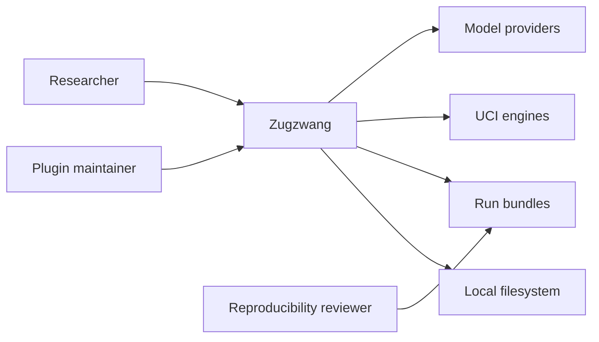
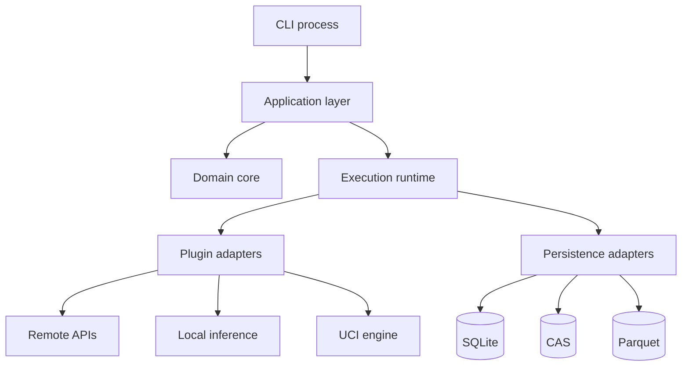
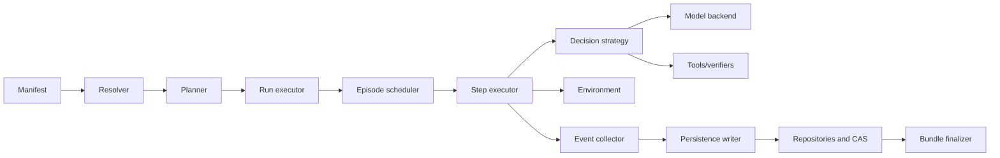

# C4 model

## Level 1: system context

## Level 2: containers

## Level 3: core components

## Level 4 guidance

Code-level diagrams belong beside implementation after M0. The repository must not freeze class diagrams before contracts are tested. Public protocols and state machines are more stable than internal class names.
