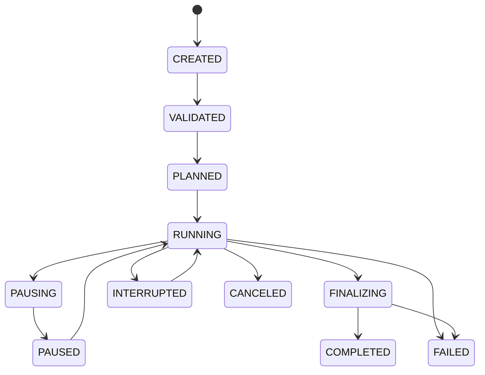
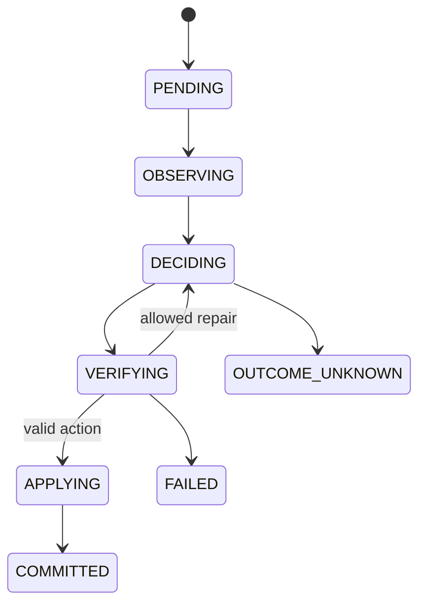

# Runtime e state machines

## Run lifecycle

## Step lifecycle

## Commit boundary

After `COMMITTED`:

- provider is never called again for the step;
- action is never reapplied;
- derived evaluation may be rerun;
- bundle finalization may be retried;
- resume starts at the first non-committed unit.

## Structured concurrency

Use `asyncio.TaskGroup` for episode groups. Cancellation propagates deliberately. Provider calls have per-call timeout and run-level deadline. Concurrency is limited per backend/model by semaphores or token buckets.

## Persistence writer

Workers produce commands. One logical writer serializes SQLite transactions and CAS references. Backpressure uses a bounded queue.

## Outcome-unknown

A timeout after request transmission may mean the provider processed the call. The call becomes `outcome_unknown`. Automatic retry is disabled unless the backend supports a reliable idempotency key and policy explicitly allows it.

## Resume algorithm

1. load run projection and latest event sequence;
2. verify resolved manifest and plugin snapshots;
3. inspect non-terminal episodes;
4. for each step, trust `COMMITTED` only if action and transition records agree;
5. recover artifact temp files;
6. continue from safe boundary;
7. emit `run_resumed`.

## Idempotency keys

Use deterministic operation keys for:

- artifact put by hash;
- event append sequence;
- metric evaluation;
- bundle finalization;
- export tables.

Do not pretend provider inference is idempotent unless documented.

## Shutdown

SIGINT/SIGTERM:

1. stop scheduling new episodes;
2. cancel safe in-flight work;
3. wait for writer drain up to deadline;
4. mark unresolved calls;
5. checkpoint;
6. exit with stable code.
