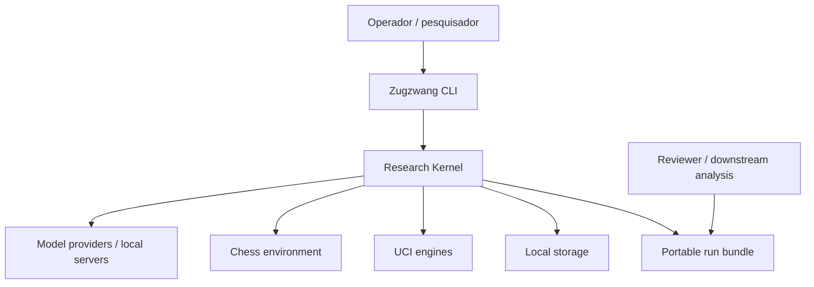
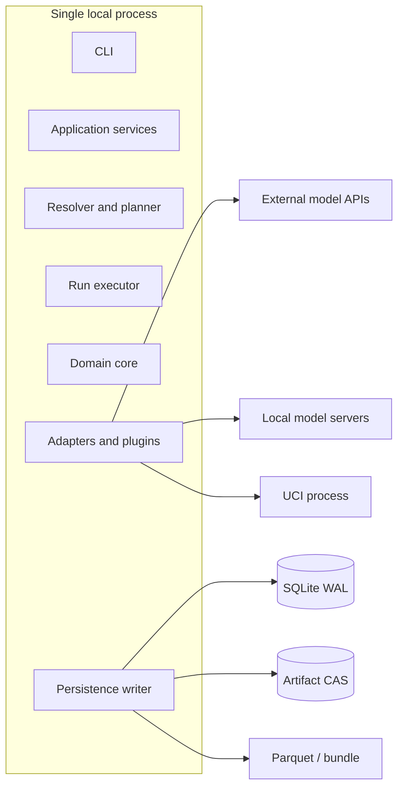

# System design

## 1. Objetivo do sistema

Executar experimentos agentic verificáveis com:

- protocolo imutável;
- componentes substituíveis;
- lifecycle retomável;
- evidência completa;
- assistência atribuível;
- avaliação versionada;
- export portável.

## 2. Contexto



## 3. Container lógico



## 4. Primary flow

1. CLI creates an application command.
2. Resolver loads YAML and validates strict boundary models.
3. Capability resolution produces a canonical JSON manifest.
4. Planner expands factors into condition and episode plans.
5. Runtime creates run/episode/step state machines.
6. Strategy requests one or more model calls through `ModelBackend`.
7. Every request and response becomes an artifact and event.
8. Verifier parses and classifies attempts.
9. Environment applies only a valid canonical action.
10. Persistence writer atomically commits artifacts, events, and projections.
11. Post-hoc evaluators derive versioned metrics.
12. Finalizer exports tables, manifests, snapshots, artifacts, and checksums.

## 5. Modules

### `zugzwang-core`

Pure domain types, IDs, ports, events, specifications, error taxonomy. No I/O framework.

### `zugzwang-runtime`

Application services, planning, state machines, budget accounting, persistence, artifact store, plugin discovery, observability.

### `zugzwang-chess`

Canonical chess domain, tasks, state/action codecs, renderers, suites, opponents.

### `zugzwang-cli`

Thin Typer/Rich adapter. No business logic or SQL.

### Plugins

Provider backends, Stockfish evaluator, Parquet reporter and later optional integrations.

## 6. Data planes

### Operational

SQLite projections answer “what is running and where can it resume?”

### Evidence

CAS answers “what exact bytes and traces produced the result?”

### Analytical

Parquet answers “how do conditions compare across thousands of steps?”

The three planes are linked by immutable IDs and hashes.

## 7. Consistency model

- one logical SQLite writer;
- artifact written before DB reference;
- step commit is atomic at the projection level;
- model call may be outcome-unknown on timeout;
- no automatic replay after a committed action;
- evaluators are idempotent by `(artifact, metric_id, metric_version, config_hash)`;
- bundle finalization is repeatable.

## 8. Scaling boundary

The v0.1 system assumes:

- one host;
- one controlling process;
- concurrent episodes;
- network model calls;
- UCI subprocesses;
- local filesystem.

Migration to Postgres/remote workers requires a new ADR when multiple hosts need to write or leases need network coordination. The domain and application ports are designed so that this is an adapter migration, not a rewrite.

## 9. Trust boundaries

Untrusted:

- provider outputs;
- remote API metadata;
- model tool arguments;
- imported bundles;
- third-party plugins;
- downloaded engines;
- external datasets.

Trusted only after validation:

- canonical manifest;
- environment transition;
- artifact hash;
- schema-conformant event;
- evaluator output with provenance.

## 10. Failure philosophy

Failures remain typed:

```text
configuration
capability
transport
timeout_outcome_unknown
provider
parse
illegal_action
budget
tool
environment
persistence
artifact
evaluation
protocol_violation
security
```

A generic exception can terminate the process, but cannot become the public error contract.

## 11. Future UI preparation

A future API uses the same application commands and query DTOs. The current architecture prepares:

- stable IDs;
- pagination/cursors;
- event sequence numbers;
- artifact references;
- cancellation;
- schema export;
- machine-readable CLI.

It does not add FastAPI or a frontend now.
