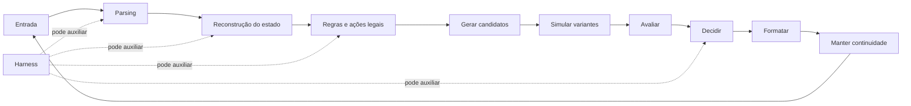

# Fundamentos científicos

## 1. Status epistemológico

Este documento deriva principalmente do dossiê fornecido pelo operador, com corte temporal em 2 de agosto de 2026. O dossiê revisa trabalhos que usam xadrez para treinar, avaliar, interpretar ou controlar modelos de linguagem e transformers sequenciais, incluindo benchmarks, datasets, arenas, harnesses e implementações abertas. Resultados de preprints podem mudar, e ratings ou porcentagens só são comparáveis quando o protocolo também é comparável.

Atualizações posteriores ao corte estão marcadas como **atualização externa** e apontam para fontes primárias.

## 2. Por que xadrez é um microscópio experimental

Xadrez oferece simultaneamente:

- estado determinístico;
- ação legal formalmente verificável;
- transições exatas;
- trajetórias longas;
- regras raras e dependências históricas;
- adversários parametrizáveis;
- avaliação por engines;
- enormes corpora humanos;
- distribuições OOD controláveis;
- linguagem estratégica e tática;
- percepção visual opcional.

Essa combinação permite separar falhas que benchmarks tradicionais misturam.

A força observada é limitada pelo elo mais fraco:

\[
\text{força observada} \approx
\min(T_{estado}, Q_{decisão}, S_{busca}, I_{interface}, R_{protocolo})
\]

Legalidade alta não implica boa policy. Boa escolha local não implica tracking longo. Explicação fluente não implica processo fiel.

## 3. Consensos emergentes

### 3.1 Interface é parte da capacidade observada

FEN, PGN, ASCII, imagem, histórico, SAN, UCI, legal moves, tools e retries mudam a tarefa. O protocolo precisa carregar esses elementos como dados versionados.

LLM CHESS encontrou grandes diferenças entre FEN, ASCII, board sempre presente, legal moves e tool surface. ChessArena encontrou ganho de robustez com legal moves, mas também indícios de seleção mais preguiçosa. Chess-R1 mostrou que alguns modelos praticamente não aprendem em regimes esparsos sem action grounding.

### 3.2 Tracking e decisão são gargalos distintos

Um sistema pode:

- reconstruir o tabuleiro e escolher mal;
- escolher bem quando recebe estado correto, mas perder o estado numa partida;
- produzir somente ações legais e continuar estrategicamente aleatório;
- imitar humanos sem maximizar força.

O benchmark deve medir, separadamente:

1. state reconstruction;
2. legal-action knowledge;
3. local decision quality;
4. trajectory stability.

### 3.3 Reward denso ajuda, mas não instala priors ausentes

Searchless Chess, Chess-R1, VAM e Pre2Post convergem em que action-values, rewards graduados e exploração controlada são superiores a uma recompensa binária pobre. Ainda assim, post-training depende fortemente da representação e da policy inicial.

### 3.4 Mais texto de reasoning não significa mais raciocínio

MATE, C1 e strategy verbalization mostram que linguagem especializada pode ajudar. `lang-chess` mostra vantagem de Best Line sobre targets excessivamente verbosos. VPS mostra que otimizar apenas a resposta pode degradar o processo. O conteúdo causal por token é mais importante que o comprimento.

### 3.5 Full-game e puzzles medem distribuições diferentes

Puzzles concentram tática e removem problemas de memória e policy-induced state distribution. Partidas completas testam continuidade, conversão, prevenção, phase drift e protocol stability. Um sistema pode ser bom numa dimensão e fraco na outra.

### 3.6 OOD deve preservar regras e quebrar regularidades

- random-legal testa dinâmica e tracking;
- Chess960 altera abertura e geometria inicial;
- transformações geométricas testam equivariância;
- estados impossíveis testam detecção de inconsistência;
- temporal holdout reduz contaminação;
- adversarial generation procura fragilidades específicas.

### 3.7 Search só escala com seletor ou value confiável

Gerar mais candidatos não basta. A curva de ganho depende da diversidade e da correlação entre avaliação interna e referência. Mixture-of-Agents e Best-of-N sem bom seletor podem apenas multiplicar o erro.

### 3.8 Pequenos especialistas são controles obrigatórios

KinGPT, Maia, Searchless Chess, Chessformer e sequence models pequenos demonstram que correspondência de distribuição e supervisão densa podem dominar escala bruta. Claims de reasoning precisam enfrentar baselines baratos.

## 4. Linhagens científicas

### 4.1 Sequence modeling e state tracking

- [The Chess Transformer](https://arxiv.org/abs/2008.04057)
- [Chess as a Testbed for Language Model State Tracking](https://arxiv.org/abs/2102.13249)
- [Emergent World Models in Chess-Playing Language Models](https://arxiv.org/abs/2403.15498)
- [Tracking World States with Language Models](https://arxiv.org/abs/2508.19851)
- [Chess-World-Model](https://arxiv.org/abs/2605.30100)

Pergunta central: o modelo representa a dinâmica ou explora frequências de trajetórias humanas?

### 4.2 Foundation models sem treino específico

- [Large Language Models on the Chessboard](https://arxiv.org/abs/2308.15118)
- [LLM CHESS](https://arxiv.org/abs/2512.01992)
- [ChessArena](https://arxiv.org/abs/2509.24239)

Pergunta central: quanto de conhecimento latente é acessível sob diferentes interfaces e harnesses?

### 4.3 Pós-treino e process supervision

- [Chess-R1](https://arxiv.org/abs/2507.00726)
- [VAM](https://arxiv.org/abs/2602.16833)
- [C1](https://arxiv.org/abs/2603.20510)
- [How Reasoning Evolves from Post-Training Data](https://arxiv.org/abs/2604.05134)
- [Verifiable Process Supervision](https://arxiv.org/abs/2605.12519)
- [Pre2Post Chess](https://arxiv.org/abs/2607.16097)

Pergunta central: qual supervisão induz policy, value, tracking e reasoning fiel?

### 4.4 Policies especializadas

- [Searchless Chess](https://arxiv.org/abs/2402.04494)
- [MAV](https://arxiv.org/abs/2412.12119)
- [Tracking vs. Deciding](https://arxiv.org/abs/2603.29761)
- [Chessformer](https://arxiv.org/abs/2605.19091)

Pergunta central: o que um transformer estreito consegue quando recebe representação e labels adequados?

### 4.5 Human alignment

- [Maia](https://arxiv.org/abs/2006.01855)
- [Maia-2](https://arxiv.org/abs/2409.20553)
- [ALLIE](https://arxiv.org/abs/2410.03893)
- [UniMaia](https://arxiv.org/abs/2605.27767)
- [Matilda](https://arxiv.org/abs/2606.25176)
- [Otter](https://arxiv.org/abs/2608.05206)

Pergunta central: força ótima, imitação humana, estilo, tempo e controle semântico são objetivos diferentes.

### 4.6 Brittleness, harness e segurança

- [Generalization or Memorization? Brittleness Testing](https://arxiv.org/abs/2605.17565)
- [AutoHarness](https://arxiv.org/abs/2603.03329)
- [Specification Gaming in Reasoning Models](https://arxiv.org/abs/2502.13295)
- [Geometric Stability Analysis](https://arxiv.org/abs/2512.15033)

Pergunta central: o sistema está raciocinando sobre o jogo, seguindo atalhos de distribuição ou explorando o ambiente?

### 4.7 Linguagem, skills e comentários

- [MATE](https://arxiv.org/abs/2411.06655)
- [Concept-guided Chess Commentary](https://arxiv.org/abs/2410.20811)
- [Communicating Chess Strategies in Natural Language](https://arxiv.org/abs/2607.11486)
- [Three-Body Alignment](https://arxiv.org/abs/2607.21993)
- [ACT-Eval](https://arxiv.org/abs/2608.04240)

Pergunta central: conhecimento verbal melhora policy, comentário, alinhamento humano ou apenas plausibilidade?

## 5. Atualizações externas ao corte do dossiê

### ACT-Eval, 4 de agosto de 2026

ACT-Eval decompõe comentários enxadrísticos em afirmações atômicas e usa verificadores determinísticos, engine e gold expert. A consequência para Zugzwang é direta: linguagem precisa ser avaliada por claims verificáveis, não por fluência global.

### Otter, 5 de agosto de 2026

Otter modela comportamento humano com histórico recente, controle de tempo e relógio, reforçando que contexto temporal e histórico são features causais, não metadata ornamental.

### LMAct e MET-Bench

LMAct compara formatos textuais e RGB, além de muitas demonstrações expert em contextos longos. MET-Bench isola tracking multimodal. Juntos, mostram que imagem do tabuleiro não deve ser tratada como equivalente automática a estado simbólico e que perception precisa ser medida antes da decisão.

## 6. Consequências arquiteturais

1. O manifesto precisa carregar representação, história, modalidade e authority policy.
2. O request do provider precisa aceitar content parts tipados.
3. Imagens precisam ser artifacts imutáveis, não caminhos soltos.
4. Retry, selection e fallback precisam ser eventos científicos.
5. H e K precisam ser eixos independentes.
6. Static knowledge injection não pode ser chamado genericamente de RAG.
7. Engine live e post-hoc precisam de fronteiras diferentes.
8. Metrics precisam de provenance e versionamento próprio.
9. Bundles precisam preservar raw evidence ou registrar a política que impediu sua retenção.
10. Experimentos iniciais devem ser pareados e locais antes de promover claims de Elo.

## 7. Limite das alegações

O corpus sustenta que xadrez é um domínio particularmente adequado para decompor competência. Ele não sustenta que um único benchmark mede inteligência geral, nem que uma explicação textual revela diretamente o mecanismo neural.
