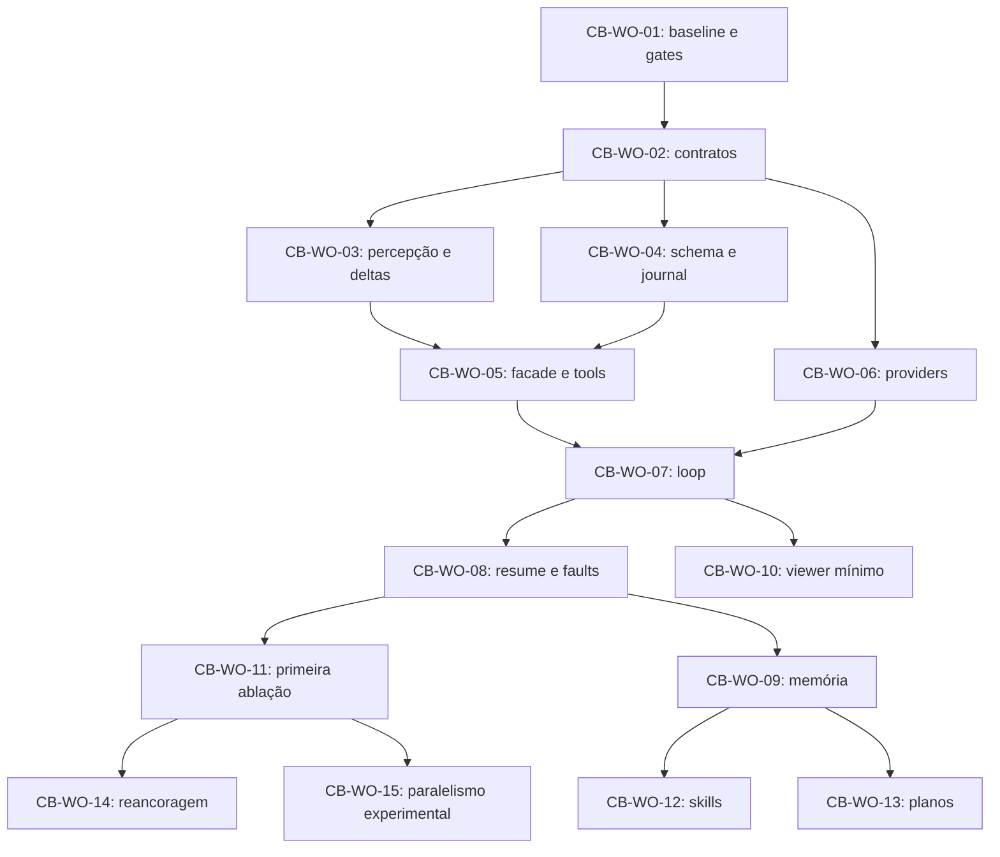

# CognitiveBoard — Checklist de roadmap (PRD v0.1)

Tracking do pipeline completo do PRD `Zugzwang_PRD_CognitiveBoard_v0.1.md`, fase a
fase, mapeado ao sistema de work orders do repositório (exigência do §38.1 e §48.1).
Atualizado a cada fase executada; nenhum gate humano é marcado sem ratificação do
operador. Fontes: §38 (CB-WO), §36 (gates CB0–CB3 e catálogo TEST), §40 (governança),
§48.3 (gates humanos).

Caminho crítico (§38.1): baseline seguro → contratos → percepção → executor e
persistência → loop → recuperação → ablação. Memória rica e skills depois do loop
observável e reproduzível.

## Epics — CB-WO 01–15

### Fase 1 — Baseline seguro

- [x] **CB-WO-01** — reconciliar baseline e riscos P0 (§38.2) → **ZGW-0087** · PR [#25](https://github.com/maelrx/Zugzwang/pull/25)
  - [x] Baseline matrix (D1–D5), snapshot dos schemas (head 0006, 16 tabelas), relatório de conflitos de ADR
  - [x] TEST-081 — política SQLite por linhas corrigidas compartilhada por doctor e bootstrap (fail-closed)
  - [x] Teste de não alteração das strategies (suíte offline verde)
  - [x] Diagnóstico de nomenclatura de término (`FIFTY_MOVE` × 75) — correção deliberada encaminhada ao CB-WO-02
  - [x] Isolamento planejado do viewer — execução no CB-WO-10

### Fase 2 — Contratos

- [x] **CB-WO-02** — contratos e manifest (§38.3) → **ZGW-0089** · PR [#27](https://github.com/maelrx/Zugzwang/pull/27)
  - [x] DTOs de cognição em `core/domain/cognition.py`: chaves §7.2 (state/position/trajectory/node/action/packet/observation/operation — sha256 integral, canonical JSON), máquina de estados §12.2 (agregados + fases internas + transições legais), config delimitada com flags default-off (G-CB-08), DecisionManifest com content hash
  - [x] Envelope de tools fiel ao §42.6 (meta com 11 campos, result XOR error, retryable_under_policy) + catálogo de erros §15.1 (16 códigos, categoria + classe de retry, `max_protocol_errors` explícito)
  - [x] Ports §11.1/§26.1: `StateIdentityPort` e `CognitiveSession` (runtime-checkable); `DecisionContext.decision_session` opcional (aditivo, legacy válido)
  - [x] Schemas JSON regenerados (`cb-tool-envelope`, `cb-decision-manifest`, `cb-config`)
  - [x] Aceitação: validação de exemplos (fixtures × modelos × JSON Schema Draft 2020-12), rejection de campos desconhecidos, imports limpos, compatibilidade com descriptors antigos
  - [x] Revisão (code-review skill, 2 eixos) aplicada — envelope reescrito para o §42.6 exato, transições estritas, classes de retry distintas; 276 offline

### Fase 3 — Percepção

- [x] **CB-WO-03** — percepção e deltas (§38.4) → **ZGW-0090** · PR [#28](https://github.com/maelrx/Zugzwang/pull/28) (empilhado no #27)
  - [x] `ChessPerception` determinístico + `PositionPacket` (§8.2 integral: state/representation/legal_actions/relations/terminal/provenance)
  - [x] Ações como objetos vinculados ao estado (L0-A: action_id + from/to/piece/capture/castling/promotion) + relações (checkers, cravada absoluta por raio)
  - [x] PositionDelta adjacente (com ação responsável validada) × arbitrária, com reconstrução completa da projeção
  - [x] TEST-005 a TEST-017 aplicáveis (12 do catálogo) + determinismo do content hash + microbench (0,39 ms/packet) no README do módulo
  - [ ] TEST-001–004/018 (snapshot/âncora/raiz-imutável com persistência) → CB-WO-04/05
  - [ ] Codec textual da view básica → CB-WO-05 (broker de exposição)

### Fase 4 — Persistência e executor

- [x] **CB-WO-04** — persistência e journal (§38.5) → **ZGW-0091** · PR [#29](https://github.com/maelrx/Zugzwang/pull/29) (empilhado no #28, incorpora a fundação #25)
  - [x] Migration 0007 (CB-M1 intermediário): cb_state_snapshots/cb_decisions/cb_node_bindings/cb_rounds/cb_provider_links/cb_tool_operations/cb_observations/cb_budget_reservations/cb_budget_entries + 12 triggers do DDL-alvo
  - [x] Writer repository único: transições §12.2 validadas, operações idempotentes (replay divergente rejeitado), observações, journal de budget append-only com reconcile por unidade
  - [x] Upgrade de cópia baseline (0001→0007) e rollback de feature ensaiados; rollback recusa DROP com dados (§23.3)
  - [x] Correção da nomenclatura de término: SEVENTYFIVE_MOVE + TERMINATION_MAPPING_VERSION v2 (FIFTY_MOVE preservado para claims; registros antigos não reescritos)
  - [x] Integridade referencial e idempotência testadas; 328 offline
- [x] **CB-WO-05** — facade e tools (§38.6) → **ZGW-0092** · PR [#30](https://github.com/maelrx/Zugzwang/pull/30) (empilhado no #29; review 2 eixos aplicado em f6f7d7f)
  - [x] `CognitionToolBroker`: única porta às tools L0 (observe/inspect/expand/compare), preflight de catálogo/escopo/tamanho/budget, settle PREPARED→COMMITTED/REJECTED/FAILED com artifact CAS, observação, envelope §42.6
  - [x] `DecisionSession.open` (§26.1): abertura §12.2 PREPARING→READY→ACTIVE, snapshots, bindings, primeiro round; sink/loader CAS-coerentes
  - [x] Journal: `command_ordinal` e `exposure_sequence` como sequências duráveis (MAX+1); `bound_node_ids(decision_id)` explícito
  - [x] TEST-019/020/021/031/032/033/034/035/036/077/078 (15 testes); 343 passed/1 skipped offline; ruff + pyright strict + foundation --strict verdes
- [x] **CB-WO-06** — providers round-trip (§38.7) → **ZGW-0093** · PR [#31](https://github.com/maelrx/Zugzwang/pull/31) (empilhado no #30; review 2 eixos aplicado em aca6c30)
  - [x] Round-trip de tool calls no lowering chat (call/result IDs estáveis) + JsonDataPart no wire (modo JSON com interaction_mode distinto)
  - [x] Capability gate dentro do adapter (imagem/required sem suporte recusam antes de qualquer POST, zero requests)
  - [x] TEST-026/027/039/064/065/066 (7 testes offline MockTransport); 350 passed/1 skipped; ruff + pyright strict + foundation --strict verdes
  - [ ] Artefato de preflight {provider, model, route, date} (§15.4) → DEFERIDO para CB-WO-07 (journal da rota efetiva por round)

### Fase 5 — Loop

- [ ] **CB-WO-07** — strategy adaptativa e loop (§38.8) → pending (depende W5+W6)
- [ ] **CB-WO-08** — durabilidade e segurança end-to-end (§38.9) → pending (depende W7)
- [ ] **CB-WO-10** — viewer mínimo causal (§38.11) → pending (depende W7)
- [ ] **CB-WO-09** — memória condicionada (§38.10) → pending (depende W8; retrieval elegível = ADR-CB-013)

### Fase 6 — Ciência

- [ ] **CB-WO-11** — primeira ablação preregistrada (§38.12) → pending (depende W8)
- [ ] **CB-WO-12** — skills versionadas (§38.13) → pending (depende W9)
- [ ] **CB-WO-13** — planos e premissas (§38.14) → pending (depende W9)
- [ ] **CB-WO-14** — reancoragem (§38.15) → pending (depende W11; autorização por profiling)
- [ ] **CB-WO-15** — paralelismo experimental (§38.15) → pending (depende W11; autorização por resultado)

## Gates de milestone (PRD §36.1)

- [ ] **CB0** — primeiro corte: TEST-001 a TEST-021, TEST-062, TEST-081 (+ TEST-081 já implementado na fase 1)
- [ ] **CB1** — programa mínimo: TEST-022 a TEST-041, TEST-053–059, TEST-063/064, TEST-078–080
- [ ] **CB2** — memória e skills: TEST-042–051, TEST-075
- [ ] **CB3** — métricas e protocolo: TEST-066, TEST-071–074 (+ TEST-076 se reancoragem ativa)

## Gates humanos abertos (PRD §48.3) — NENHUM ratificado por agente

- [ ] **G-CB-01** — nomenclatura final e novas exposições (default: R7/H4 compatível, sem reusar R8)
- [ ] **G-CB-02** — rota/modelo inaugural com tool fidelity (default: fake offline)
- [ ] **G-CB-03** — budgets e política de interrupção (default: preset bounded, falha explícita)
- [ ] **G-CB-04** — política SQLite e durabilidade (default aplicado no ZGW-0087: não abrir workspace durable em versão reprovada; perfil durable não implementado)
- [ ] **G-CB-05** — corpus/skills e licença de fontes (default: fontes endógenas, skills desabilitadas)
- [ ] **G-CB-06** — política de empate/claim (default: preservar legacy, não inventar ação)
- [ ] **G-CB-07** — dataset confirmatório e poder/amostra (default: piloto exploratório rotulado)
- [ ] **G-CB-08** — ativação de reancoragem/paralelismo/visual (default: desabilitados)

## Registro de execução

| Data | Fase | Ordem | PR | Resultado |
|---|---|---|---|---|
| 2026-09-06 | Fase 1 — baseline | ZGW-0087 | #25 | Code review 2 eixos aplicado; 261 offline; TEST-081 verde |
| 2026-09-06 | Tracking | ZGW-0088 | este PR | Este checklist |
| 2026-09-06 | Fase 2 — contratos | ZGW-0089 | [#27](https://github.com/maelrx/Zugzwang/pull/27) | Contratos de cognição fiéis ao §42.6/§12.2/§15; 34 testes de contrato; review aplicado |
| 2026-09-06 | Fase 3 — percepção | ZGW-0090 | [#28](https://github.com/maelrx/Zugzwang/pull/28) | Percepção L0 + delta reconstrutível; TEST-005–017; review aplicado; empilhado no #27 |
| 2026-09-06 | Fase 4 — persistência | ZGW-0091 | [#29](https://github.com/maelrx/Zugzwang/pull/29) | CB-M1 (migration 0007 + writer + budget journal) + término v2; review aplicado; empilhado no #28 |
