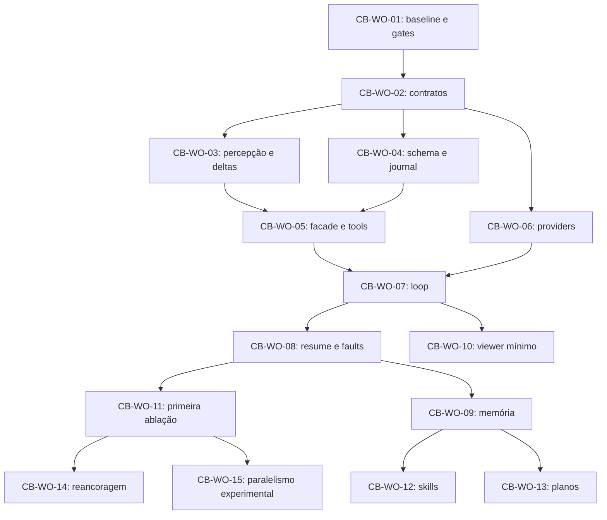

# CognitiveBoard — Checklist de roadmap (PRD v0.1)

Tracking do pipeline completo do PRD `Zugzwang_PRD_CognitiveBoard_v0.1.md`, fase a
fase, mapeado ao sistema de work orders do repositório (exigência do §38.1 e §48.1).
Atualizado a cada fase executada; nenhum gate humano é marcado sem ratificação do
operador. Fontes: §38 (CB-WO), §36 (gates CB0–CB3 e catálogo TEST), §40 (governança),
§48.3 (gates humanos).

Caminho crítico (§38.1): baseline seguro → contratos → percepção → executor e
persistência → loop → recuperação → ablação. Memória rica e skills depois do loop
observável e reproduzível.

## Epics — CB-WO 01–15

### Fase 1 — Baseline seguro

- [x] **CB-WO-01** — reconciliar baseline e riscos P0 (§38.2) → **ZGW-0087** · PR [#25](https://github.com/maelrx/Zugzwang/pull/25)
  - [x] Baseline matrix (D1–D5), snapshot dos schemas (head 0006, 16 tabelas), relatório de conflitos de ADR
  - [x] TEST-081 — política SQLite por linhas corrigidas compartilhada por doctor e bootstrap (fail-closed)
  - [x] Teste de não alteração das strategies (suíte offline verde)
  - [x] Diagnóstico de nomenclatura de término (`FIFTY_MOVE` × 75) — correção deliberada encaminhada ao CB-WO-02
  - [x] Isolamento planejado do viewer — execução no CB-WO-10

### Fase 2 — Contratos

- [ ] **CB-WO-02** — contratos e manifest (§38.3) → **ZGW-0089** · pending
  - [ ] Módulo `core/cognition`: DTOs (StateIdentity, PositionPacket, PositionDelta, DecisionContext, ToolEnvelope, DecisionState)
  - [ ] Port de identidade de estado + canonicalização v2 (state/position/move keys)
  - [ ] Extensão opcional do DecisionContext
  - [ ] Envelope de tools com catálogo de erros (§42.6)
  - [ ] Schemas JSON regenerados (zugzwang schema)
  - [ ] Aceitação: validação de exemplos, rejection de campos desconhecidos, testes de import, compatibilidade com descriptors antigos

### Fase 3 — Percepção

- [ ] **CB-WO-03** — percepção e deltas (§38.4) → pending (após ZGW-0089)
  - [ ] `ChessPerception` determinístico + `PositionPacket` (L0-S básico/relacional)
  - [ ] Ações como objetos vinculados ao estado (L0-A) + relações (cravada/pin)
  - [ ] PositionDelta de avanço único
  - [ ] Snapshots v2 paralelos ao legado
  - [ ] TEST-001 a TEST-018 + microbench documentado

### Fase 4 — Persistência e executor

- [ ] **CB-WO-04** — persistência e journal (§38.5) → ZGW-0091 · pending
- [ ] **CB-WO-05** — facade e tools (§38.6) → pending (depende W3+W4)
- [ ] **CB-WO-06** — providers round-trip (§38.7) → pending (depende W2)

### Fase 5 — Loop

- [ ] **CB-WO-07** — strategy adaptativa e loop (§38.8) → pending (depende W5+W6)
- [ ] **CB-WO-08** — durabilidade e segurança end-to-end (§38.9) → pending (depende W7)
- [ ] **CB-WO-10** — viewer mínimo causal (§38.11) → pending (depende W7)
- [ ] **CB-WO-09** — memória condicionada (§38.10) → pending (depende W8; retrieval elegível = ADR-CB-013)

### Fase 6 — Ciência

- [ ] **CB-WO-11** — primeira ablação preregistrada (§38.12) → pending (depende W8)
- [ ] **CB-WO-12** — skills versionadas (§38.13) → pending (depende W9)
- [ ] **CB-WO-13** — planos e premissas (§38.14) → pending (depende W9)
- [ ] **CB-WO-14** — reancoragem (§38.15) → pending (depende W11; autorização por profiling)
- [ ] **CB-WO-15** — paralelismo experimental (§38.15) → pending (depende W11; autorização por resultado)

## Gates de milestone (PRD §36.1)

- [ ] **CB0** — primeiro corte: TEST-001 a TEST-021, TEST-062, TEST-081 (+ TEST-081 já implementado na fase 1)
- [ ] **CB1** — programa mínimo: TEST-022 a TEST-041, TEST-053–059, TEST-063/064, TEST-078–080
- [ ] **CB2** — memória e skills: TEST-042–051, TEST-075
- [ ] **CB3** — métricas e protocolo: TEST-066, TEST-071–074 (+ TEST-076 se reancoragem ativa)

## Gates humanos abertos (PRD §48.3) — NENHUM ratificado por agente

- [ ] **G-CB-01** — nomenclatura final e novas exposições (default: R7/H4 compatível, sem reusar R8)
- [ ] **G-CB-02** — rota/modelo inaugural com tool fidelity (default: fake offline)
- [ ] **G-CB-03** — budgets e política de interrupção (default: preset bounded, falha explícita)
- [ ] **G-CB-04** — política SQLite e durabilidade (default aplicado no ZGW-0087: não abrir workspace durable em versão reprovada; perfil durable não implementado)
- [ ] **G-CB-05** — corpus/skills e licença de fontes (default: fontes endógenas, skills desabilitadas)
- [ ] **G-CB-06** — política de empate/claim (default: preservar legacy, não inventar ação)
- [ ] **G-CB-07** — dataset confirmatório e poder/amostra (default: piloto exploratório rotulado)
- [ ] **G-CB-08** — ativação de reancoragem/paralelismo/visual (default: desabilitados)

## Registro de execução

| Data | Fase | Ordem | PR | Resultado |
|---|---|---|---|---|
| 2026-09-06 | Fase 1 — baseline | ZGW-0087 | #25 | Code review 2 eixos aplicado; 261 offline; TEST-081 verde |
| 2026-09-06 | Tracking | ZGW-0088 | este PR | Este checklist |
| — | Fase 2 — contratos | ZGW-0089 | pending | |
| — | Fase 3 — percepção | ZGW-0090 | pending | |
