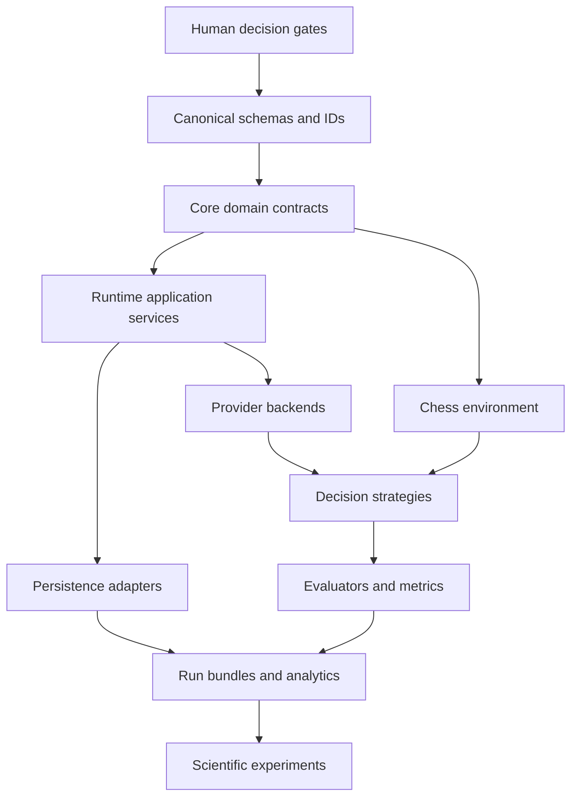

# Sequência de dependências

## Princípio

A implementação segue de invariantes para efeitos externos. Um adapter nunca define a semântica do domínio que deveria adaptar.

## Critical path

1. Gate de licença e Python.
2. Identificadores, clocks, money/usage, errors e schema versions.
3. Manifest source → resolved manifest → canonical hash.
4. Domain events e state machines.
5. SQLite/CAS transactional protocol.
6. Fake backend + fake environment vertical slice.
7. Chess environment and renderers.
8. Provider adapters and strategies.
9. Post-hoc evaluators and analytical exports.
10. Run bundle validation and import.
11. Experimental suites.

## Paralelismo seguro

Podem avançar em paralelo depois dos contratos:

- chess renderer e provider fake;
- SQLite repositories e CAS;
- CLI queries e analytical schema;
- experiment cards e knowledge packet authoring;
- contract tests para adapters diferentes.

Não podem avançar de forma independente:

- migrations antes do domain model;
- provider retries antes do attempt model;
- Stockfish metrics antes de metric provenance;
- public plugin API antes de GATE-007;
- package publication antes de GATE-012.
